# ImpactKV / KVFlow 技术迭代回顾：从代码结构启发到任务依赖复用

日期：2026-08-05

当前实现分支：`research/coding-aware-v45-multi-observation-20260803`

本轮实验起始 HEAD：`583509d4a`（最终证据提交以 Git 历史为准）

范围：从早期 TaskCone / AST 路线，到 V9–V12、E/P 系列、真实 coding-agent bridge、受控 V40–V92 研究支线、SGLang-native V45/V46，以及 M47–M56 coding 动机、accuracy 与同提示速度审计

状态：**供内部审阅；不是论文定稿；没有修改 paper、旧脏 checkout、prefetch 分支或任何预注册门槛。**

---

# 第一部分：十分钟读懂研究主线

这一部分是报告正文。它不要求读者记住 V、P、M 编号，而是解释项目遇到了什么矛盾、每轮实验改变了什么认识，以及当前算法为什么形成现在的样子。第二部分保留完整版本账本、表格和复现路径，供需要核查数字时查阅。

## 本轮结论摘要

| 问题 | 结论 | 证据强度 |
|---|---|---|
| V40 是否真的更快 | 是；exact-same-prompt median TTFT `316.18→286.74 ms`（1.103x），N=4 含 build 仍 1.102x | M56，244 copied targets / 13 tasks，0 fallback |
| V40 accuracy 是否已优于 General/Dense | 尚不知道；fresh-13 三臂全部 0/13，不能排序 | M55 official，`INCONCLUSIVE_ZERO_POWER` |
| coding 信息中什么成立 | 最近 interaction 的 path overlap 能预测 attention dependency | M52/M53 两批方向复现 |
| 什么没有成立 | grounded 类型、same-file mutation、path×drift 单分数都不能稳定预测 splice safety | M50/M51/M54 冻结 gate 失败 |
| two-stage selector 能否上线 | 不能；24 case 只来自 5 tasks，低于 8-task 容量门槛，GPU label 未打开 | M55，`INSUFFICIENT_TASK_DISJOINT_COHORT` |
| 当前应保留什么 | V40 是科研 baseline；V45/V46 的 version/pool/executor 是基础设施，V46 recency policy 不晋级 | 历史 official + M47–M56 |

一句话总结：**本轮真正完成的是 V40 的同提示速度证明和 selector 假设的边界审计；尚未完成的是可泛化的 coding utility selector 与有非零 base rate 的 accuracy 比较。**

## 0. 我们真正想解决的问题

Coding agent 会反复看到相同的仓库内容。它先读取文件，经过几轮搜索、测试和修改后，又在新的 prompt 中引用早先读到的代码。如果每次都进行 Dense prefill，模型会重复计算大量 token；如果只做 exact prefix reuse，又只能利用没有改变位置和左上下文的前缀，覆盖范围很窄。项目希望复用这些已经计算过、但出现在 prompt 中部的 K/V，从而减少重复 prefill。

困难在于：**文本相同，不代表 K/V 相同。** 同一段 `parser.py` 在旧 prompt 中可能位于一次搜索之后，在新 prompt 中则位于修改和测试之后。K 可以按新位置做 RoPE 修正，但 K/V 中仍保留旧左上下文形成的 hidden state。因此我们的目标从来不是“找到重复文本并复制”，而是回答两个不同的问题：

- 这段历史信息对当前任务是否有用？
- 即使它有用，把旧上下文中的 K/V 搬过来是否足够安全？

此前许多失败都源于把这两个问题混成一个分数。AST、函数签名、文件版本和路径相关性看上去都很“懂代码”，但它们并不自动预测 K/V 搬运误差。

可以用一个具体场景理解这一矛盾。假设 agent 的历史中有三段 observation：

```text
A: 读取 src/parser.py，得到 900 token 源码
B: 搜索 tests/ 中的错误断言，得到 600 token 日志
C: 读取 docs/config.md，得到 700 token 文档

当前请求：刚刚修改 parser.py 后，决定下一步怎样修复解析失败
```

路径依赖告诉我们 A 比 C 更可能影响当前决策；文件版本检查又会发现 A 的可见内容可能已经被修改；即使 A 的文本版本仍合法，它在旧 prompt 中形成的 K/V 也可能因为上下文变化而偏离 Dense。也就是说，路径负责回答“值不值得复用”，version guard 负责回答“文本是否仍合法”，K/V probe 才负责回答“搬运后会不会偏得太远”。当前研究的核心突破，就是把这三种职责拆开。

## 1. 研究故事：四次关键转向

### 1.1 先把执行器做可信：早期的漂亮速度数字不能用

项目最早尝试 TaskCone、ASTSpanKV 和 AST-IslandKV：目标函数或语法关键区 Dense，其余代码尽量复用。这个想法直观，但早期实现存在 body offset、RoPE、zero-gap 和 launcher 等问题；当时部分“约 31% 收益”并不是有效的物理复用结果。

因此第一步不是继续优化 selector，而是先证明 middle-span KV copy 本身正确。E2 在 120 个 server 观测上实现了 completion 完全一致、最大 logprob 差异为 0、0 fallback，并把 p95 round makespan 降到 Dense 的 82.27%。这一步只证明执行器能够正确搬运 exact-compatible KV，却非常重要：从此以后，策略失败不能再被执行器错误掩盖。

### 1.2 从 AST 到 repair oracle：代码结构重要，但不是 KV 风险答案

随后项目系统测试 AST、symbol、identifier、函数签名、K-only、V-only、不同 layer 和不同 token span。它们都采用等成本 control，避免“某方法重算更多 token所以更准”的假提升。

结果不是某个 AST 规则略逊，而是整个假设的上限很低：P23 即使事后从五种候选里挑 oracle 最优，NLL advantage 也只有 `+0.00321`，没有通过 `+0.005` 的预注册门槛。ASTSpanKV 还把 prompt 切成中位 66.5 个 Dense/copy stage，调度开销令 TTFT 比 Dense 慢 74.29%；把碎片限制成少量 island 后，速度问题减轻，但质量优势仍不稳定。

这解释了为什么“直接重算函数签名”在因果上有问题。函数签名对人类理解代码很重要，但模型在当前请求中是否依赖它、它的旧 K/V 是否失真，是另外两个问题。语法重要性不等于 attention dependency，更不等于 contextual K/V safety。于是 AST 被保留为定位和切段工具，不再直接决定 repair。

### 1.3 从 token 位置转向 agent workflow：V40 找到了更自然的复用对象

真正的方向变化发生在真实 coding-agent trajectory。与其猜一段代码里哪些 token 重要，V40 改为利用 agent 已经产生的工作流语义：只缓存成功、只读、路径可定位且未被后续写入污染的工具结果，不缓存 assistant reasoning、tool call、测试执行、diff 或 mutation。

这个选择有两层意义。第一，它提供了自然 resident source：observation 本来就在正常 agent 推理中被 Dense materialize，不需要 prefetch 或额外 source-build。第二，它把可审计的 coding provenance 变成候选边界，避免缓存模型自己尚未验证的思考过程。

V40 的 12-task development 结果是 4/12 resolved，Dense 和 General 都是 3/12；在三个 Dense-pass task 上没有 damage，并比 General 少复制 64.9% token。这个结果还不足以证明总体优于基线，但它第一次给出了“少而有语义的 workflow observation”可能优于无差别复用的任务级信号。

V45 随后补上 target-time 文件版本重验；V46 又把单个临时 source 扩展成最多三个 observation 的有界 pool。V46 在 RepoBench 静态测试中把 cache-ready speedup 从 V40 的 1.089x 提到 1.326x，说明系统已经不缺复用机会。然而 official preservation canary 中 Dense/V40 为 3/3，V46 只有 2/3。**多复制确实更快，但未经约束的多岛复用会损害质量。** 这使研究瓶颈从“怎样找到更多可复制 token”转向“怎样选择有用且低风险的 island”。

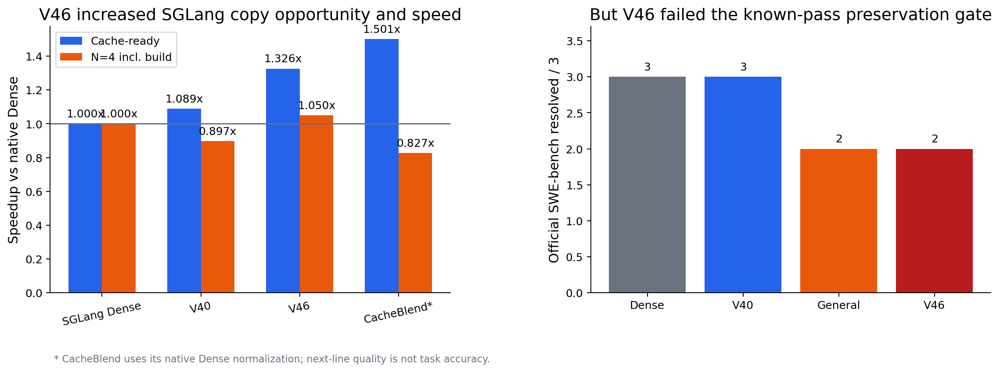

### 1.4 不再从最终分数猜原因：M47–M56 把 utility、risk、accuracy 与速度分开

最新一轮没有继续添加 V47、V48 式 heuristic，而是做一组因果动机实验。

M47 先固定每个方法复制 `3 × 512` token。V46 recency 达到 1.322x，简单 coding-symbol 只有 1.175x；V46 更快主要是因为它选择了靠后的连续块、减少了 Dense gap，而不是因为它更理解代码。这否定了“加一些 symbol/path 关键词就构成 coding novelty”。

M50 比较 grounded tool observation 与 assistant decision，只有 10/20 对的 grounded splice JS 更低；M51 比较 same-file mutation 与 noncritical transition，也只有 8/18 对的 mutation JS 更高。两项冻结 gate 都失败。于是我们撤回“工具事实天然安全”和“文件 mutation 天然代表更高 K/V 风险”这两个过强解释。grounded provenance 与 version guard 仍然有价值，但它们负责候选合法性，而不是物理安全性。

真正稳定复现的是 M52/M53 的 path dependency。路径相关 observation 获得更高 target attention 的配对比例分别为 70.0% 和 89.5%，位置校正比为 1.623 和 1.413。这证明最近 coding interaction 的路径可以预测模型正在依赖哪段历史信息。但它没有稳定预测 splice JS；换句话说，path 是 utility 信号，不是 safety guard。

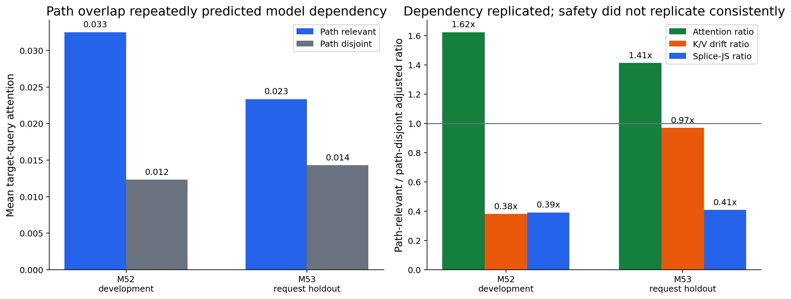

M54 又检验了最自然的组合：把 path 权重乘到 16-token K/V drift probe 上。结果 hybrid 与 JS 的 Spearman 从 probe-only 的 0.506 降到 0.477，候选配对排序准确率仍只有 42.9%。这次失败很关键，因为它阻止我们再次把两个含义不同的量压成一个“看起来更完整”的分数。

M55 随后把验证移到 13 个与 M52–M54 task-disjoint 的真实 SWE-bench trajectory。官方容器结果是 Dense、General、V40 全部 `0/13`；三者的 Wilson 95% 区间都为 `[0, 22.81%]`。冻结 preservation gate 因“没有观察到 damage”而机械通过，但全零结果没有 accuracy 辨识力，因此证据矩阵将它记为 `INCONCLUSIVE_ZERO_POWER`，而不是正面精度证据。运行仍验证了真实机制暴露：V40 在 13/13 题、253 个请求中复制 196,704 token，General 在 292 个请求中复制 645,741 token，二者都 0 fallback；V40 少复制 69.5%。

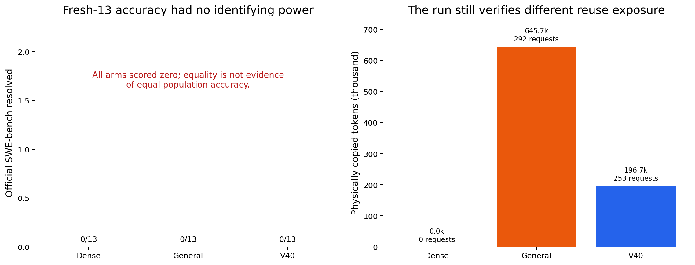

M55 的 two-stage selector 也没有进入 GPU causal measurement。它找到了 31 个 path-matched pair，target-time version guard 淘汰 2 个，剩余 29 个；可均衡选择 24 case，却只覆盖 5 个任务，低于冻结的 8-task 门槛。因此问题不是 probe threshold，也不是 FileVersion 过严，而是严格的“同请求内 path-relevant / path-disjoint 成对”机会在新 trajectory 上过于集中。按照预注册规则，我们没有读取 attention/JS 标签、没有调阈值，也没有实现 V55 runtime。

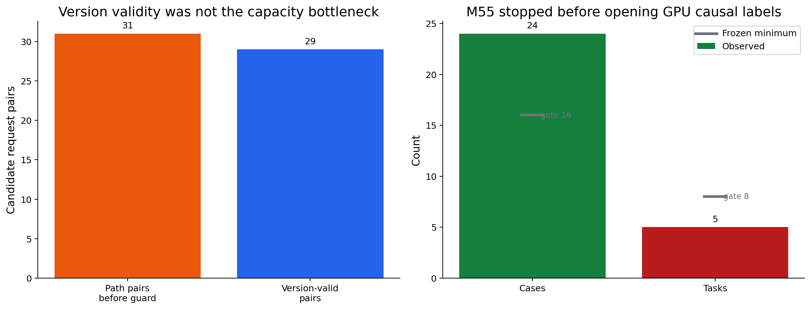

M56 最后把速度问题与自由运行轨迹完全拆开。它从 Dense trajectory 重建 383 个请求，逐请求保证 Dense/V40 prompt token hash 相同；诊断输出只生成 1 token且绝不进入后续 prompt。244 个 V40 target 覆盖 13 个任务，244/244 真实 copy、0 fallback，共复制 226,101 token。median TTFT 从 Dense 的 316.18 ms 降到 286.74 ms，即 `1.103x`；79.5% 的配对请求更快，N=4 含 source build 后仍为 `1.102x`。首 token 一致率为 97.54%，高于 90% gate，但不是 100%——这同时证明它确实是 lossy reuse，而不是 exact reuse。

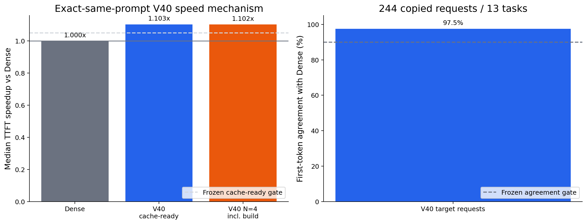

## 2. 当前方法是什么，coding-aware 体现在哪里

当前可运行实现是 SGLang-native V46。它由三层组成。

**候选层**只接收 agent 正常执行中自然产生的 repository observation。候选必须来自成功的只读工具结果，长度足够、路径可定位；assistant reasoning、测试、diff、写操作和状态查询不会进入 pool。V45/V46 会在 source 注册时和 target 使用前检查路径、内容 hash 及后续 mutation，文本版本不合法就释放 KV。

**计划层**维护每个 session 最多三个 source。当前 V46 按长度和新近度选择最多三个不重叠 island，因此已经能利用多个 observation，但还没有把 path utility 与 probe risk 加入最终线上 selector。这正是当前 policy 尚未晋级的原因。

**执行层**按 `Dense gap → copied island → Dense gap` 交替处理完整 prompt。K 按 source/target 位置差做 RoPE delta，V 直接复制；source handle、lease、eviction 和 session reset 都有显式生命周期，ledger 不一致时 fail closed。它没有删除 prompt，也没有 prefetch，复制的仍是旧上下文形成的 K/V，所以是真正的 lossy reuse，而不是 exact cache 的变体。

Coding-aware 并不等于“AST token 多给一点权重”。它目前体现在 observation provenance、repository path、file-version transition 和 agent lifecycle 上；下一版还要把 path dependency 用作复用效用，把在线 K/V probe 用作物理风险约束。

```text
自然产生的 tool observation
        ↓ provenance / version validity
    合法候选池
        ↓ probe risk 过滤高风险候选
    低风险候选
        ↓ path dependency 排序复用价值
    固定预算内选择少量 island
        ↓
SGLang middle-span lossy K/V copy
```

## 3. 用同一条 coding session 看懂主要算法

下面的例子只用于解释算法动作，数字不是新增实验结果。假设 agent 正在修复 `parse_config`，rolling history 依次出现：

| 时刻 | 历史事件 | 可见内容 | 后续状态 |
|---|---|---|---|
| T1 | O1：读取 `src/parser.py` | 900-token 旧源码 | T4 后同文件被修改 |
| T2 | O2：读取 `tests/test_parser.py` | 600-token 测试与断言 | 未被修改 |
| T3 | A1：assistant 分析并发起 edit | 300-token reasoning/tool call | 不是外部事实 |
| T4 | W1：写入 `src/parser.py` | patch/mutation | 使 O1 的文件版本失效 |
| T5 | E1：运行测试失败 | 500-token error log | 是执行结果，不是只读源码观察 |
| T6 | O3：读取 `docs/config.md` | 700-token 配置文档 | 合法但与当前失败路径较远 |
| T7 | target | “下一步如何修复 parser 测试？” | 需要选择历史 KV |

同一段 history 在不同算法中会得到完全不同的处理。

### 3.1 TaskCone、ASTSpanKV 与 AST-IslandKV：在代码文本内部切块

TaskCone 不理解上述 agent 事件。它把一个合成长 workspace 看成目标函数和许多 distractor slot。如果题目指定 `parse_config`，算法会把 `parse_config` 所在 slot 全部 Dense，把其他 63 个旧函数整体复制或只重算统一比例的头部。它利用的 coding 信息只有“题目指向哪个完整函数”。

ASTSpanKV 会进一步解析每个 distractor。对于下面的函数，它可能复制普通赋值，Dense 重算控制流和 `return`：

```python
def parse_config(x):          # stable：copy
    value = normalize(x)      # stable：copy
    if value is None:         # critical：Dense
        raise ValueError()    # critical：Dense
    return value              # critical：Dense
```

真正执行时会形成 `copy → Dense → copy → Dense` 的许多短 stage。若 64 个函数都这样切，stage 数会迅速增长；这就是 ASTSpan 中位 66.5 stage、反而显著变慢的原因。AST-IslandKV 不改变标签，只挑最大的 B 个 stable span。例如 B=2 时可能只复制两个最长函数体，其余全部 Dense，把 stage 数限制在约 B+2。它解决了碎片化，却没有证明“AST stable 就更适合保留 stale K/V”。

### 3.2 V9–V12：先判断模块是否合法，再尝试探测 contextual drift

V9 不再解析函数内部，而是把 prompt 划成 issue、tool schema、source view、test output、target 等模块。在示例中，O1/O2/O3 是三个 source-view module，A1 是 prior-agent module，E1 是 test-output module。只有文本在 source/target 中完全一致、不是 exact prefix、不是当前 turn，而且测算后确实省时的模块才会成为 copy island。

V10 再把这些模块放进 session graph，要求候选来自更早 turn、scope 与 workspace version 一致。问题是一次无关文件修改也会提升全局 workspace version，从而错误淘汰仍然合法的 O2/O3。

V11 因此改成按文件判断。T4 写了 `src/parser.py`，所以 O1 拒绝；`tests/test_parser.py` 和 `docs/config.md` 没有被写，O2/O3 仍合法。这个例子也说明 V11 只回答“旧文本是否仍代表当前文件版本”，并没有回答 O2 的旧 K/V 是否安全。

V12 对每个合法候选先 Dense 计算 H 个 probe token。假设 O2 长 600 token、H=16：算法在 T7 当前上下文中重算 O2 的前 16 token，与 T2 cache 中 RoPE-shift 后的 K 和原 V 比较；若 deviation 低于阈值，复制余下 584 token，否则 O2 整段 Dense。这个动作比静态 version 更接近真实 K/V 风险，但当时没有找到同时保留足够容量并显著降低伤害的阈值。

### 3.3 P 系列与 P27：固定 repair 预算时，究竟重算哪里

假设一个 1,000-token reusable block 已经全部拥有 stale K/V，实验允许 Dense 修复 20%，即 200 token。通用 tail control 直接重算最后 200 token；AST selector 可能把 80 token 给函数签名、120 token 给 `if/return`；K-only 方法只替换选中位置的 K，V-only 只替换 V。所有方法都必须按 token-layer-component 匹配成本，才能判断“位置选择”而不是“计算量更多”带来的差异。

P27 改变的不是 repair kernel，而是上下文本身。它从 repository 中检索 `parse_config` 等最多六个完整函数，组成带 path 和 qualname 的 capsule package；source 先为 package 建一次 Dense KV，target 复用整个 package 的旧 K/V，只把 package 尾部 20% Dense repair。于是实验可以分清：若失败，是因为选出的函数不足以解题，还是因为所选函数的 stale K/V 损坏了推理。独立集表明主要问题是前者，所以 function-only capsule 被放弃。

### 3.4 V17–V40：从“代码里修哪里”转成“工作流里复用什么”

在示例轨迹上，V17 的 repository version graph 会因 T4 写入而淘汰 O1，同时保留 O2/O3。V31 看到最新关键事件是测试失败 E1，会让随后 target Dense；V38 则从 T4 mutation 开始进入持久 commit phase，后续全部 Dense。它们能降低风险，却也可能让大部分真正需要加速的修复阶段不再复用。

V40 的做法不同。它只允许成功、只读、路径可定位的 tool observation：A1 reasoning 被排除，W1 mutation 被排除，E1 测试输出被排除；O1 原本符合类型要求，但因随后 same-path write 失效；最后 pool 中只剩 O2 和 O3。V40 最多选一个最长 observation，所以在这个例子里会选 700-token O3。它由真实 agent 历史自然 materialize，不额外构造 source；但“最长”并不保证与当前 parser failure 最相关，这正是后续 path dependency 要解决的问题。

### 3.5 CacheBlend-derived V88/V90：不换 prompt，在层内决定保留多少 current state

受控支线会为可复用 segment 单独构建 cached K/V，T7 的可见 prompt 与 Dense 完全一致。假设 reusable prefix 有 1,000 token，`check_layer=24, r=.75`：模型先在当前 T7 上下文传播到第 24 层，计算 current 与 cached V 的差异；差异最大的 750 token 保留 current K/V，余下 250 token 从该层开始使用 stale state。这里的 `r=.75` 是保留 current/repair 的比例，不是复制 75%。

V88 不再自己挑 750 个 token，而是用输出契约、API/side-effect、随机状态等 coding 条件选择从哪一层开始、保留多大比例。例如纯格式转换可能走更激进的早层/低 repair 路径，依赖随机状态的测试逻辑走更保守路径。V90 又在模型早层测真实 current/cached V risk，再决定走激进还是保守 schedule。它们解释了 coding-conditioned routing 为什么可能有效，但 source 需要额外 materialize，所以不是当前 SGLang 自然 resident pool 的最终架构。

### 3.6 V45/V46 与 M55：从合法 pool 中挑“有用且低风险”的 island

回到当前 SGLang 主线，V45 会在 T7 再检查一次文件版本，因此即使 O1 曾经注册进 cache，也会因 T4 same-path write 被释放。V46 可以同时保留 O2/O3，按长度和新近度选择最多三个 island，并执行：

```text
Dense 到 O2 位置 → copy O2 KV → Dense 中间 gap
→ copy O3 KV → Dense target suffix → decode
```

这能比单 island 少算更多 attention，但它可能优先选择更长、更近却无关的 O3。M52/M53 的结论允许下一版改进这一点：当前失败涉及 parser tests，O2 的 path dependency 高，O3 低，因此 O2 的复用 utility 更高。

M55 原计划先用冻结 probe 检查 O2 的 K/V contextual risk：若 O2 是 `high utility + low risk`，就在固定预算内优先复用；若是 `high utility + high risk`，说明它重要但旧状态危险，应 Dense 重算；O3 若是 `low utility + low risk`，只能在预算还有剩余时复用。这个例子展示了为什么最终算法应先过滤 risk、再排序 utility，而不是把两者相乘。但 fresh-13 只在 5 个任务中形成这种严格可配对场景，未过 8-task 容量门槛，所以该逻辑仍是待验证设计，不是当前已采用算法。

## 4. 哪些结果真正改变了项目方向

下面只保留会改变技术决策的结果；完整数字和失败版本位于第二部分。

| 决策问题 | 决定性证据 | 我们因此怎样改变算法 |
|---|---|---|
| middle-span copy 是否可信 | E2：120/120 completion 一致，最大 logprob diff 0，0 fallback | 允许研究 selector |
| AST/symbol 是否能直接指导 repair | P23 oracle advantage 仅 `+0.00321`；ASTSpan 中位 66.5 stages、TTFT -74.29% | AST 只作索引，不作 risk truth |
| workflow observation 是否值得研究 | V40：4/12，Dense/General 3/12；比 General 少复制 64.9% | 采用 grounded observation island |
| 扩大 pool 是否足够 | V46 cache-ready 1.326x，但 preservation 2/3，低于 Dense/V40 3/3 | 保留 executor，冻结无约束 policy |
| path 是否提供 coding-specific 信息 | M52/M53 attention consistency 70.0% / 89.5% | path 作为 utility |
| utility 与 risk 能否合成单分数 | M54 hybrid Spearman 0.477，低于 probe-only 0.506 | 改为两阶段约束，不再相乘 |
| 严格 path-pair 是否足以支撑两阶段 selector | M55：24 case 但只覆盖 5/8 所需任务 | 不开 GPU label，不实现 V55；先修 opportunity definition |
| V40 在同 prompt 下是否真的更快 | M56：244 copy、0 fallback；median TTFT `316.18→286.74 ms`，`1.103x` | V40 的速度机制成立；与 task accuracy 分开陈述 |

受控 CacheBlend-derived 支线还有一个重要但边界明确的结果：在三个互斥 100-case split 合并后，V88 为 77/300，CacheBlend 为 69/300，KVCOMM 为 68/300。这说明 coding-conditioned routing 可能改善点估计；但 paired 差异尚未达到常用显著性门槛，而且这条支线有昂贵的 source build、不是 SGLang V40 架构。因此它是机制证据，不是当前方法已经超过两个 SOTA 的证明。

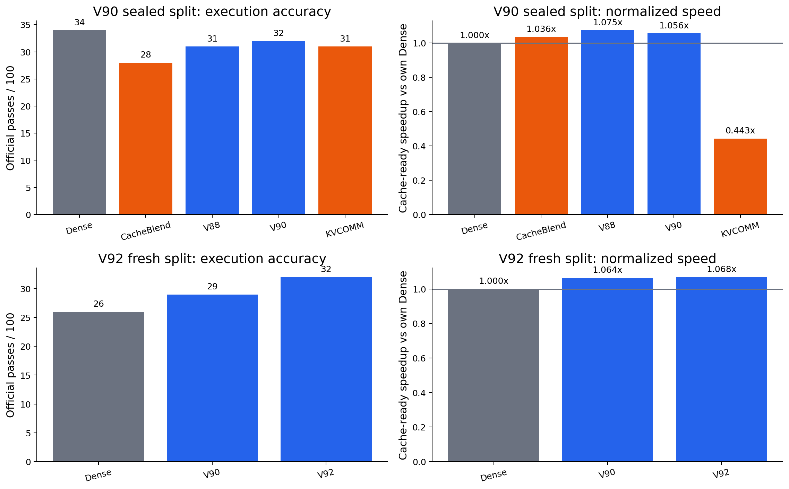

## 5. 当前最诚实的结论

项目已经完成四件可复用的工作：一个可信的 SGLang middle-span KV 搬运执行器；一个从真实 agent workflow 中获取自然 resident observation 的 KV pool；一组区分候选合法性、模型依赖和物理风险的因果实验；以及一项 244-target、exact-same-prompt 的 V40 速度验证。

项目尚未完成的是最终 selector与有辨识力的 accuracy 验证。V40 的速度不再只依赖静态 prompt：M56 在 prompt hash 完全相同、0 fallback 的条件下得到 1.103x median TTFT speedup；但 M55 fresh-13 的三臂全部 0/13，不能证明 V40 accuracy 等于或高于 General，更不能证明超过 CacheBlend/KVCOMM。当前证据也不允许声称 grounded observation 天然安全、same-file mutation 天然高风险，或 path relevance 可以单独保护 accuracy。

因此当前贡献不是一个已经定型的 V46 policy，而是一个更清楚的算法问题：

> 在版本合法、自然 resident 的 coding observation 中，先剔除 K/V contextual risk 过高的候选，再从剩余候选中选择当前任务真正依赖的路径，最后在固定 copy budget 内执行少量连续 island 的 lossy reuse。

## 6. M55 为什么停止，以及下一轮究竟要修什么

M49 已否证现有三岛 request-level risk aggregation，所以 M55 原本要比较五个单岛等复制预算方法：fixed-budget recency、path-only、probe-only、seeded random，以及 two-stage constrained selector。每个非 abstain arm 在 common case 上都只复制同一个 128-token budget，且新的 selector 不发明统一分数：

```text
eligible_i = version_valid_i and probe_risk_i <= threshold

没有 eligible candidate：Dense abstain
否则：优先 path-relevant candidate；若它风险过高，
      改选最低风险的 eligible candidate
```

冻结容量 gate 要求至少 16 case、8 tasks。fresh-13 中 path matching 产生 31 对，version guard 只删除 2 对，说明 FileVersion 不是瓶颈；剩余 29 对虽然足以选出 24 case，却集中在 `xarray-3305`、`sphinx-8120`、`django-12406`、`requests-6028`、`xarray-3095` 五题。任务数 gate 失败后，M55 在 GPU causal label 前停止。这一负结果否定的是“严格 relevant/disjoint 配对足够普遍”，而不是 M52/M53 已复现的 path-attention 关系。

因此下一轮不能调低 8-task 门槛或改变 probe threshold来救 M55。应先注册一个 capacity-first 的 utility 实验：允许对每个独立 version-valid observation 计算连续 path evidence（精确 path、同目录/调用邻域、最近 interaction 距离），先在未打开 attention/JS 的条件下证明覆盖任务数与 copy budget，再比较它与 Dense attention 的关系。只有新的 utility definition 通过独立容量和 attention gate，才恢复 risk-filtered selector；真正 multi-island composition 仍必须直接执行组合 intervention，不能用 `max(single-island risk)` 代替。

## 7. 与 prefetch 合作者如何保持可归因

当前 coding 分支只决定“哪些自然 resident KV 可以复用”，prefetch 分支只决定“已经存在的 KV 何时搬到设备”。二者共享 source identity、lease、传输和 fallback contract，但不能互相改变 selector。合并验证必须保留 `off / coding-only / prefetch-only / combined` 四臂，并分别记录 selected、copied、transferred 和 fallback token。这样才能区分速度来自少算 attention 还是提前搬运，也能把任何 accuracy 变化归因到 lossy selector，而不是 prefetch 调度。

读者如果只想了解当前进展，可以在这里停止。下面是证据附录：它保留术语、所有重要版本、撤回结论、图表数据和复现入口，作用是支持审计，而不是要求顺序阅读。

---

# 第二部分：证据附录

## 1. 阅读证据前必须统一的术语

### 1.1 Dense、exact reuse 与 lossy reuse

- **Dense**：目标请求的全部 prompt token 都按当前左上下文重新执行 prefill。
- **Exact reuse**：只在数学上等价的条件下使用旧 KV，例如相同 prefix 的 radix cache。它的适用范围窄，但不应改变输出。
- **Lossy reuse**：可见 token 可以完全相同，但旧 KV 是在旧左上下文中形成的。即使 K 做了 RoPE 位置修正，hidden state 仍可能不同，因此输出可能变化。

若重复文本为 `x`，source 与 target 的左上下文分别为 `C_s`、`C_t`：

```text
Dense target: KV_dense = TransformerKV(C_t, x)
Lossy reuse:  KV_reuse = TransformerKV(C_s, x)
```

`KV_reuse != KV_dense` 的来源不是 token 不相同，而是 `C_s != C_t`。这也是项目需要 coding-aware 风险控制的根本原因。

### 1.2 K 和 V 为什么不能混为一谈

- K 包含位置编码影响；从 source 位置搬到 target 位置时，必须按位置差做 RoPE delta 旋转。
- V 不做 RoPE 旋转，可以直接复制，但它仍然携带旧上下文形成的 hidden state。
- 后期 P17、V82 等实验把 K-only、V-only 分开，是为了判断主要伤害来自哪个通道。结果没有发现跨任务稳定的单通道主导，因此没有采用“永远只修 K”或“永远只修 V”。

### 1.3 TTFT、cache-ready 与 `N=4 incl. build`

- **TTFT**：从目标请求进入推理到生成第一个 token 的时间。
- **Cache-ready TTFT**：假设 source KV 已经存在，只测 target 在线路径。
- **`N=4 incl. build`**：把一次 source KV 构建成本平均摊到 4 次 target 复用：

```text
per_request_cost(N=4) = target_TTFT + source_build / 4
speedup = Dense_TTFT / per_request_cost
```

Cache-ready 变快不等于低复用次数的端到端系统变快。后期 V88–V92 正是在这里暴露出 source materialization 成本过高。

### 1.4 NLL 是什么，为什么后来不能再把它当 accuracy

对正确答案 token 序列 `y_1...y_T`，NLL 为：

```text
NLL = -(1/T) * Σ log p(y_t | prompt, y_<t)
```

报告中的 “NLL advantage” 通常定义为控制方法 NLL 减去候选方法 NLL，因此正数表示候选让 gold token 的平均概率更高。NLL 很适合便宜地筛选 repair 机制，但它不等于 coding agent 最终 patch 能否通过测试。P27 在 development 上 NLL 很好却在 independent split 反转，P32 后又发现多种 lossy 方法的最终功能结果差异远小于此前预想；这促使项目把 official execution accuracy 提升为主指标。

### 1.5 V、E、P 编号不是同一条编号轴

| 前缀 | 含义 | 示例 |
|---|---|---|
| `V` | 较大的算法、数据模型或策略版本 | V11 FileVersion、V40 observation island、V46 pool |
| `E` | 执行器正确性与物理机制阶段 | E2 exact middle-span server path |
| `P` | 一次有明确假设与 gate 的研究 probe | P13B、P27E、P33 |

V11 文档内部也曾使用 P0/P1/P2 表示自己的阶段，它与后来全局 P3–P33 不是同一序列。本文统一写成 `V11/P0` 以避免歧义。

### 1.6 报告中最容易误解的执行参数：`head_tokens`、tail repair、layer 与 component

早期 SGLang 实验把 prompt 切成若干可定位 segment。对长度为 `L` 的一个 segment，label 中的 `head_tokens=H` 不是“复制 H 个 token”，而是：

```text
segment = [前 H 个 token] + [后 L-H 个 token]
          └── Dense 重算 ──┘   └── 从 source 复制旧 KV ──┘

copied_tokens = L - H
```

因此三个边界值分别是：`H=L` 表示整段 Dense；`H=0` 表示整段复制；`0<H<L` 表示先重算 segment 的头部，再复制余下 body。source 与 target 的 token/hash 必须一致；搬运 K 时按 source/target 位置差做 RoPE 修正，V 直接复制。

P 系列中的 **tail repair** 使用另一种但等价的预算表达：先把一个长 reusable segment 视为旧 KV，只对它最后连续的 `r%` token 在当前 prompt 下重新执行。若还指定 layer 或 component，则只替换选中 token 的对应部分：

| 写法 | 实际 KV 动作 |
|---|---|
| `tail10, all-layer, joint` | 最后 10% token 的所有层 K 和 V 都用当前计算值替换；前 90% 保持 stale |
| `K-only` | 只替换选中位置的 K；V 保持旧值 |
| `V-only` | 只替换 V；K 保持旧值 |
| `middle12` | 只替换连续 12 层中的 K/V；其他层仍旧 |
| `tail80/code20` | 在固定总 repair 预算中，80% 给末尾连续 token，20% 给 coding selector 选中的 span |

这里的 “10%” 是 repair budget，不是复制比例。若 reusable segment 有 10,000 token，`tail10` 是约 1,000 token Dense repair、约 9,000 token 保持 stale。P 系列按 **token-layer × component** 记账，防止“一个方法修 10% 全层，另一个修 10% 但只修 V”却被误写成等成本。

后期 CacheBlend-derived 支线中的 `check_layer=24, r=.75` 又是第三种执行形态：模型先用当前 prompt 正常传播到指定检查层；在该层比较 current 与 cached K/V，并按 V-difference 选 `75%` reusable-prefix token 保留当前状态，其余 token 从该层开始继续使用 stale state。它不是“只运行第 24 层”，也不是“复制前 75% token”。

---

## 2. 证据纪律：哪些图能支持结论，哪些不能

### 2.1 证据等级

| 等级 | 定义 | 可以支持 | 不可以支持 |
|---|---|---|---|
| A | 冻结/互斥 split、相同 prompt/token hash、官方功能 evaluator、物理 reuse ledger | 当前协议下的 accuracy 与 speed 点估计 | 未达显著性时的总体 SOTA 断言 |
| B | 相同输入的静态 mechanism test 或小型冻结 canary | executor、机会、TTFT 形状、局部 preservation | population accuracy |
| C | NLL、JS、teacher top-1、next-line exact/similarity、offline replay | 动机、筛选、因果诊断 | 最终 coding task accuracy |
| X | 已发现 runtime/schema/prompt mismatch 的结果 | 说明为什么必须重做实验 | 任何正向 headline |

### 2.2 已撤回或降级的旧结论

| 旧说法 | 问题 | 修正后证据 | 处理 |
|---|---|---|---|
| Uniform head 30% 可有约 31.2% 收益 | body offset、RoPE 与 zero-gap 等 runtime 错误 | 修正后约 1.86% | X：撤回 |
| 早期 AST/chunker 7/10–13 有效 | runtime invalid；launcher 还包含字面 `\\n` | 无可用 task claim | X：撤回 |
| HumanEval TaskCone V1 成立 | 错 body offset、head-only RoPE、zero KV gap | policy 证据整体无效 | X：撤回 |
| V10 容量 32.66% / 32.94% | schema 把后续 user observation 误作 immutable issue | 9.12% / 9.59% | 只采用修正值 |
| V11 “P0 PASS” | 过期 partial verdict | 两个 coding-specific gate 都失败 | 改为 `P0 FALSIFIED` |
| V12 JS 低等于 accuracy 保留 | proxy 外推 | 4,639 配置没有容量/伤害共同可行点 | 不声称 accuracy |
| 225 题表可直接比较 Dense/Task/KVCOMM/CacheBlend | 后来确认各方法 prompt/引擎不完全一致 | 只保留历史 within-lane 诊断 | 不作 SOTA 排名 |
| Grounded tool observation 天然比 reasoning 安全 | V40 motivation 只证明容量/provenance，未测物理 splice harm | M50 仅 10/20 对 grounded JS 更低 | 降级为候选定义，不作安全证明 |
| Same-file mutation 可直接预测更大 KV 误差 | 把语义 stale 与 contextual K/V drift 混为一谈 | M51 mutation 仅 8/18 对 JS 更高，调整比 0.819 | 版本 guard 保留；风险断言撤回 |
| Path overlap 应触发 Dense 保护 | higher attention 不等于 higher splice harm | M52/M53 attention 复现，JS 方向不一致 | path 只作 dependency/utility |
| `path_weight × probe_drift` 是更好的统一风险分数 | 把效用和风险强行压成一个轴 | M54 Spearman 0.477 < probe-only 0.506 | 不进 SGLang |

这一步不是“清除不喜欢的数据”，而是项目技术演进的第一个关键节点：如果不先撤回机械错误和协议错配，后续每一次优化都会在追逐不存在的目标。

---

## 3. 整体演进图：两条支线最终重新汇合

```mermaid
flowchart LR
    A[早期 TaskCone / ASTSpan] -->|runtime 与 fragmentation 反证| B[V9–V12 workflow / file-version]
    B -->|容量可行但风险信号失败| C[E0–E3A 正确执行器]
    C --> D[P3–P26 静态 AST / symbol repair]
    D -->|oracle ceiling 很低| E[P27 完整 capsule]
    E -->|independent split 反转| F[P30–P33 指标与 selector 审计]
    F --> G[真实 coding-agent bridge]
    G --> H[V40 grounded observation island]

    H --> I[V45 target-time file-version guard]
    I --> J[V46 bounded observation pool / multi-island]
    J -->|速度提升、preservation 失败| K[M47–M54 因果动机审计]
    K -->|path dependency 成立；单轴 risk 规则失败| P[M55 capacity / accuracy 审计]
    P -->|strict pair 覆盖不足；fresh accuracy 全零| Q[M56 同提示速度回放]
    Q -->|V40 speed 成立；accuracy 尚未识别| O[当前 SGLang 主线：先扩 utility coverage，再做 risk-filtered selector]

    H --> L[V41–V73 统一 prompt 的 CacheBlend-derived probes]
    L --> M[V75–V84 延迟压缩与角色因果]
    M --> N[V85–V92 task route + online K/V risk]
    N -->|点估计好；novelty、build cost、SGLang 形态不合格| O
```

两条支线的职责不同：

- **SGLang-native 主线**研究“真实 coding agent 的哪些历史 observation 可以成为自然 resident 的 KV source”，主要创新在 provenance、版本、生命周期和多 observation 执行。
- **CacheBlend-derived 受控支线**研究“在完全相同 prompt/token 下，什么时候、在哪一层、以多大比例修复 stale hidden state 更安全”，主要用于公平实验和机制因果分析。

V92 不是 V46 的后继版本，也不是当前 SGLang 分支的算法。它是重要证据，但不是最终架构。

---

## 4. 第一阶段：先证明旧路线为什么不可信或不够快

### 4.1 TaskFix：先问“给出目标位置是否就够了”

TaskFix 是构造型定位实验，不是一套长期保留的 serving 算法。它生成成对 coding prompt，使两题表面结构接近但真正需要处理的位置不同，然后检查 task-aware 规则能否把 repair 预算放到不同位置。Oracle-localized Dense 更进一步：直接把正确位置告诉执行器并将该局部 Dense 化，用来给“定位正确即可恢复输出”这个假设做上界测试。

结果中 Oracle-localized Dense 为 0/13，说明即使位置由 oracle 给出，局部重算也没有恢复所需的全局因果状态。因此 TaskFix 的作用是排除一个假设，而不是产出一个可部署版本。

### 4.2 TaskCone：目标函数 Dense，其他完整文件块尽量复制

> 直观执行例见正文 3.1；本节保留冻结算法和实验数字。

TaskCone V2 为每道 HumanEval 题构造约 12K token 的 workspace：一个 target function 加许多 distractor function/file slot。warm request 先对完整 workspace 做 Dense prefill；target request 插入“只实现目标函数”的指令，但各 source slot 本身保持 token-identical。算法把每个完整 slot 当作一个单元：

```text
for slot in workspace:
    if slot == target_file:
        head_tokens = slot_length          # 目标整段 Dense
    else:
        head_tokens = round(p * slot_length)
        # 重算 distractor 头部 p%，复制后面 1-p%
```

其中 `PX` 取 `p=0`：目标 Dense，所有 distractor 在原位置整段复制；`P20/P40/P60/P80` 分别对每个 distractor 重算前 20%/40%/60%/80%。Uniform 与 Shuffled control 保持每题完全相同的整数 repair budget，只改变预算落点。L2 又加入等长 reserved envelope，使 warm/target 的 source slot 起止位置、总 token 数和 target slot 位置都严格一致，排除 prompt shape 混杂。

一个直观例子是：workspace 含 64 个旧函数，问题只要求补 `parse_config`。TaskCone 会 Dense 重算 `parse_config` 所在 target slot，复制其余 63 个 distractor slot；它并不会解析 `parse_config` 内部哪条分支重要。算法真正利用的 coding 信息只有 **任务指定了哪个完整函数/文件**。

| 实验 | 动机 | 结果 | 决策 |
|---|---|---:|---|
| TaskFix V5 | 构造能区分 task-aware 策略的配对集 | balanced accuracy 55%；仅 1/10 pair-correct | 放弃该构造 |
| TaskFix V6 R2 | 检查回归安全性 | 2/20 regression-safe | discovery fail |
| TaskFix V7 | 扩大可行任务数 | 最大可行 23，门槛 24 | 不开 GPU 正式阶段 |
| Oracle-localized Dense | 给正确位置后是否足够 | 0/13 | “知道位置”不是答案 |
| TaskCone V2 P80 | 目标函数附近分配 KV | 10.49% 更慢 | 放弃性能主张 |
| TaskCone L2 | 修正执行器后重测 | 30/30 tests；82.67%，2 个 completion SHA 改变 | strict identity gate 失败 |

**保留的经验：** task metadata 可以用于检索或 guard。

**放弃的技术：** 把“目标函数附近”直接等同为“安全复用/优先重算区域”。

### 4.3 ASTSpanKV：算法究竟怎样工作

> 正文 3.1 用同一个 `parse_config` 例子比较 TaskCone、ASTSpanKV 与 AST-IslandKV；本节进一步给出真实 label 规则和 matched control。

ASTSpanKV 不是“按 AST 复制完整函数”，也不是“只重算函数签名”。它对 **每个 Python source slot 的全文** 做 token-level 二值切分：控制流相关 token 为 `critical`，其余为 `stable`。切分结果必须覆盖全文、互不重叠、没有空洞。

#### 4.3.1 从源码到 critical/stable region

Python stdlib `ast` 解析器遍历以下 node：`If`、`For`、`While`、`With`、`Try`、`Return`、`Raise`、`Yield`、`Assert`、`Break`、`Continue`、`Pass`。与这些 node byte range 相交的 token 标为 critical，其余标为 stable。实现随后做两次边界修正：

1. 少于 5 token 的 critical run 扩展到包含它的最小完整 statement；
2. 少于 5 token 的 stable run 合并到相邻 run；若 Python parse 失败，整个 source 保守地变成一个 stable region。

这里最后一条不是安全 fallback：parse 失败被标为 stable，意味着它可能整体进入 copy 候选；这也是该早期 Python-only labeler 的一个局限，后续 FileVersion 路线改为无法解析就 fail closed。

以 distractor 函数为例：

```python
def parse(x):                 # stable run -> copy
    if x is None:             # critical run -> Dense
        raise ValueError()    # critical run -> Dense
    y = normalize(x)          # stable run -> copy
    return y                  # critical run -> Dense
```

实际 run 边界由 tokenizer offset 和“最小完整 statement”扩展共同决定，不保证逐行切开；上例只是帮助阅读。若这恰好是当前题目的 target slot，那么无论内部标签如何，整个 target slot 都强制 Dense。

#### 4.3.2 label 与运行时 KV 动作

```text
for region in all_source_regions:
    if region belongs to target slot:
        head_tokens = region.length     # target 全 Dense
    elif region overlaps control flow:
        head_tokens = region.length     # critical 全 Dense
    else:
        head_tokens = 0                 # stable 全量复制旧 K/V
```

target 请求左到右执行，因此一个 distractor 可能变成：

```text
Dense prompt gap
  -> copy stable run
  -> Dense if/raise run
  -> copy stable run
  -> Dense return run
  -> ...
  -> Dense target function与输出尾部
```

被复制 region 的 token 序列必须与 warm source 精确一致；K 按新位置做 full-RoPE delta，V 复制。AST 只决定 Dense/copy 边界，不修改 prompt，不预测未来，也不缩短可见上下文。

#### 4.3.3 matched controls 为什么是公平的

Target function 在 ASTSpan、Uniform、Shuffled 三臂中都固定 Dense，只随机化 distractor。三臂拥有相同 eligible region set 与完全相同的整数 Dense/recompute token budget：

- **ASTSpan**：critical Dense，stable copy；
- **Uniform**：把相同 Dense budget 均匀放到同一批 region；
- **Shuffled**：用固定 seed 1729 打乱 budget 落点。

因此实验回答的是“AST critical 标签是否比等成本位置更好”，而不是“ASTSpan 是否因为多算了 token 才更准”。

#### 4.3.4 为什么它失败

官方 HumanEval Dense 为 134/164。校准子集上 Dense / Uniform / ASTSpan / Shuffled 为 32/30/31/30，ASTSpan 对 Dense 造成 1/32 回归；配对中位 TTFT 不是变快，而是 **-74.29% improvement**，即显著变慢。每个请求中位有 66.5 个 Dense/copy stage，固定调度开销压过了少算 attention 的收益。

**采用：** AST 继续作为代码边界与检索索引。

**放弃：** 大量小 AST island 直接进入运行时。

### 4.4 AST-IslandKV：只复制最大的 B 个 stable island

AST-IslandKV 直接继承冻结的 ASTSpan region，不重新解析或改变标签。它只从 distractor 的 stable region 中按 `长度降序 -> slot/signature/index` 选最大的 `B∈{2,4,8,16}` 个，整段复制；target、所有 critical region、未选 stable region 全部 Dense。于是执行 stage 的理论上限约为 `B+2`，而不再随全部 AST run 数增长。

Uniform control 选择 B 个最大 eligible region，不看 critical/stable，再用 largest-remainder 算法把 treatment 的精确 copy-token budget 分配进去；Shuffled control 固定 seed 随机选 B 个，并在容量不足时确定性替换。三臂严格匹配 copied token 与 island 数。

B2/B4/B8/B16 均保持 8/8 功能输出；最快 B8 仍比 Dense 慢 5.04%。

**采用：** “少量、连续、受界 island”成为后续 executor 设计约束。

**放弃：** 仅靠合并 AST island 就能形成速度赢家的假设。

---

## 5. 第二阶段：V9–V12 从 prompt 模块走向文件版本与模型状态

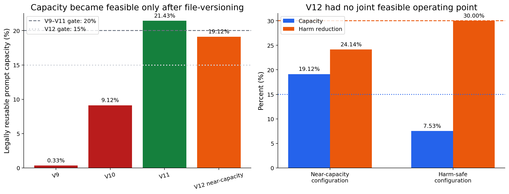

### 5.0 四个版本共享什么，又分别新增什么

> 正文 3.2 逐步展示同一次 read、write、target 如何被 V9、V10、V11 和 V12 分别处理。

V9–V12 不再把“代码 token”当唯一对象，而把一次 coding workflow 渲染成有类型、有身份、有位置的 module 序列。共享执行流程是：

```text
在线 prompt/event
  -> 划分 module 并计算 content/token hash
  -> 删除 exact-prefix baseline、当前 turn、目标附近与身份不一致项
  -> 把相邻候选合成自然 island
  -> 用 measured cost model 排序，最多选 4 个 island
  -> 输出每个 module 的 Dense/copy label
  -> 与 exact-token/exact-island matched controls 比较
```

四版真正的递进在“候选是否合法、如何估计风险”，不是 KV kernel 每次重写：

| 版本 | prompt 表示 | 候选合法性 | 风险/排序 | 最终 KV 动作 |
|---|---|---|---|---|
| V9 WorkflowModuleKV | system、tool schema、issue、tests、source、tool output、target 等 typed module | warm/target content 相同且两侧都 immutable；非 exact-prefix；离 generation target 至少 2 条 graph edge | module 长度与 residency 的 cost-positive；最多 4 个自然 island | 选中 module 整段 copy，其余 Dense |
| V10 SessionGraphKV | 同 session 的 event module；带 first-seen turn、workspace version、cache scope、dependencies | 同 session、token slice 精确、已在更早 turn 出现、非 current observation、非 turn-local、workspace version 一致 | graph distance + cost；最多 4 island | 同 V9 |
| V11 FileVersion | V10 module + canonical raw tool mutation provenance + source-view paths | 普通 workspace module 仍要求版本相同；source view 即使全局 version 变了，只要其路径未被后续写入也可复用；路径不明 fail closed | 仍按 cost-positive island 排序 | 同 V9/V10 |
| V12 ProbeHead | 只继承 V11 合法候选 | 先 Dense 重算每个候选前 `H∈{8,16,32,64}` token | 对 probe head 计算 shifted-K 与 current-K、old-V 与 current-V cosine deviation，取两者最大值；低于阈值才复制 body | probe head Dense，候选余下 body copy；高风险候选整段 Dense |

这张表也解释了一个重要边界：V11 解决的是 **文件版本合法性**，V12 才尝试解决 **旧 contextual state 是否接近当前状态**；二者不是同一个问题。

### 5.1 V9 WorkflowModuleKV：概念合理，真实容量只有 0.33%

V9 的模块包括 system policy、tool schema、role instruction、task spec、acceptance tests、failure trace、repository map、source code、static tool output、prior agent message、candidate patch、target stub 与 output contract。它先用 producer/consumer、path/symbol mention 建有向信息流图，再从 target stub 反向算最短距离。只有 warm/target 文本 hash 相同、两侧标为 immutable、位于第一次 prompt mismatch 之后、距离 target 至少 2、长度大于 4 且成本为正的 module 才能整段复制。真实 prompt 中最终符合这些条件的稳定非代码模块占比中位数仅 0.33%，远低于 20% 门槛，因此不值得进入 GPU 质量阶段。

**为何采用模块审计：** 它第一次把“哪里重复”变成可测容量。

**为何放弃 V9 策略：** 即使完全安全也没有足够 token 支撑 TTFT 收益。

### 5.2 V10 SessionGraphKV：图依赖合理，但 schema 修正后容量崩塌

V10 把一次真实 session 的 system/user/assistant/tool/source-view/workspace-edit/test-output/target 事件变为 module。每个 module 记录 `first_seen_turn`、`producer_turn`、`workspace_version`、`cache_scope∈{session,workspace,turn}` 与 dependency。planner 对相邻两轮请求逐 module 对齐：exact prefix 交给普通 radix cache；turn-local、当前最新 observation、graph distance <2、新出现、token slice 不同或 workspace version 过期的 module 全部 Dense；剩余相邻候选组成最多 4 个 cost-positive island。早期 32.66% / 32.94% 是 schema 错误；修正后合法 non-prefix 仅 9.12%，cost-positive 9.59%，分别低于 20% / 15% gate。

**采用：** session 内 provenance 和 dependency guard。

**放弃：** 将跨轮 user observation 视为 immutable 的数据模型。

### 5.3 V11 FileVersion SessionGraphKV：容量问题被解决，风险预测仍失败

V11 的关键改动只作用于 `source_view`：它从 raw tool event 提取 canonical read path 与后续 write path。若 source view 在事件 `e_i` 观察了 `a.py`，之后即使 workspace global version 增加，只要 `e_{i+1...t}` 没有写 `a.py`，旧 view 仍视为当前文件版本；若发生路径 overlap，则拒绝；若 write-like event 无法定位路径，则全局 fail closed。普通 workspace module 仍要求 workspace version 完全相同。64 sessions / 192 requests 上：

- reusable capacity 中位数 21.43%；cost-positive 21.43%；
- 后续至少两轮有复用机会的 session 为 100%；
- 中位 4 个 island；稳定 token 206,378；强制 Dense 的 unresolved token 510。

这证明 file-version scope 值得保留。随后 causal atlas 有 32 sessions、8 种 disturbance、4,960 exact rows，lookup p95 仅 0.04795 ms；但用于预测伤害的 workflow delta-R² 只有 0.02467，95% CI `[0.01062, 0.04697]`，低于 0.05 gate；safe-vs-unsafe harm reduction 甚至为 -119.711%。

**采用：** FileVersion 合法性与 fail-closed 语义。

**放弃：** 用静态 workflow feature 给候选排序并声称低伤害。

### 5.4 V12 ProbeHead：动态 K/V probe 仍没有容量—安全共同可行点

V12 不扩展 V11 scope。对每个候选 module，它先在 target prefix 下 Dense 计算最前面的 H 个 token，同时从 source cache 取同一 H 个 token：source K 先按位置差做 RoPE shift，再与 target K 比 cosine deviation；V 直接与 target V 比。`score=max(K_deviation,V_deviation)`。若 score 低于冻结阈值、复制 body 的 cost 为正且不会超过 4-island 上限，则保留 probe head 的 Dense KV、复制余下 body；否则把 body 也 Dense。候选按 target token 顺序在线决定，避免未来信息。32 个 development session、96 个 later request、1,196 个候选模块产生 4,784 observations 和 4,639 个配置；可行配置为 0。

- 近容量配置：19.12% capacity，但 harm reduction 24.14%，未达 30%。
- 满足至少 30% harm reduction 的配置：capacity 最大 7.53%，未达 15%。

**采用：** 模型状态应参与 risk 判断，而不是只看静态文本。

**放弃：** 单一 head deviation threshold 作为在线 selector；也不把 teacher top-1/JS 当最终 accuracy。

---

## 6. 第三阶段：E0–E3A 先把执行器变成可信测量工具

在研究 coding selector 前，必须排除“搬错 token、K 没转对、V 少搬、repair 预算不等价、fallback 掩盖 treatment”等机械错误。

E2 的受控 server 结果：

| 指标 | 结果 |
|---|---:|
| Observations | 120 |
| Completion identity | 120/120 |
| 最大 output-logprob 绝对差 | 0 |
| Fallback | 0 |
| Allocator / lease growth | 0 |
| Exact p95 round makespan / Dense | 0.82265 |
| `mean(Dense - exact)` bootstrap 95% 下界 | 1086.11 ms |

由此采用的 runtime 基础是：

1. exact token/hash/position ledger；
2. K 做 shifted RoPE，V 对应复制；
3. Dense gap 与 copy/repair stage 可交替；
4. source handle、generation、lease、dtype、模型身份全部校验；
5. 任何不一致 fail closed。

E0–E3A 的意义不是最终算法，而是让后面的负结果可以归因到策略，而不是 executor bug。

紧接着的 V13R2 task-repair executor 又补了 joint K/V repair 与 fused budget 的物理账本。100% repair 的 2-case identity canary 达到 output identity 1.0、max logprob diff 0、copy/repair ratio 1.0、0 fallback；但它比 Dense 慢 53.61%，fused 版本仍慢 44.35%。P1 的 5%–20% task/random/tail sweep 也大多慢 18%–22%，N=4 更慢 42%–46%。因此 **采用 fused、可分通道、可计 token-layer 的 repair 能力作为实验仪器；放弃把早期 host-driven repair 路径当速度方案。** 后面的 P 系列才在更合理的 online executor 上继续比较 selector。

---

## 7. 第四阶段：P3–P26 系统否定“静态 coding 位置就是 repair truth”

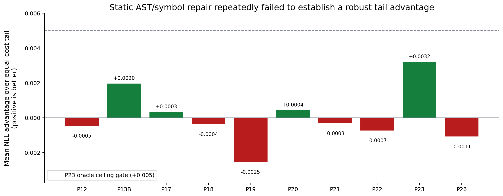

图中正值表示 gold-token NLL 优于等成本 tail。多数值在零附近波动，P23 甚至使用五种 rank 中每题最好的 oracle 仍未过 `+0.005` ceiling gate。这说明失败不只是 selector 没训练好，而是这个候选空间本身的上限很低。

### 7.0 P 系列共享的底座与逐版本算法字典

P3–P26 不是 24 个独立推理引擎。它们共享同一个长 repository segment、同一个 source cache、同一个目标 prompt 和同一个 sparse repair executor，只改变三件事：**选哪些 token、修哪些 layer/component、是否对整请求准入**。除特别注明外，未选 token 的 K/V 都从旧 source 复制，选中 token 在当前 prefix 下联合重算所有层 K/V，最后与等 token-layer 成本的 continuous tail control 比 gold NLL。

下面用一个贯穿例子解释。任务说：“缺失 include 时，`parse_config` 应抛 `MissingIncludeError`。”长 segment 中依次出现 issue、test、`parse_config`、`load_include`、error class、几十个无关文件和末尾工具摘要。`tail10` 不理解任务，直接修最后 10%；coding 方法则尝试把相同预算转移到 parser/loader/error 等位置。

| 实验 | selector 怎样选 token | repair / route 怎样执行 | 该版本真正检验的假设 |
|---|---|---|---|
| P3 structural multi-span | AST 签名、branch、`raise` 等结构锚点附近的多个短 span | 所选 span 全层 joint K/V，其余 copy | 多个语法关键点是否优于连续 tail |
| P4 tail-first swap | 先建立完整 tail budget，再把少量 tail token 等量交换到高置信结构 span | 总 token-layer 不变 | 保留 positional prior 后，coding token 是否有正边际价值 |
| P5 query/symbol | 从 issue/query 解析被点名 symbol，在其源码邻域放 repair | 5% code repair 对 5% tail | task mention 是否比通用 AST 更接近 repair truth |
| P6 explicit-symbol `s90-k1` | 在 oracle 构造集上明确给出一个 symbol，90% 固定预算围绕它 | 大块单-symbol repair；另测在线 resolver precision | “如果 symbol 选对”这一上界是否足够，以及在线能否找到它 |
| P7 issue-only | 只从 issue 抽 path、qualified name、identifier | offline top candidate；低 coverage/precision 时不开 GPU | 不看 test/patch，仅 issue 能否定位 |
| P8 failing-test guided | failing-test AST + issue + path lexical evidence，最多 3 个函数 | offline retrieval；达 gate 才生成 GPU spans | 测试证据能否把 changed function 放进 top-3 |
| P9 bounded static slice | 读取 base commit 已存在的 failing test，做两跳 import/call slice | 只在真实在线可见 test 上构图 | 静态依赖图能否替代慢且不准的 lexical retrieval |
| P10 import hybrid | 四路径 import frontier + P8 fallback + `path:line` traceback anchor | top-3 function selection | module-level import 是否能跨 repo 泛化 |
| P11/P11B multi-symbol | 不强求唯一函数，允许 changed path 与多个 symbol；GPU 最多 6 span | 六个 code span 全层 joint repair，对等成本 tail | 真实 patch 跨 symbol 是否是此前失败原因 |
| P12 raw rank-5 | 不做 path-diverse 去重，直接保留 retrieval raw top-5 | 五个 span 的同预算 repair；另与 random placement 比 | coding ranking 是否至少强于随机，以及是否强于 tail |
| P13/P13B tail80/code20 | 总 repair budget 的 80% 给 continuous tail，20% 给 P12 code spans | 同一请求中 code+tail 联合 repair | coding 作为 tail 的小比例补充能否带来正增益 |
| P14 shallow-wide tail | 扩大 tail token 覆盖，但只修 14 层或 7 层，使 token-layer 等于 full-layer tail | K/V joint，仅层范围变浅 | repair 应否“修更多 token、每个 token 修更少层” |
| P15/P15B drift router | 在 revealed Dense/cache 对中测局部 hidden/KV drift，预测 code 或 tail 哪个更好 | 每题在 code/tail arm 间路由 | 表示偏差大小能否预测 downstream NLL 收益 |
| P16 causal-output | 对候选位置做揭示态扰动，测该位置变化对 output distribution 的影响 | 按 output sensitivity 预测 code-vs-tail | 比局部 drift 更因果的 proxy 是否能选 treatment |
| P17 K/V split | token span 沿用 coding/tail，分别只替换 K 或只替换 V | component ledger 单独计费；其余 component stale | 伤害是否稳定集中在一个 KV 通道 |
| P18 middle-layer commit | coding span 扩大，但只在 P15 指出的中层 band 替换 K/V | token-layer 与 tail 匹配 | 中层是否是 coding state 的高性价比提交点 |
| P19 identifier lattice | 从 issue 抽 identifier，在源码中选首次/末次出现，形成分散 lattice | 多 anchor 全层 repair | 明确 task identifier 是否比 symbol neighborhood 更可靠 |
| P20 additive insurance | 完整保留 `tail5`，额外加入 `code1`；control 为 `tail6` | 预算是 6%，不再从 tail 中扣 code | coding 失败是否只是因为它挤占了 tail 预算 |
| P21 syntax relay | 从 code anchor 到 segment 末尾，选换行/语法 checkpoint 作稀疏 relay | code/relay 多点全层 repair，对 tail6 | 少量中继点能否让新 coding state 传播到输出 |
| P22 contiguous symbol island | 选一个连续 5% symbol-section island，再加 tail5 | 与 continuous tail10 等成本 | 失败是否仅由 code span 太碎造成 |
| P23 rank1–rank5 oracle | 分别运行五个等成本 symbol-rank arm，事后按每题 gold NLL 取最好 | 这是不可在线部署的 upper-bound oracle | 即使完美知道该选哪个 rank，这个动作族上限是否够高 |
| P24 model-free admission | 用候选 path 集中度等答案盲 task feature 预测 tail5 高风险 | 高风险 Dense/少复用，低风险沿用 reuse；先做 offline AUROC/BA | 不能改好 placement 时，能否至少避开危险请求 |
| P25 dual-view disagreement | 分别从 tail-repaired 与 coding-repaired state 生成两个确定性 8-token continuation | 若两 view 分歧则判高风险；probe decode 成本完整计入 | 短在线分歧能否代替 teacher-forced NLL 风险 |
| P26/P26R continuous shallow bridge | 从 frozen rank-1 code island 一直覆盖到 reusable segment 末尾 | 连续 token bridge 只修 centered middle-layer band；按 base-depth/depth+1 token-disjoint 分区精确配平 tail10 | coding state 与输出间的 stale gap 是否是根因 |

上表中的 **repair** 不是重新生成文字，也不是把重算后的 token 插入 prompt。可见 prompt 始终不变；变化的是这些 token 在指定层的 K/V 是否由当前 prefix 重新形成。

### 7.1 逐步决策账本

| 实验 | 新技术 / 假设 | 关键结果 | 采用 / 放弃 |
|---|---|---|---|
| P3 | 多个结构 span | 未胜 control | 放弃结构分散 repair |
| P4 | tail-first 后交换结构 span | 未胜 full tail | 放弃简单交换 |
| P5 | query/symbol repair | 13/17 wins，均值 `+0.01110`，低于 `+0.02` gate | 保留 query 信号；不晋级 |
| P6 | 显式 symbol | dev `+0.00856`、18/25 wins；fresh precision 0.75/0.8824 < 0.90 | 放弃低精度 mapping |
| P7 | issue-only online selector | coverage 0.2698；precision 0.1765 | 立即停止 |
| P8 | failing-test guided | coverage 0.9683；recall@3 0.4918；p95 66.15s | 质量与规划延迟均失败 |
| P9 | static slice | 10/63 eligible；recall@3 0.30 | 放弃 |
| P10 | import hybrid | dev recall 0.5714；fresh 0.04 | 独立集推翻 |
| P11B | 6-span multi-symbol | prefill -48.44%；对 tail `-0.00020`、3/8 | 速度真实，质量失败 |
| P12 | raw rank5 | 对 random `+0.00343`；对 tail `-0.00046`、3/8 | 得出“coding > random < tail” |
| P13B | tail80/code20 | prefill -54.02%；对 tail `+0.00197`、4/8 | 混合略好但不过 gate |
| P14 | wider shallow tail | 14-layer `-0.00019`；7-layer `-0.00142` | 浅层扩散不成立 |
| P15/P15B | drift router | validation `-0.00087`、3/8 | dev correlation 不泛化 |
| P16 | causal-output proxy | 4/14 direction；Spearman -0.3582 | 代理方向错误 |
| P17 | K-only / V-only | `-0.00051` / `+0.00033` vs tail | 无稳定通道主导 |
| P18 | middle-layer code repair | 对 code `+0.00074`；对 tail `-0.00037` | 仍未胜强控制 |
| P19 | identifier lattice | `-0.00254`、6/16、1 severe | identifier 不是 repair truth |
| P20 | additive code insurance | `+0.00043`、7/16 | 效果过小，offline stop |
| P21 | syntax relay | `-0.00032`、2/8 | 因果传播假设失败 |
| P22 | contiguous symbol island | `-0.00073`、1/8 | 失败不只是 span 太碎 |
| P23 | 五 rank oracle ceiling | `+0.00321`、4/8，低于 0.005 gate | 关闭该候选家族 |
| P24 | task admission classifier | balanced accuracy 0.633 < 0.700 | 不足以安全路由 |
| P25S | dual-view risk | 8/8 输出相同；AUROC/BA 0.5 | proxy 无信息 |
| P26R | continuous shallow bridge | `-0.001073`、1/8、3 ties | 浅层连接不能补救 |

### 7.2 为什么“直接重算函数签名”在因果上不成立

函数签名适合帮助找到完整函数，却通常不是输出所需状态的唯一来源：真正信息可能在函数体分支、调用者、测试断言、异常定义和最近工具结果中。只更新签名会留下两类旧状态：签名后的 copied 函数体仍由旧签名形成，后面的 tail 也没有重新吸收新的函数体语义。P19、P22、P26 逐步扩大 repair 单元仍失败，证明问题不是再把签名窗口放宽一点即可解决。

因此 AST / symbol 最终只被保留为 **索引与封装边界**，不再直接代表 KV repair truth。

---

## 8. 第五阶段：P27 把“上下文选择错误”与“stale KV 错误”拆开

> 正文 3.3 用固定 20% repair budget 对比 tail、AST 与 function capsule；本节保留 P27 的正式因果分解。

P27 不再在完整 repository block 内挑零散 AST token，而是先把 repository 建成 symbol index。在线 query/failing-test 只负责检索最多 6 个完整函数；每个 **capsule** 是自描述文本单元：

```text
# path: config/parser.py
# qualname: parse_config
def parse_config(...):
    ...完整函数体...
```

多个 capsule 按冻结顺序串成一个 shared package。source request 对这个 package 做一次 Dense materialization；target prompt 中保留同样 package 文本，但左上下文不同，于是复制得到的仍是 lossy K/V。target 再对 package 最后的 `r∈{10%,15%,20%,30%}` token 做全层 joint tail repair，前 `1-r` 保持 stale。P27A 使用 `ceil(rL)` 触碰冻结上限而机械停止，P27B 后改为 `floor(rL)`；这只是预算正确性修复，不改变科学假设。

需要强调：P27 的“完整函数”是 **上下文表示/检索单元**，不是说完整函数全部 Dense。选中的完整文本先作为旧 KV package 复用，只有 package 尾部按比例 repair。它做三个因果对照：

```text
Full Dense -> Capsule Dense:  删除其他上下文是否安全？
Capsule Dense -> Capsule Reuse: 相同 capsule 改用 stale KV 损失多少？
Full Tail -> Capsule Reuse:  最终 pipeline 是否更优？
```

也可以写成如下分解：

```text
总 pipeline 差异
  = selector/context effect（Full Dense -> Capsule Dense）
  + lossy-state effect（Capsule Dense -> Capsule Reuse）
```

这正是 P27 比 P3–P26 更有价值的地方：当最终结果反转时，可以判断是“删错上下文”还是“KV 搬运/repair 不够”。

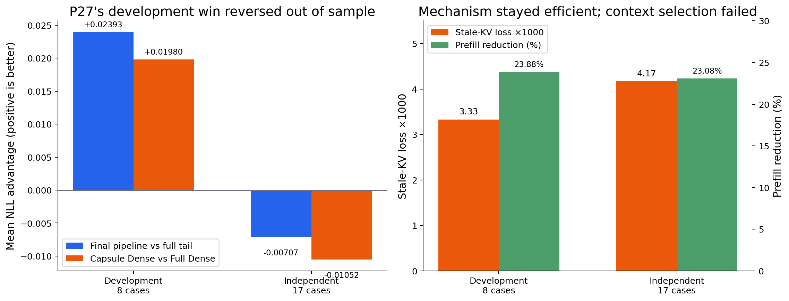

### 8.1 Development 为什么一度看起来成功

P27C 20% repair 在 8-case development 上：

- pipeline vs full tail：`+0.02393`；
- 7/8 wins；
- stale-KV loss：0.00333；
- cache-ready prefill reduction：23.88%；
- 成为第一个通过 development 组合 gate 的配置。

### 8.2 为什么最终放弃 capsule-only pipeline

独立 P27E 17-case：

- pipeline vs full tail 反转到 `-0.00707`；
- 5/17 wins，3 severe losses；
- prefill reduction 仍为 23.08%；
- stale-KV loss 仍为 0.00417，平均机制误差并未崩溃；
- 真正反转的是 Capsule Dense vs Full Dense：development `+0.01980`，independent `-0.01052`。

这给出清晰因果结论：**主要失败不是 KV kernel，也不是 20% repair 太少，而是“命中路径/函数”不能保证所选上下文足够完成任务。**

**采用：** 以后任何减少上下文的 selector，都必须先用 reduced-context Dense control 证明上下文充分。

**放弃：** function-only capsule 作为通用 pipeline；也停止继续调 P13/P17/P23 一类静态阈值。

---

## 9. 第六阶段：P30–P33 修正速度、accuracy 与 selector 归因

### 9.1 P30：真实速度形状与 source build 成本

| Prompt 长度 | Dense TTFT | Copy-only | Task method |
|---:|---:|---:|---:|
| 2K | 112.48 ms | 102.25 ms | 103.42 ms |
| 4K | 247.18 ms | 112.45 ms | 113.98 ms |
| 8K | 640.37 ms | 132.69 ms | 154.22 ms |

Copy-only 是执行器上限，不是最终 coding 算法；它仍复制旧上下文 KV，并非 exact reuse。Task method 的简单平均 TTFT saving 为 46.20%，copy-only 为 47.77%。但 source build 约 330.67 ms：task 在 N=1 为 -35.96%，N=2 才 +13.64%，N=4 为 +38.44%。从此报告必须同时给 cache-ready 与 build-inclusive。

### 9.2 P32：此前“精度损失很大”的许多判断并不成立

100 个 function-task 的同一研究 lane 中，Dense 71、copy-only 71、tail 70、task-contiguous 73、task-sparse 72、tail60/code40 72、K-only 72、bridge 71、syntax 69、identifier 68。Lossy perturbation 并不必然造成巨大最终 accuracy drop。

但 KVCOMM 73、CacheBlend 75 的旧横向数字后来发现 prompt/engine 不完全匹配，因此只能保留为历史参考，不能作为正式 SOTA 排名。这个协议问题直接推动了后来的固定 prompt/token-hash 基准。

### 9.3 P33：hybrid 会排序，但 coding-specific 归因失败

64 个 calibration cases、5-fold：

| Selector | Mean NDCG |
|---|---:|
| Hybrid | 0.8504 |
| Coding | 0.8470 |
| Drift | 0.8331 |
| Position | 0.8330 |

Hybrid 显著胜 position（`+0.01744`, CI `[0.00517, 0.02964]`）与 source drift（`+0.01768`, CI `[0.00618, 0.02864]`），却未显著胜 coding-only（`+0.00394`, CI `[-0.00582, 0.01294]`），所以预注册“胜所有 ablation” gate 失败。semantic-tail 在 1%–5% 预算上的效应也都接近零且 CI 穿零。

**采用：** target-time utility 才是应预测对象；必须做特征 ablation。

**放弃：** 以 semantic relevance 或 source drift 自身为因果解释。

---

## 10. 第七阶段：进入真实 multi-agent trajectory，形成 V40

这里的 V13–V40 是 7 月 27–28 日形成的 **从函数控制过渡到 agent trajectory 的版本线**，不要与更早的 V13R2 task-repair executor 混淆。V13–V16 仍用固定函数 prompt 做边界与行为 probe；V17 才引入 repository version graph，V18 以后进入冻结或在线 agent trajectory。核心问题由“函数 prompt 内修哪些 token”逐步变成“在真实 agent 轨迹的哪种状态下应复用、应缩短、或应 abstain”。

### 10.0 这条版本线到底改变了什么

> 正文 3.4 使用 O1/O2/O3、mutation 和 test failure 的连续轨迹解释各类 workflow policy，不需要先记住版本号。

真实 agent trajectory 被分成 completed interaction group：通常是一条 assistant tool call 加对应 tool result。General 总是复制 rolling history 中最大的连续旧 group block；coding arm 在相同 prompt 下决定：哪些 group 可当 source、source 应多长、当前 target 是否应 Dense abstain。所有版本都不删除可见消息，改变的是 middle-span KV source。

| 方法族 | 具体算法动作 | coding 信息怎样进入 |
|---|---|---|
| V13/V14 boundary repair | 对一个已复用 chunk 的前 16/后 16 token 做 current-context joint K/V repair；V14B 用 chunk-matched KL 选 head+tail mask | 只利用 chunk 边界，不利用任务语义 |
| V16 behavioral contract | 对 shared coding segment 的每行打分：条件词、否定、return/raise、example、运算符和数值 literal；取最高 32 token joint repair | 利用 task 中“when/unless/must/return”等行为条款；signature32 是负控制 |
| V17 version graph | rolling window 滚掉最旧 group 后，找 file-version-valid group 的最长连续 island；晚期 mutation 使同路径的早期 observation stale；最新 risky group 默认 Dense | 利用 tool command 的 path、write 与 failure provenance |
| V19 post-mutation | 在 V17 基础上取消“最新 mutation 后 group 必须 Dense”的保护，让 mutation 后仍合法的更近 island也可复用 | 检验 mutation 后状态是否更有价值，代价是更多上下文重算 |
| V20/V21 dual island | 同时使用普通 exact Radix prefix 与一个 V19 shifted middle island；V21 做三次顺序平衡复验 | exact prefix 抵消 coding island 为保护状态而丢掉的速度 |
| V22 seam32 | 先复用 ordinary exact Radix prefix，但将该 prefix 最后 32 token Dense 重算，再接 V20 shifted island | 假设误差集中在 prefix-to-middle 拼接边界 |
| V23 target-prefix | 只有真正注册了 coding target 的请求才允许 ordinary exact-prefix reuse；source-build 与未命中请求保持 Dense | 去掉 V22 中 ordinary prefix 影响所有请求的混杂；本身不是新 selector |
| V28 payoff guard | 比较 coding/general 在 copy cap 下的候选 token，加 exact-prefix credit；若未来可复用次数不足则 Dense，payoff ratio 低则走 General，否则 coding | 使用 workflow 剩余步数与可摊销 copied-token 收益 |
| V31 critical-event abstain | 最新 group 是 mutation、diff 或真实 test/executable failure 时，下一 target Dense；无风险时走 General contiguous reuse | 用 coding lifecycle 中的高价值状态转移决定是否复用 |
| V33B/V34/V35B | 分别把 Dense veto 缩到带 cooldown 的 phase transition、当前关键 target、代码版本第一次 validation/repair decision | 逐步寻找比 V31 更窄、覆盖够高的 abstention 时机 |
| V37/V38 | V37 保护 failure→repair、首次 validation、diff→submission；V38 一旦发生 source write/mutation 就持久进入 commit phase，之后 target/source 都不再 lossy，探索期仍复用 | 用 patch lifecycle，而不是单个关键词，建立 session state machine |
| V40 observation island | 只缓存成功、只读、≥400 字符、path 可定位且未被后续同路径 mutation 污染的 **tool result**；assistant/tool-call/test/diff/mutation 全排除；选最长、并列取最新，最多 4,096 token | 复用 repository 工具观察到的事实，而不是模型 reasoning |

V31–V38 的 target abstention 可以画成一个简化状态机：

```text
exploration（read/search） --允许 general/coding reuse-->
    mutation / source write
        -> repair / first validation / diff review（Dense）
        -> V38: commit phase 持久 Dense，直到 session 结束
```

这也解释了为什么后期规则越来越“安全”却不再更好：若 Dense veto 覆盖 60% 请求，accuracy damage 会下降，但 coding reuse 容量和 novelty 也同时消失。

### 10.1 V13–V18：边界 repair 失败后，转向 repository version graph

| 版本 | 动机实验 | 关键结果 | 决策 |
|---|---|---|---|
| V13 boundary probe | 判断 K/V drift 是否集中在复用段边界 | head joint drift 是 interior 的 7.84x；head16/tail16 可测 | 允许 guard probe，不等于任务收益 |
| V13 visible guard | 错误输出时退回可见 Dense 验证 | 225 题 167/225，与 Dense 相同；比 V12 +1.33pp，但比 CacheBlend -0.89pp；fallback 16% | accuracy/fallback gate 均未全过 |
| V14B head+tail | 按 chunk-matched KL 选 head16+tail16 | probe KL 降低；但 full225 163，Dense 167、V12 164、CacheBlend 169、KVCOMM 164 | 放弃边界修复主张；该跨方法表后来也因 prompt 差异降级 |
| V15 flip audit | 检查 CacheBlend 高于 Dense 是否只是随机波动 | 20 个 flip case × 5 starts，每次 reuse 11、Dense 9；汇总 +10pp，但 bootstrap CI `[-10,+30]`；45 damage、55 rescue | 证明 lossy 改变可重复，但不能证明总体优势 |
| V16 behavioral contract | 修复行为契约 token 是否优于位置 control | damage cohort KL reduction 仅 7.21%；未低于所有 control | 放弃该 repair selector |
| V17 version graph | 用 mutation/path 图剔除 stale source | 228 decisions；General 有 stale group 的比例 46.49%；V17 stale token 0；valid token gain 23.40%；均值 1.03 islands | 进入 runtime prototype |
| V18/V18R replay | 相同 prompt 下验证 version graph 的速度与 fidelity | 39 target、0 fallback；coding target TTFT 236.04 ms，General 196.74 ms；coding first-token agreement 92.33% < 95% gate | 不晋级 accuracy |

V17 的正结果非常重要：它证明 repository version graph 可以在不保留 stale file view 的同时，比“只保护最后一次写入”多保留 23.4% 有效 token。但 V18 也同时证明：**合法 version 不代表 hidden state 更接近 Dense，也不保证速度优于 General。**

### 10.2 V19–V27：post-mutation、双 island 与 target-prefix 的逐层筛选

| 版本 | 技术变化 | 实验证据 | 决策 |
|---|---|---|---|
| V19 | post-mutation reuse | 两次 replay 中 cache-ready/first-token gate 互相不稳定；changed-span cohort 为更低 JS 付出中位 +33.86% TTFT、+1,249.5 recompute token | 不开 accuracy |
| V20 | dual island | 两次 repeat 一次 first-token fail、两次 N=4 一次 fail | 不晋级 |
| V21 | 3-repeat robust dual | median cache-ready ratio 0.9679、N=4 ratio 0.9726；但 first-token matches 168/180，General 171/180 | fidelity gate fail |
| V22 | 32-token seam repair | median cache-ready ratio 0.9828；first-token 168 vs 172；seam mechanism 未证明 | 放弃 seam |
| V23 | target-scoped exact-prefix reuse | 3 repeats first-token 170=170；median TTFT ratio 0.9704、N=4 0.9742；机制 gate 全过 | 允许 18-task development |
| V23 full18 | official agent accuracy | Candidate 4/18、General 5/18；2 damage、1 rescue；0 fallback | 不进 full225 |
| V24B | paired branch mechanism | 相同 prompt/first token；candidate copy 969 token、General 3,003；ordinary prefix isolation 正确 | 只证明 paired runner |
| V25 | transition-selected paired canary | 3 题中 V23-only 1、General-only 0、其余 2 都失败 | 选择偏置且样本不足 |
| V26D | 预注册 5-task replication | Candidate 0/5、General 0/5 | fail development replication |
| V27D | Dense-pass audited completion | 5 个有效任务 Candidate/Dense/General 均 3/5；另有 1 个声明 timeout | 只作 selector evidence，禁止 promotion |

V23 的 target-prefix 技术解决的是 **作用域混杂**，不是新增一段 Dense repair：只有已经注册 coding shifted-island target 的请求才能同时使用它前面的 ordinary exact Radix prefix；source-building 请求与未命中请求保持 Dense，`prefix_repair_tokens=0`。这样 ordinary prefix 不再偷偷影响 selector 外的请求。它在 proxy 与 replay 上过关，却在 official task 上没有超过 General；V25 的一题 rescue 又在预注册 V26 复验中消失。因此 V23 被保留为可用的 target-scoped exact-prefix executor pattern，不再当作 accuracy policy。

### 10.3 V28–V39：从 payoff guard 到 commit phase，反复出现“规则会 abstain，但不会胜 General”

| 版本 | Motivation / replay | 关键结果 | 采用 / 放弃 |
|---|---|---|---|
| V28 payoff guard | 只在预计有收益时复用 | 首轮相对 General TTFT ratio 1.608、N=4 1.591；反向顺序 0.984 | 暴露 order/co-tenancy 混杂 |
| V28C | 4-round counterbalance | ratios 1.594 / 0.984 / 1.004 / 0.955；速度鲁棒性 gate fail | 不跑 accuracy |
| V29 disjoint guard | 缩小 guard overlap | common TTFT ratio 1.009，first-token gate 失败 | 拒绝 |
| V30 component route | K/V、middle-layer 修复 | middle12 KL 降 52.03%，V repair 降 20.78%，但 V 并不优于 K | 不实现 component serving |
| V31 critical-event abstain | mutation/test 等关键事件时 Dense | replay TTFT 179.71 ms vs General 184.15；13 abstain、29 reuse；proxy 全过 | 允许 paired canary，但非 task win |
| V33 | 状态转移后一段时间 veto | guarded 136/245=55.51%，容量塌缩 | fail motivation |
| V33B | cooldown 只 veto 当前附近 | guarded 13.06%，相对 V33 减少 76.47% | 允许实现 |
| V34 | current-target veto | guarded 28.57%，覆盖 18/21 tasks | 允许实现 |
| V35 | decision-point guard | concrete source-read event 仅 4；相对 veto reduction 未过 gate | 拒绝 |
| V35B | version-validation target | guarded 13.88%，14/21 tasks | 允许 6-task development |
| V36 | official 6-task | Candidate 3、General 3、Dense 4；Candidate damage 1/4 Dense-pass，25% | fail development |
| V37 | patch lifecycle | guarded 57/245=23.27%，覆盖 diff/validation/failure | motivation pass |
| V38 | persistent commit-phase latch | commit Dense 149/245=60.82%；exploration reuse 96/245 | motivation pass |
| V39 | outcome-independent 6-task | Candidate 3、General 3、Dense 2；0 Dense damage、各 rescue 1，但未严格胜 General | fail promotion |

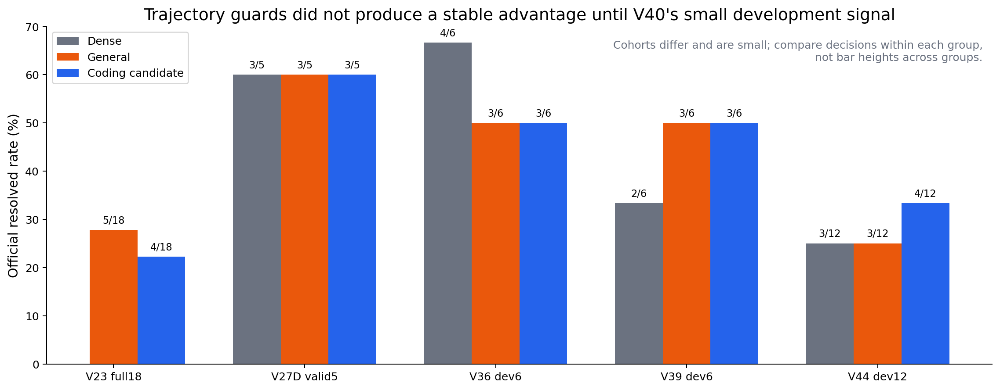

这些 cohort 大小、任务和选择方式不同，图只展示每次候选为何采用或停止，不能跨柱比较绝对高低。V36 说明“version validation 时 Dense”会伤一个 Dense-pass；V39 说明更宽的 commit phase 可保住 Dense，但并没有比 General 多解题。继续堆 trajectory rule 会越来越像大面积 abstain，失去 reuse 容量，却没有产生 coding-specific accuracy delta。

### 10.4 第一轮 matched bridge：coding 少复制，但并未更准或更快

18 个相同 agent protocol 任务：Dense 7/18、General 8/18、Coding 7/18；中位 TTFT 分别 268.6 / 187.4 / 190.6 ms，即 General 1.43x、Coding 1.41x。可是 request elapsed 分别 4754.9 / 4850.9 / 4889.2 ms，General 与 Coding 反而慢 2.0% / 2.8%。Coding 复制 307,690 token，比 General 的 378,923 少 18.8%，却没有转化为 accuracy 或端到端优势。

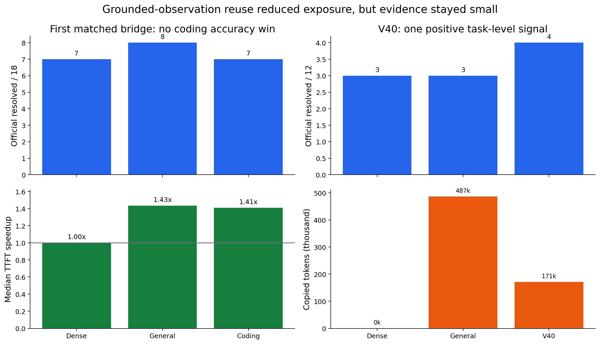

这一步证明：仅靠“更保守、少复制”不够。需要保护一种明确的 coding 状态，而不是一般地缩小 reuse。

### 10.5 V40 的技术转向：缓存“工具观察到的事实”，不缓存“模型思路”

V40 只允许成功、只读、内容足够长、路径可定位、未被后续 mutation 污染的 repository tool result 成为 source；assistant reasoning、测试执行、diff、mutation 与状态查询都不复用。每个目标最多一个 4,096-token middle island，K 做 RoPE delta，V 复制，前后 Dense。

V40 motivation replay 本身也有量化依据：246 个 eligible target 中 135 个有 grounded source，覆盖 20/21 tasks；selected token 110,017，而 General 在同一批请求为 306,494，只占 35.90%；中位每次 446 token；130 个 observation 因 version invalidation 被排除；assistant token 选择数严格为 0。随后 exposed canary 中三臂都 resolved，V40 只复制 2,452 token，General 为 13,778。

它第一次把 coding-aware 建立在在线可审计事件上：

```text
read-only command + successful tool output + repository path
+ later-write invalidation + exact segment identity
```

### 10.6 V43 为什么无效，V44 为什么只算 development signal

V43 的 6 个任务、18/18 arms 都耗尽调用预算并提交空 patch，全部 `LimitsExceeded`；运行完成不等于实验有 accuracy 信息，因此 V43 整体弃用。

V44 冻结 12 个 development tasks 并修正调用预算：Dense 3/12、General 3/12、V40 4/12。Dense 已通过的 3 题中，V40 damage 0，General damage 1；Dense-fail rescue 各 1/9。V40 复制 171,139 token，General 复制 487,144，少 64.9%。中位 TTFT 仅是固定顺序 host-resident 诊断：Dense 357.6 ms、General 335.7 ms、V40 327.5 ms。

**采用：** grounded observation、path invalidation、reasoning exclusion、单 island 暴露控制。

**尚不能声称：** V40 已显著超过 General、CacheBlend 或 KVCOMM。

---

## 11. 第八阶段：V41–V92 受控支线——为什么有正结果，为什么没有作为最终主线

这条支线在 CodeMAS-v2 固定 prompt/token 条件下，以 CacheBlend 类 stale-KV repair executor 为底座研究位置、密度、层和任务条件。它的价值是公平机制实验；它与 SGLang observation-source 主线不是同一算法族。

### 11.0 先说明 CacheBlend-derived 底座，否则 `layer24/r=.75` 无法理解

> 正文 3.5 用 1,000-token prefix 解释 `layer24/r=.75`、V88 route 与 V90 online risk；本节给出精确定义。

每个 case 的 prompt 被分成 reusable prefix segments 与当前 suffix/query。实验先分别 Dense materialize reusable segment 的 K/V，target 时可见 prompt 与 Dense 完全相同。到 `check_layer=ℓ` 时，执行器已有当前 prompt 在第 ℓ 层形成的 current K/V，也有 cached K/V：

```text
diff_i = ||V_current(i) - V_cached(i)||²
k = round(r * reusable_prefix_tokens)
repair_set = top-k(diff)

i in repair_set: 从第 ℓ 层开始保留 current K/V
i not in set:    从第 ℓ 层开始换成 cached stale K/V
suffix/query:    始终 current Dense
```

默认 selector 是通用 V-difference top-k，这就是本文的 Controlled CacheBlend。`r` 越大，当前状态保留越多，通常更稳但更慢；`ℓ` 越晚，前面更多层先形成 current-context hidden state，通常更稳但也更慢。未入 top-k 的 reusable token 仍保留 stale K/V，所以 `layer24/r=.75` 依旧是 lossy reuse。

早期 V62–V73 的 coding selector 不改变 `k`，只尝试用 syntax/cursor/file/attention 分数替换或约束通用 V-difference top-k；V75 以后多数版本保留通用 top-k，coding 信息改为选择 `(check_layer, r)`。两者的 novelty 与因果问题不同：

| 方式 | coding 信息控制什么 | 代表版本 |
|---|---|---|
| token selector | 固定预算内究竟修哪些 reusable token | V49、V53、V62–V73 |
| schedule router | 何时开始 lossy、保留 current token 的比例 | V77、V85–V92 |
| online risk | 在真正的 current/cached state 上决定是否从激进 schedule 切到保守 schedule | V90/V92 |

注意 source materialization 是逐 segment 额外执行，不是 SGLang V40 那种从自然 agent 历史得到 resident observation。这正是该支线 cache-ready 点估计很好、build-inclusive 很差的原因。

### 11.1 V41–V54：从大块复制到 cursor semantic island

这些版本的 token 操作可以更具体地理解为：V41 把 repository evidence block 作为 reusable prefix，大部分 token 在通用 CacheBlend schedule 下 stale；V49 先从 task/cursor 中提 anchor，只允许 anchor 命中的小范围进入候选；V51 额外保护/重算靠近输出的 tail；V52 用 task 与代码片段的 lexical relevance 决定是否激活；V53 要求候选是能在 source 中精确定位的连续 span；V54 再把该 span 缩到 cursor 附近的 semantic island。它们都没有改变最终 suffix Dense 的事实。

| 版本 | 变化 | 关键结果 | 决策 |
|---|---|---|---|
| V41 repository block | 复制约 3,831 token 大块 | RepoBench50 2.191x；exact 5/50 与 Dense 相同 | 证明大复用机会；但不是 agent policy |
| V49 anchor gate | 只对 23/50 选择，均值 235 token | 1.022x；exact 4 vs Dense 5 | guard 过度、仍伤质量 |
| V51 tail repair | 加最近 tail 保护 | full50 exact 恢复 5；1.005x；holdout 0.9995x | 质量恢复但速度消失 |
| V52 relevance route | 放宽到 36/50 | 1.036x；confirm exact 6 vs Dense 7 | 相关性路由不稳 |
| V53 span-grounded | 用连续 grounded span | 1.024x；exact 9=9；similarity 60.13% > 57.50% | 保留连续 span 思路 |
| V54 cursor island | cursor 附近语义 island | exact 14=14；0.9994x | 质量相同但无速度 |

这组实验揭示了一个反复出现的三角矛盾：大块复制有速度但 context mismatch 大；强 guard 能保质量却让容量消失；文本相关性不能直接预测 hidden-state 风险。

### 11.2 V55–V73：从 gold-NLL probe 到 attention selector，连续得到反证

这一段不是一串“名字不同但算法未知”的版本，可归为五类明确干预：

| 版本 | 实际干预 |
|---|---|
| V55 | 用 development gold NLL 诊断哪种 schedule 好，只能做 oracle/motivation，不能在线读取 gold |
| V56–V59 | 分别探测 K/V sensitivity、mid-layer K gate、component 差异，并尝试保持 K stale/修 V 等单通道组合 |
| V60/V61 | 复制相邻 semantic block，或降低 distractor 对 top-k 的影响 |
| V62–V67 | 把 syntax line、protected code token、Python statement、K/V top-k agreement 注入固定预算 selector；coding token会挤掉同数量的 generic V-difference token |
| V68–V73 | 用 cursor symbol/file grounding、rank fusion、suffix-to-prefix attention 或 normalized cursor attention 选被保护 token |

这里“coding-protected”并不是额外多算 token：总 `k` 固定。实现先保留大部分 generic V-difference top-k，再用少量 coding-selected token 替换其中得分较低的位置，并记录 displaced token；因此若结果变差，可以归因于 coding placement，而不是算力增加。

| 版本组 | 要回答的问题 | 实验结论 |
|---|---|---|
| V55 | task-conditioned gold NLL 能否选 route | serving 前 gate 失败 |
| V56–V59 | K/V sensitivity、mid-K gate、component probe、K reuse/V repair | 均未建立稳定可推广的通道或 gate |
| V60 | adjacent semantic block | RepoBench200 1.109x；exact 27 vs Dense 28 | 有速度，少 1 exact |
| V61 | distractor attenuation | dev50 1.061x；exact 7 vs Dense 8 | 拒绝 |
| V63 | 单纯提高 recompute ratio 是否足够 | 95% recompute 仍修不好 API-signature loss | 必须选更安全 stale 位置 |
| V65 | semantic K/V consensus | holdout200 candidate 55，CacheBlend 57；速度几乎相同 | 拒绝 |
| V66 | Python statement consensus | holdout100 candidate 18=CacheBlend 18，但 Dense 19 | 拒绝 |
| V67 | K-difference agreement | damage 反而略高；方向性 gate 失败 | 拒绝 dual-KV consensus |
| V68 | cursor-symbol grounding | 有方向信息但保留 5/6 已知 damage，AUC 未过 gate | 不足以安全路由 |
| V69 | quality-first density | r=.90 只到 7/10，质量随 stale fraction 非单调 | 停止静态 ratio sweep |
| V70–V73 | rank fusion、file scope、suffix attention、normalized cursor attention | 最多出现 rescue 与 damage 抵消；V73 为 2 rescue / 2 damage | 停止 RepoBench selector 调参 |

### 11.3 V75–V84：真正有用的机制发现是“先形成 coding 语义，再做 lossy compression”

V75 找到较高 recompute density 的可行点，但 r=.85 非单调，说明 density 不是 coding-aware 方法。V77 随后改变问题：不是“修哪些 token”，而是“从第几层开始允许 stale/compressed KV”。

在 100 个 development cases 上：

| 开始 lossy 的检查层 | Exact | Speedup vs Dense |
|---:|---:|---:|
| Layer 1 | 36/100 | 1.1845x |
| Layer 8 | 37/100 | 1.1410x |
| Layer 16 | 38/100 | 1.0965x |
| Layer 24 | 39/100 | 1.0552x |
| Dense | 38/100 | 1.0000x |

第二个已打开 split 的 V79 复验中，Layer 24 是唯一匹配 Dense exact 31/100 且仍有 1.0517x speedup 的 delayed arm。由此保留的核心机制是：**coding token 可能需要先经过约三分之二模型层数形成任务语义，再允许 lossy state 替换。**

V80 把该机制带到 DS-1000 官方执行：Dense 12/50、CacheBlend layer1 12/50、V80 layer24 11/50；速度 1.0325x，所有请求都是真实 stale K/V、0 fallback。它证明了机制真实，也证明静态 Layer24 仍不足够。

V81 增加密度修复了 V80 的唯一已知 damage，却产生两种新 damage；V82 的 K-only 与 V-only 都改变 12/50 输出，没有单通道主导；V84 发现 planner/implementer scaffold 在 layer1 都 context-sensitive，尤其 implementer 仅 21 stale token 就破坏全部 3 个选中 Dense-pass task。于是静态 layer、ratio、K/V channel、prompt role 均不能单独成为最终路由。

### 11.4 V85–V88：任务条件路由第一次同时改善开发集质量和速度

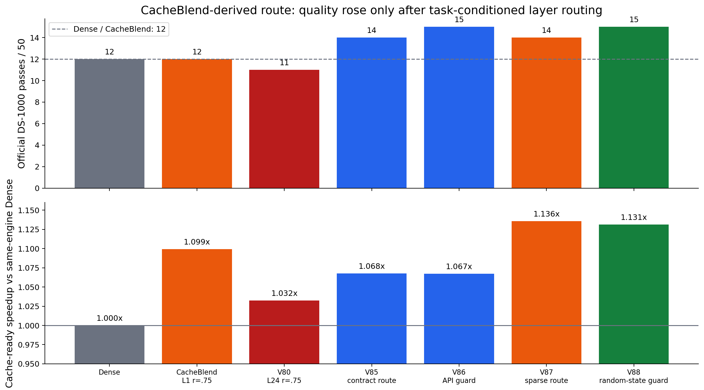

这些 router 只读取 `official_task` 文本，不读答案、case ID 或 evaluator。冻结规则如下：

| 版本 | 答案盲分类 | 选择的 schedule |
|---|---|---|
| V85 | task 明确要求写入变量 `result` -> `direct-result`；`df=...`、`# SOLUTION START`、function-body、other 分开 | direct-result 用 layer1；其余 layer24；统一 r=.75 |
| V86 | 在 V85 上识别 `side-effect + seaborn` | Seaborn side-effect 用 layer24/r=.90；其余沿用 V85 |
| V87 | `direct-result/function-body/other` 视为输出较灵活 | 灵活类用激进 layer1/r=.60；dataframe/side-effect 留在 layer24，Seaborn r=.90，其他 r=.75 |
| V88 | task 明确出现 random seed、`manual_seed`、`set_seed`、`random_state` 或 reproducibility obligation | 若原本是灵活激进类但有显式随机状态，仍在 layer1，但从 r=.60 提高到 r=.75；其余沿用 V87 |

也就是说，V88 的 coding-aware 不是“识别到 random 就复制更多”，而是识别 **输出必须满足的状态义务** 后，让更多 token 保留 current-context state、减少 stale token；代价是该请求略慢。

- **V85 output-contract route**：direct-result 任务走 layer1，其他走 layer24；14/50，超过 Dense/CacheBlend 的 12/50，含 controller 1.0677x，但比 CacheBlend 慢约 2.7%。
- **V86 API-sensitive side-effect route**：两条 Seaborn side-effect 请求改用 layer24/r=.90；15/50，0 Dense-pass damage，仍比 CacheBlend 慢约 2.7%。
- **V87 flexibility sparse route**：速度到 1.1358x 并快于 CacheBlend，但丢掉 `ds1000/708` random-seed 正确答案，14/50，按 gate 拒绝。
- **V88 random-state guard**：识别显式随机状态约束，恢复 V86 的 15/50，同时含 controller 1.1313x，且每题都有 positive stale K/V、0 fallback、不是 exact reuse、没有 prefetch。

这组采用的 coding 信息不是“函数名重要”，而是 **输出契约、API side effect、随机状态义务** 决定允许 lossy compression 的层和密度。

### 11.5 V89 证明静态关键词 guard 仍会过拟合

V89 primitive-semantic guard 在 development 从 V88 的 12/50 提高到 14/50，2 rescue / 0 damage；但 sealed validation 上 V88 26/100，V89 25/100，V89 相对 V88 0 rescue / 1 damage。因此 V89 被拒绝，明确禁止继续手工枚举 API 关键词。

### 11.6 V90：在线 K/V 风险信号第一次在 fresh split 改善冻结 V88

V90 只对 V88 原本走 layer1/r=.60 的激进请求启用第二层判断。在 layer1 对每个 reusable-prefix token 计算 `d_i=||V_current(i)-V_cached(i)||²`，通用 selector 原计划修 top-60%。风险量定义为未被 top-60% 覆盖的 V-difference mass：

```text
stale_mass = 1 - Σ(i in top60%) d_i / Σ(all reusable i) d_i
risk = stale_mass >= 0.006
```

若总差异为 0，则 stale_mass=0。安全请求直接复用同一 top-k 结果执行 layer1/r=.60；风险请求在 layer1 只做决策、不做 blending，保持完整 current hidden state 传播到 layer24，再执行 r=.75。其他 V88 route 不变。这里 K-difference overlap/entropy 只记录诊断，冻结 route 真正使用的是 V stale mass。

在 fresh sealed 100 上，所有 arm prompt/token hash 100/100 相同：Dense 34、CacheBlend 28、V88 31、V90 32、KVCOMM fixed-prompt reuse 31。V90 相对 CacheBlend 6 rescue / 2 damage，净 +4，McNemar p=0.289；相对 KVCOMM 净 +1，p=1.0；相对 Dense 净 -2。它形成点估计 Pareto，但统计上尚未定论。

### 11.7 V91/V92：优化风险路径，收益真实但很小

V91 不改变选择语义：安全请求复用 risk 计算时已经得到的 V top-k index；风险请求跳过 layer1 未使用的 sort/gather/partial-attention setup。它只是 fast path，因此 accuracy 必须逐请求等价。V92 再把风险 route 从 layer24/r=.75 改为 layer20/r=.70：layer1 仍只测风险，若触发则 layer0–19 保持完整 current propagation，在 layer20 才以 70% current / 30% stale 的 token schedule 开始 blending。未触发请求仍是 layer1/r=.60；其他 V88 route 不变。

fresh 100-case 上：Dense 26、V90 29、V92 32；V92 对 V90 3 rescue / 0 damage，p=0.25。触发的 29 个请求上 V92 比 V90 快 1.83%，bootstrap delta CI `[-0.821, -0.148]` ms；全 100 请求只快 0.38%，CI `[-0.217, 0.012]` ms 穿零。

### 11.8 三个互斥 split 的 V88 aggregate：强点估计，不是显著 SOTA

冻结 V88 在 3 个 outcome-independent、互斥 100-case split 上：

| 方法 | Official execution | Mean normalized cache-ready speedup |
|---|---:|---:|
| V88 | 77/300 | 1.1340x |
| Controlled CacheBlend | 69/300 | 1.0804x |
| Fixed-prompt KVCOMM | 68/300 | 0.4827x |

V88 对 CacheBlend 为 12 rescue / 4 damage，p=0.0768；对 KVCOMM 为 14 / 5，p=0.0636。方向一致且接近显著，但仍高于 0.05，所以只能写“最强点估计证据”，不能写“已统计证明超过 SOTA”。

### 11.9 为什么最终不把 V92 当作我们的主算法

1. **架构归属不对。** V92 以 vLLM-blend / CacheBlend 式 hidden-state compression 为执行底座，不是 V40 的 SGLang observation reuse 延续。
2. **novelty 不够独立。** 创新主要是 task route 和 online V-risk 改变 CacheBlend 的 layer/ratio；容易被解释为 CacheBlend 的 coding-conditioned 变体。
3. **source build 没解决。** Cache-ready 只有 5%–13% 级收益，而顺序 source build 约 300 ms，在短 DS-1000 prompt 上需要上百次复用才摊平。
4. **统计证据还不足。** V90/V92 的 paired accuracy p 值均未达到常用显著性门槛。
5. **用户目标要求 SGLang-only、无 prefetch、保留广义 lossy reuse。** 因此应把 V90 的“在线 K/V 风险”作为机制资产迁回 V40 主线，而不是继续堆 V93 静态 route。

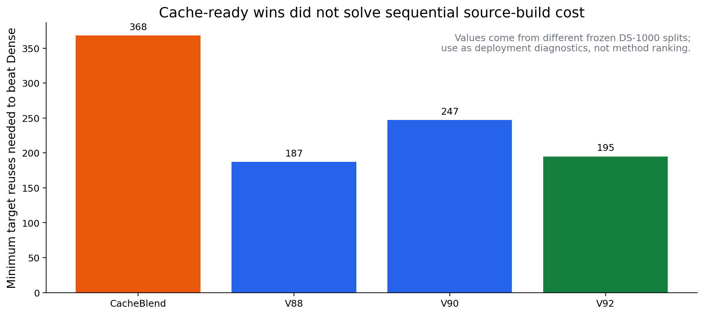

图中不同值来自各自冻结 DS-1000 split，只说明部署障碍的量级，不用于方法间速度排名。

---

## 12. 第九阶段：回到 SGLang V40，形成 V45/V46

### 12.1 V45：修复 source 选择与 target 消费之间的版本窗口

V40 在 source 注册时检查文件是否已被写入，但下一次 target 消费前可能又发生 mutation。V45 增加 target-time revalidation：重新定位 observation hash、路径和后续 writes；overlap、unlocalized 或 ambiguous mutation 一律释放 source 并 Dense。

冻结 12 条 V40 trajectory 的 offline audit：

| 指标 | V40 | V45 |
|---|---:|---:|
| Registered sources | 213 | 199 |
| Runtime-eligible targets | 203 | 183 |
| Planned copied tokens | 171,139 | 157,516 |

V45 保留 90.1% 的 V40 target opportunities，删除 20 个 target，其中 8 个明确因为 target 前出现 same-file write。实验性 symbol-disjoint relaxation 在 270 个窗口、662 个 candidate instance 上新增机会为 0，因此没有启用。

**采用：** target-time file-version guard。

**放弃：** 在没有机会证据时放宽同文件不同 symbol；不因“看起来更 coding-aware”而增加风险。

### 12.2 V46：从一个临时 source 扩展到有界 KV pool

V46 保留 V40/V45 的 observation 定义与版本安全，增加：

- 最多 3 个 persistent、自然产生的 read-only observation source；
- 路径从 command 与 tool output 同时提取；
- repository-scoped search 在任何 repository mutation 后失效；
- target 前逐 source 重验；
- 最多 3 个不重叠 island，按长度和新近度选择；
- 一次 target 按 `Dense -> copy -> Dense gap -> copy ... -> Dense` 执行；
- pool eviction、release、session reset 与当前 target protection 原子更新。

离线生产 planner replay 有 331 requests、1,064,801 prompt tokens；236 个 request 有 copy，计划复制 303,600 token，占 28.51%；没有 target 引用同一原子更新中释放的 source。这个结果证明 opportunity/lifecycle，不证明 task accuracy。

### 12.3 V46 为什么没有晋级

静态 RepoBench50 mechanism test：V46 150/150 physical copy、每个 target 1,536 token、0 fallback。Cache-ready 从 V40 的 1.089x 提升到 1.326x，N=4 including build 从 0.897x 提升到 1.050x。但 next-line exact 仍为 4/50，Dense 为 5/50；它不是功能 accuracy。

更强的 official SWE-bench preservation 小集上：Dense 3/3、V40 3/3、General 2/3、V46 2/3。两题实际消费 copied KV，一题过、一题失败；full-12 在 canary 失败后没有重启，因此不存在合法的 V46 full-12 accuracy 数字。

**采用：** 有界 pool、multi-island executor、命令+输出 provenance、repository-scope invalidation、原子 lifecycle。

**暂不采用为最终 policy：** 无 utility/risk 约束的“尽量复制三个 island”。速度机会已经够，当前瓶颈是同时复用多个旧 contextual state 造成的质量风险；M50–M54 又进一步证明，coding path dependency 与 K/V distortion 不能被当作同一个分数。

---

## 13. 当前 KV pool 到底怎样工作

> 正文 3.6 已用一条完整 session 展示 O1 被 version guard 淘汰、O2/O3 进入 pool，以及 multi-island 的实际执行顺序。

当前分支实现的 V46 pool 不是全局 LRU，也不预取未来 KV。它是单个 coding session 内、最多三个 source 的受界状态机：

1. bridge 把 assistant tool call 与 tool result 组成 completed interaction group；
2. 只有成功、只读、至少 400 字符、路径可定位的 tool result 可注册；
3. source 必须自然经过一次 Dense 请求而 materialize；不会为了缓存额外发请求；
4. pool entry 保存 source/request/prompt/segment hash、路径、scope、模型与 dtype 等身份；
5. 每次 target 之前，根据当前 rolling history 重新检查 observation、path 与 writes；
6. 有效候选按 copied length、再按 recency 排序，最多选 3 个不重叠 island；
7. 当前 target 引用的 source 先被保护，再进行新 source 注册和旧 source eviction；
8. mutation、ambiguity、eviction、session reset 都会显式 release lease；
9. scheduler 逐 island 交替 Dense 与 copy；K 做 RoPE delta，V 复制；任何 ledger 不一致则 fail closed。

它仍然是 lossy：pool 保证“文本与文件版本仍合法”，不能保证“旧 prefix 下的 hidden state 与当前 prefix 相同”。V46 的失败正好证明 version validity 与 contextual safety 是两个不同问题。M50–M54 随后又把 contextual safety 拆成两个轴：path dependency 表示该 observation 是否有用，K/V probe 才试图估计搬运它会偏多少。

---

## 14. 第十阶段：M47–M56 重新验证 coding reuse 的动机、容量与速度

V40/V45/V46 形成后，项目已经有真实 SGLang lossy executor、自然 resident observation 和足够 copy opportunity，但仍缺少最关键的因果链：**为什么 coding-aware 选出的 observation 应该比通用 recency/tail 更值得复用？**

M47–M56 不再用最终任务结果反推 selector，而是依次测六层问题：

1. 同预算下，简单 coding selector 是否胜 recency/random；
2. 模型内部的 attention 与 K/V drift 是否解释物理 splice harm；
3. grounded provenance、file version、path dependency 各自到底预测什么；
4. 这些信号能否组成一个可上线的低成本 risk score。
5. 新的 path-pair definition 是否在 task-disjoint trajectory 上有足够覆盖；
6. V40 在 prompt token 完全相同时是否确实降低 TTFT。

### 14.1 M47–M49：先确定“位置、依赖、漂移”不是同一件事

M47 在 RepoBench-P50 上固定每个方法复制 `3 × 512` token，所有 150 个 island 都真实复制且 0 fallback：

| 方法 | Exact line | Code similarity | TTFT | Dense speedup |
|---|---:|---:|---:|---:|
| Dense | 5/50 | 49.99% | 287.27 ms | 1.000x |
| V46 recency | 4/50 | 52.54% | 217.29 ms | **1.322x** |
| Coding-symbol | 4/50 | 51.35% | 244.53 ms | 1.175x |
| Seeded random | 4/50 | 51.79% | 250.01 ms | 1.149x |

V46 更快主要因为它选中了更靠后的连续 island，Dense gap 更少；简单 lexical coding relevance 并没有胜 recency。这个结果否定了“只要加入 symbol/path 关键词就能产生 novelty”。

M48 对 50 个 RepoBench-P 请求、294 个等长候选进行 full-Dense oracle 测量：最后 32 个 target query 对候选的 attention、RoPE-corrected K drift、V drift，以及真实物理单岛 splice JS。`attention × drift` 与单岛 JS 的全局 Spearman 为 0.570，高于 attention-only 的 0.158 与 drift-only 的 0.526；但它需要完整 Dense target K/V，只能作为因果动机。

M49 用候选前 16 token、zero-based layer 17 的 K/V drift 近似 M48 oracle。在独立 50-case holdout 上，它对单岛 JS 的全局 Spearman 为 0.530、平均 within-case Spearman 为 0.489；但对 V46 三岛 composed JS 的 request-level Spearman 只有 0.193，high/low risk JS 比仅 1.281。结论是：**16-token probe 能给单岛排序，但把三个单岛分数取 max 不能预测组合误差。**

### 14.2 M50：grounded observation 并不均匀安全

M50 从真实 Dense coding-agent 轨迹中，为每个请求配对一个成功只读 tool observation 与最近的 assistant reasoning/tool-call block。二者都为 128 token、共享同一 source/target prompt 与 rolling transition，并校正 target position difference。

| Metric | Grounded tool | Assistant decision | Grounded lower pairs | Equal-position ratio |
|---|---:|---:|---:|---:|
| Final-logit JS mean | 0.0003266 | 0.0004579 | **50.0%** | 0.750 |
| Final-logit JS median | 0.0002564 | 0.0003588 | — | — |
| K/V drift mean | 0.01869 | 0.01694 | 60.0% | 0.633 |
| Next-action NLL delta mean | 0.00358 | 0.00889 | 50.0% | — |

平均值与位置校正比看起来有利，但 20 对中只有 10 对 grounded JS 更低，没有通过冻结的 65% consistency gate。少数 assistant 大误差拉低了均值，不能把这种异质分布写成“grounded fact 天然安全”。

Decision: `NOT_SUPPORTED`。

### 14.3 M51：文件版本合法性不等于 KV 风险预测

M51 比较同一段 128-token old observation 的两个真实 transition：treatment 是该 observation 的文件随后被纯 mutation，control 是同文件继续被引用但没有 mutation/diff/executable failure。有效重跑有 18 对、8 个任务。

| Metric | Same-path mutation | Same-path noncritical | Mutation higher pairs | Adjusted ratio |
|---|---:|---:|---:|---:|
| Final-logit JS mean | 0.0003987 | 0.0003883 | **44.4%** | 0.819 |
| Final-logit JS median | 0.0001348 | 0.0003609 | — | — |
| K/V drift mean | 0.01724 | 0.02323 | 55.6% | 0.713 |
| Next-action NLL delta mean | -0.00024 | 0.00478 | 44.4% | — |

所有风险方向 gate 均失败。V45 的 version guard 仍应保留，因为旧文件内容在语义上已经 stale；但它是 correctness validity，不是已证明的 contextual K/V risk predictor。

第一次 M51 `matched18` 因平衡采样第二轮重复 `case_id` 而作废，artifact 已写入 `INVALID_DESIGN.json`。修复后的 `matched18_v2` 沿用原门槛、18 个唯一 pair；报告只引用 v2。

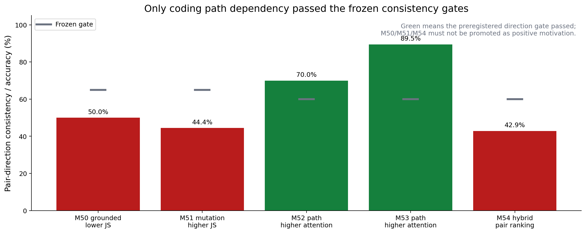

### 14.4 M52/M53：path overlap 稳定预测 dependency，而非单独预测 safety

M52 在同一真实 target prompt 内配对 path-relevant 与 path-disjoint 的 grounded observation。`relevant` 的定义完全在线：该 observation 的 repository path 是否出现在最新 completed coding interaction 中。每块 128 token，source/target 文本严格相同。

| Cohort / metric | Path relevant | Path disjoint | Relevant higher pairs | Position-adjusted ratio |
|---|---:|---:|---:|---:|
| M52 attention mean | **0.03251** | 0.01231 | **70.0%** | **1.623** |
| M52 K/V drift mean | 0.00436 | 0.01395 | 25.0% | 0.381 |
| M52 splice JS mean | 0.0004627 | 0.0005374 | 30.0% | 0.391 |
| M53 attention mean | **0.02334** | 0.01429 | **89.5%** | **1.413** |
| M53 K/V drift mean | 0.01398 | 0.02609 | 36.8% | 0.969 |
| M53 splice JS mean | 0.0003537 | 0.0003331 | 47.4% | 0.408 |

M52 的 dependency gate 全部通过。M53 使用 19 个未见 request ID、每种 candidate-pair identity 最多一次；任务与个别 observation 仍可能重叠 development，因此是 request holdout，不是 task-disjoint。它把 attention 方向从 70% 复现到 89.5%，但 drift 与 JS 的逐对一致性没有完整复现。

因此目前最强的 coding-specific 正证据是：**path overlap 稳定表示模型正在依赖哪个历史 observation。** 它估计 reuse 的 utility，而不是直接估计 lossy error。

### 14.5 M54：dependency 与 drift 不能粗暴相乘

M54 使用 M49 已冻结的 layer-18、16-token probe，并把 path-relevant candidate 的 probe score 乘以 M52 attention ratio `1.623`。测试集是 M52/M53 都未开启的剩余 14 个 request、6 个任务；M54 causal label 在 registration 前未读取。

| Score | Global Spearman with JS | Pair ranking accuracy |
|---|---:|---:|
| 16-token probe only | **0.506** | 42.9% |
| Path-weighted probe | 0.477 | 42.9% |
| Change | **-0.030** | 0.0 pp |

乘法 hybrid 仍与 JS 相关，但比 probe-only 更差，并且没有改善同请求内的候选排序。四个核心晋级门槛失败。

Decision: `NOT_SUPPORTED`；不实现到 SGLang。

### 14.6 新的算法推导：utility 与 risk 必须分轴

> 正文 3.6 给出了 `high/low utility × high/low risk` 的具体 observation 处理例子。

M50–M54 支持的不是另一个单分数 heuristic，而是如下 action matrix：

| Probe risk | Path dependency | 应执行的动作 |
|---|---|---|
| High | High | Dense/recompute：重要但不安全 |
| Low | High | 优先 lossy reuse |
| High | Low | Reject：低效用且高风险 |
| Low | Low | 仅在剩余预算中复用 |

M55 在新的 task-disjoint coding-agent cohort 上预注册比较 fixed-budget recency、path-only、probe-only、seeded random 与 two-stage constrained selector。M49 已否证现有三岛 request aggregation，所以设计严格隔离为每个 target 只干预一个 128-token island；two-stage 的冻结形式为：

```text
eligible_i = version_valid_i and probe_risk_i <= threshold
if no island is eligible: Dense
else: prefer the path-relevant eligible island
      or fall back to the minimum-risk eligible island
```

动机晋级条件不是单看 JS 或 attention：它必须比 probe-only 覆盖更多 target attention，同时 single-island JS 不更差；并比 path-only 降低 JS，同时在 common cases 都复制 128 token，且相对 recency 至少保持 70% coverage。但这些质量 gate 没有被打开，因为更早的 cohort capacity gate 已失败：

| Capacity audit | Observed | Frozen minimum / meaning | Outcome |
|---|---:|---:|---|
| Path-matched pairs before version guard | 31 | — | audit only |
| Version-valid pairs | 29 | — | 2 pairs correctly removed |
| Balanced selected cases | 24 | 16 | pass |
| Distinct tasks | **5** | **8** | **fail** |

五个任务的 case 分布为 `xarray-3305: 7`、`sphinx-8120: 7`、`django-12406: 5`、`xarray-3095: 3`、`requests-6028: 2`。Decision: `INSUFFICIENT_TASK_DISJOINT_COHORT`。没有加载 3B causal model，没有读取 attention/JS label，没有调整 threshold，也没有实现 runtime selector。这个结果不能宣称 two-stage 算法失败；它证明当前严格的 utility opportunity definition 缺乏跨任务覆盖。

### 14.7 M56：把 V40 速度与 agent 行为分叉彻底隔离

M56 使用 fresh-13 Dense trajectory 重建全部 383 个请求。Dense 和 V40 的 request key、prompt token 数与 prompt hash 逐一相同；每次只生成 1 个诊断 token，且不把该 token 加回后续 prompt。普通 radix reuse 被关闭，source 来自前序自然 observation，prefetch=false。

| Metric | Dense | V40 | Result |
|---|---:|---:|---:|
| Target requests | 244 | 244 | 13 tasks |
| Median target TTFT | 316.18 ms | 286.74 ms | **1.103x** |
| P95 TTFT ratio | — | — | **1.550x** |
| Per-request TTFT wins | — | — | **79.51%** |
| N=4 median incl. source build | — | 286.87 ms | **1.102x** |
| Physical copy | 0 | 244/244 | 226,101 token |
| Fallback | 0 | 0 | pass |
| First-token agreement | reference | 97.54% | pass ≥90% |

Decision: `SUPPORTED_SPEED_REPLAY`。它证明 V40 的自然 resident middle-span copy 在相同 prompt 下有真实速度收益；97.54% 而非 100% 的 first-token agreement也说明这是 positive-staleness lossy reuse。它不衡量完整 patch accuracy，不能补救 M55 的全零 official cohort。该冻结 replay 采用单次 `Dense→V40` server 顺序，尚未做 reverse-order replication；因此它是强于静态测试的机制证据，但正式发表前仍应补 counterbalanced run 以排除热状态/顺序残余混杂。

---

## 15. 与合作者的分支解耦：保证每个收益可归因

| 责任层 | 回答的问题 | 允许改变 | 明确不改变 |
|---|---|---|---|
| Shared core | KV 身份、source handle、lease、传输、fallback 如何统一 | runtime contract 与 telemetry | 不决定 coding span，不预测未来 |
| Coding-aware branch | 哪个历史 observation 可复用，什么时候应 abstain | provenance、version guard、risk、island budget | 不 prefetch，不改变任务 prompt |
| Prefetch collaborator branch | 已存在的 KV 何时/搬到哪里 | placement、queue、host/device 调度 | 不改变 reuse eligibility 与 accuracy policy |
| Integration branch | 两种机制能否组合且 feature-off 等价 | 薄适配、组合测试、统一指标 | 不发明新的 selector |

当前报告的 coding 结论全部来自 prefetch=false 的实验；V40/V45/V46 source 都由 agent 历史自然 materialize。未来合并时至少保留 `off / coding-only / prefetch-only / combined` 四臂，并分别记录 selected、copied、transferred、fallback token。否则 TTFT 变化无法区分“少算 attention”与“提前搬运”，accuracy 变化也无法归因。

当前 review 分支是 `research/coding-aware-v45-multi-observation-20260803`。它面向合作者提供的是可审阅的 coding policy 与 SGLang runtime contract，不直接把对方 prefetch 实现 merge 进来，也不在本报告中把 prefetch 收益算作我们的 lossy reuse speedup。

---

## 16. 技术采用与放弃的最终总账

| 技术 | 当前状态 | 直接证据 | 结论边界 |
|---|---|---|---|
| Shifted RoPE K + V copy | 采用 | E2 120/120 identity、0 logprob diff、0 fallback | exact path 正确；不等于 lossy 无损 |
| 多 Dense/copy stage | 采用但严格限岛数 | ASTSpan 中位 66.5 stage 导致 -74.29% TTFT；AST-Island B8 仍 -5.04% | 必须少量连续 island |
| AST/symbol 直接决定 repair | 放弃 | P3–P26；P23 oracle 仅 +0.00321 | AST 只作索引 |
| Equal-cost tail control | 保留为诊断 | 多个 coding selector 只胜 random 不胜 tail | 不是最终竞争基线 |
| FileVersion validity | 采用为 correctness guard | V11 21.43% capacity；V45 删除 8 个真实 same-file-write target；M51 风险 gate 失败 | 证明文本版本合法，不证明 mutation 会增大 KV 误差 |
| ProbeHead threshold | 放弃 | V12 4,639 配置、0 feasible | 动态状态方向保留，具体 proxy 放弃 |
| Function-only capsule | 放弃 | P27C 正向，P27E pipeline/context 双反转 | reduced-context Dense 必须先过 |
| Grounded tool observation | 采用为候选边界 | V44 4/12、0 Dense damage、复制量少 64.9%；M50 consistency 50% | 小样本 task signal；不是均匀低风险证明 |
| V40 单 observation | 当前科研基线 | 官方小样本正信号、强 provenance | 机会有限；安全动机已被 M50 降级 |
| V46 3-entry pool | executor/lifecycle 采用，policy 未晋级 | offline 28.51% copied；static 1.326x；official 2/3 | 需要 utility/risk 二维选岛，不是只加 scalar guard |
| Path dependency | 采用为 utility 信号 | M52 attention 70%、adjusted 1.623；M53 89.5%、1.413 | 证明模型依赖，不单独证明 splice safety |
| M49 16-token K/V probe | 保留为单岛 risk 机制 | independent single-island JS Spearman 0.530；request composed 0.193 | 可给单岛排序，不能用 max 预测三岛请求 |
| Path-weighted drift scalar | 放弃 | M54 hybrid Spearman 0.477 < probe-only 0.506；pair 42.9% | utility 与 risk 不可粗暴相乘 |
| M55 strict path-pair selector | 未测质量、停止 | 24 case 只覆盖 5 tasks，低于冻结 8-task gate | 失败的是 opportunity coverage；不得调门槛后补跑 |
| M56 V40 same-prompt replay | 支持速度机制 | 244/244 copy、0 fallback、median `1.103x`、N=4 `1.102x` | one-token TTFT/fidelity，不是 task accuracy |
| 静态 layer/ratio | 放弃为最终方法 | V69/V80/V81 非单调 | 可作为 route action，不可独立选择 |
| Output-contract/API/random-state route | 机制资产 | V85–V88 development；V88 aggregate 77/300 | 静态关键词易过拟合 |
| Online V-difference risk | 建议迁回 SGLang 主线 | V90 fresh +1 over V88；V92 triggered 1.83% faster | 尚需 SGLang observation 条件下验证 |
| V92 整体架构 | 不作为当前主线 | 点估计好但 CacheBlend-derived、build break-even 195 | 作为机制证据，不作最终 novelty |
| Prefetch | 从 coding claim 排除 | 所有 V40/V46/V88–V92 claim 均注明 false | 合作者可后续正交合并 |

---

## 17. 当前能说什么，不能说什么

### 17.1 可以说

1. 我们已经有一个在 SGLang 中真实执行 middle-span K/V copy、支持 RoPE correction、lease/lifecycle、multi-island 与 fail-closed ledger 的系统。
2. Coding provenance 能显著改变 reuse exposure：V40 相比 General 在 V44 少复制 64.9%，同时没有破坏 3 个 Dense-pass task。
3. 静态 AST/token importance 不能稳定预测 KV repair utility，这一点由多个等成本实验与 oracle ceiling 共同支持。
4. Coding task 的输出契约、随机状态、side effect 与在线 V-difference 包含风险信息；V88–V92 提供了方向一致但尚不显著的点估计证据。
5. V46 已把“机会不足”从主要瓶颈变成“多 source contextual risk”；它的 28.51% planner copy coverage 与 1.326x static cache-ready speed说明继续只扩 pool 没有研究必要。
6. 最新 coding interaction 的 path overlap 能稳定预测模型依赖：M52/M53 的 path-relevant attention 分别在 70.0% / 89.5% 配对中更高，位置校正比为 1.623 / 1.413。
7. 单岛 16-token K/V probe 在独立 RepoBench holdout 上能排序局部 splice risk，但现有 request aggregation 与 path 乘法组合都失败。
8. V40 的同提示速度机制已经在 244 个 target 上通过：median TTFT `316.18→286.74 ms`（1.103x）、79.5% 配对请求更快、0 fallback；N=4 含 build 后仍为 1.102x。
9. V40 会显著收缩 lossy exposure：fresh-13 中它比 General 少复制 69.5% token，同时覆盖 13/13 题；这证明 policy 行为不同，但全零 official 结果不提供 accuracy 方向。

### 17.2 不能说

1. 不能说 V46 已超过 CacheBlend 或 KVCOMM：它没有有效 full official cohort，静态 next-line 也弱于 CacheBlend。
2. 不能把 V88/V90/V92 的点估计写成统计显著 SOTA；paired p 值仍高于 0.05。
3. 不能把跨引擎绝对毫秒直接排名；KVCOMM 使用 native Transformers eager，只能比较相对自己的 Dense speedup。
4. 不能把 cache-ready speedup 当作 N=1/N=4 部署收益；source build 是当前最大系统债务之一。
5. 不能把 Dense 当作 accuracy 理论上界。Lossy perturbation 会改变 greedy trajectory，可能 rescue 也可能 damage；V92 在一个 fresh slice 高于 Dense 不代表一般规律。
6. 不能重新使用旧 225 题 prompt-mismatched 表作为公平 SOTA 证据。
7. 不能说 grounded tool observation 天然比 assistant decision 安全；M50 只有 10/20 配对支持该方向。
8. 不能说 same-file mutation 已被证明会增大 lossy KV harm；M51 只有 8/18 配对 mutation JS 更高。
9. 不能把 path relevance 当成单独的 Dense guard 或 risk multiplier；M53 没有复现统一 safety 结论，M54 的乘法 hybrid 还弱于 probe-only。
10. 不能把 fresh-13 的 `0/13 = 0/13 = 0/13` 写成 V40 accuracy preservation；三个 arm 的 Wilson 95% 上界都为 22.81%，该 cohort 没有辨识力。
11. 不能说 M55 已否定 two-stage selector；它在 GPU label 前因 5-task coverage 失败，否定的是当前严格 path-pair opportunity definition。
12. 不能把 M56 的 1.103x 写成已经完成生产级速度定论；prompt 已严格配对，但当前只有 `Dense→V40` 一种 server 顺序，仍需反序复现。

---

## 18. 对下一轮设计的约束，而不是先给新版本号

这份回顾支持的下一步不是继续做 V93 keyword sweep，也不是让 V46 复制第四个 island，更不是降低 M55 的 8-task gate。M55 已经说明：先要求一个 target 同时存在严格 path-relevant 与 path-disjoint observation，会把机会集中在少数任务。下一候选应是新的 capacity-first motivation（暂记 M57，不是 runtime 版本），并满足：

1. 继续在 SGLang V40/V45/V46 分支上开发；
2. source 仍来自自然 resident 的 grounded tool observation；不 prefetch，不改 prompt；
3. 复用必须保持 positive stale K/V，不能退化成 exact-only；
4. 保留 V45 version validity，但不得把它写成 K/V risk proxy；
5. utility 仍只来自已经复现的 online path dependency，但从二元 exact-pair 扩展成对每个独立 observation 可计算的连续 evidence，例如 exact path、同目录/调用邻域和最近 interaction 距离；不得使用最终 patch outcome；
6. 第一阶段只计算候选容量，至少覆盖 8 个 task 和冻结比例的 V40 target；容量不够就停止，不能读取 attention/JS；
7. 容量通过后，第二阶段才用 Dense attention验证新 utility score，并与 recency、seeded random 做等 128-token 预算比较；
8. risk 继续使用冻结的单岛 K/V probe，与 utility 采用 lexicographic constraint，不相乘；
9. multi-island 必须直接测 composed intervention，不能再用 `max(single risk)` 代替；
10. accuracy 必须换成有非零 Dense base rate 的独立 official cohort：先注册“preservation cohort”和“representative cohort”两个不同问题，前者允许使用历史 Dense-pass 题但只能回答 damage，后者不能按 treatment outcome 选题；
11. 与 CacheBlend/KVCOMM 的最终对比必须共用 agent backend、prompt/token hash和题目，分别报告 official accuracy、cache-ready TTFT、source build、N=4/N=16；跨引擎速度只比较各自相对 native Dense 的 normalized speedup；
12. M56 已通过的 244-target same-prompt replay作为速度回归门槛保留，并补一轮预注册的 `V40→Dense` reverse-order replication；任何新 selector 不得靠减少 copy 到近 exact-only 来虚增 fidelity。

这部分由 M50–M56 共同推出：V40 speed mechanism 已成立，当前研究瓶颈是“有覆盖的 coding utility definition”和“能区分 accuracy 的 benchmark”，而不是继续证明 copy kernel 或继续扩大 pool。

---

## 19. 证据索引与复现入口

### 19.0 算法描述对应的实现位置

本报告不是只根据实验目录反推算法。以下是本轮逐项核对过的主要实现；前四项位于旧脏 checkout，仅作只读溯源，本报告没有修改它：

```text
/home/gfy/CodeMAS_Project/sglang-kvflow/
  benchmark/multi_workflow/humaneval_taskcone_v2.py
  benchmark/multi_workflow/astspankv.py
  benchmark/multi_workflow/astislandkv.py
  python/sglang/srt/mem_cache/ast_chunker.py
  benchmark/multi_workflow/workflowmodulekv.py
  benchmark/multi_workflow/sessiongraphkv.py

当前 review worktree:
  benchmark/multi_workflow/sessiongraph_v11.py
  benchmark/multi_workflow/probehead_v12.py
  benchmark/multi_workflow/measure_probehead_v12.py
  benchmark/multi_workflow/coding_reuse_policy.py
  benchmark/multi_workflow/motivate_v47_task_conditioned_pool.py
  benchmark/multi_workflow/motivate_v48_attention_kv_risk.py
  benchmark/multi_workflow/motivate_v49_probe_proxy.py
  benchmark/multi_workflow/motivate_v50_coding_provenance.py
  benchmark/multi_workflow/motivate_v51_file_version_risk.py
  benchmark/multi_workflow/motivate_v52_path_dependency.py
  benchmark/multi_workflow/motivate_v53_path_dependency_holdout.py
  benchmark/multi_workflow/motivate_v54_dependency_drift_hybrid.py
  benchmark/multi_workflow/motivate_v55_two_stage_selector.py
  benchmark/multi_workflow/run_m55_v40_task_disjoint_campaign.py
  benchmark/multi_workflow/run_m56_v40_same_prompt_replay.py
  benchmark/multi_workflow/audit_algorithm_evidence_matrix.py

CacheBlend-derived 受控复现 worktree:
  /home/gfy/CodeMAS_Project/kvflow-reproductions/worktrees/cacheblend-coding-v62/
    example/coding_task_contract.py
    example/repro_common.py
    vllm_blend/vllm/attention/ops/coding_selector.py
    vllm_blend/vllm/attention/backends/xformers.py
    vllm_blend/vllm/model_executor/models/qwen2.py
    docs/IMPACTKV_V92_HANDOFF.md
```

P3–P27 中部分早期 frozen launcher 已在工作区清理时移出当前 branch，因此它们的算法定义以对应 registration/artifact 和 7 月 22 日 failure-analysis 审计的交叉记录为准；报告对这部分只写注册过的高层动作，不虚构已不存在的函数名或实现细节。

### 19.1 本报告图表

- 数据快照：`docs/kvflow/assets/technical_iteration_20260805/evidence_data.json`
- 生成脚本：`docs/kvflow/assets/technical_iteration_20260805/build_charts.py`
- 图 1–14：同目录 `01_*.png` 至 `14_*.png`

数据快照不是替代原始 artifact；它把图中使用的字段与 source root 集中记录，方便审阅时逐项核对。

### 19.2 早期审计与 V9–V12

```text
/home/gfy/CodeMAS_Project/kvflow-reports/weekly_reports_20260718/
  2026-07-21_IMPACTKV_KVFLOW_WEEKLY_RESEARCH_AUDIT_REVISION.md

/home/gfy/CodeMAS_Project/kvflow-artifacts/
  impactkv_sessiongraph_v11_20260717/P0_FINAL_VERDICT.md
  impactkv_probehead_v12_20260717/DEVELOPMENT_CALIBRATION_REPORT.json
  impactkv_exact_middle_e2_20260718/server/E2_RESULT.json
```

V11 权威 verdict SHA-256：`628c42be00eb9476e7b9a8365bb37410a17d76fd16d782d3a17d5bae970cfefa`。

V12 calibration report SHA-256：`fa168dc7ade15f67a23be557d303cde6235833cce31f5e9b3d3861300694a996`。

### 19.3 P3–P33

```text
/home/gfy/CodeMAS_Project/kvflow-reports/weekly_reports_20260722/
  2026-07-22_IMPACTKV_CODING_AWARE_WEEKLY_FAILURE_ANALYSIS.md
  2026-07-24_IMPACTKV_CODING_AWARE_CURRENT_STATUS_CORRECTED.md

/home/gfy/CodeMAS_Project/kvflow-artifacts/
  impactkv_rank5_p12_gpu_development_20260722/
  impactkv_tail_code_p13b_fast_gpu_development_20260722/
  impactkv_symbol_oracle_p23_development_20260722/
  impactkv_task_capsule_p27c_budget_grid_20260722/P27C_DEVELOPMENT_RESULT.json
  impactkv_task_capsule_p27e_confirmatory_20260722/P27E_CONFIRMATORY_RESULT.json
  impactkv_algorithm_matrix_p30_20260723/P30_LATENCY_RESULT.json
  impactkv_coding_aware_fresh100_p32_20260723/P32_RESULT.json
  impactkv_code_drift_oracle_p33_20260724/P33_RESULT.json
```

### 19.4 Agent bridge、V40 与原生基线

```text
/home/gfy/CodeMAS_Project/kvflow-reports/weekly_reports_20260726/
  2026-07-26_IMPACTKV_ACCURACY_SPEEDUP_AUDIT.md
/home/gfy/CodeMAS_Project/kvflow-reports/weekly_reports_20260728/
  2026-07-28_IMPACTKV_V40_AND_MERGE_READINESS.md

/home/gfy/CodeMAS_Project/kvflow-artifacts/
  impactkv_bridge_agent_accuracy_speed_20260726/
  impactkv_native_frontier_v3_20260720/
  impactkv_v13_kv_boundary_probe_20260727/
  impactkv_v14b_headtail_full225_20260727/
  impactkv_v17_repository_version_graph_20260727/
  impactkv_v18r_frozen_replay_replication_20260727/
  impactkv_v21_robust_dual_replay_20260727/
  impactkv_v23_full18_accuracy_20260727/V23_FULL18_RESULT.json
  impactkv_v27d_dense_pass_audited_completion_20260727/V27D_RESULT.json
  impactkv_v28c_counterbalanced_speed_20260727/V28C_RESULT.json
  impactkv_v31_critical_event_abstain_replay_20260727/V31_RESULT.json
  impactkv_v36_v35b_task_level_campaign_20260727/V36_RESULT.json
  impactkv_v39_v38_independent_20260728/V39_RESULT.json
  impactkv_v40_grounded_observation_motivation_20260728/V40_MOTIVATION_RESULT.json
```

### 19.5 V41–V92 受控支线

```text
/home/gfy/CodeMAS_Project/kvflow-artifacts/
  impactkv_codemas_v2_controlled_sota_20260729/
    v41_repository_block_full50/RESULT.json
    v65_independent_repobench_holdout200/RESULT.json
    v77_layerwise_lossy_localization/RESULT.json
    v79_layerwise_cross_split_confirmation/RESULT.json
    v80_ds1000_functional_validation/RESULT.json
    v85_output_contract_layer_route/RESULT.json
    v86_api_sensitive_side_effect_route/RESULT.json
    v87_flexibility_tier_sparse_route/RESULT.json
    v88_random_state_guarded_flexibility_route/RESULT.json
    v89_coding_risk_iteration/FINAL_RESULT.json
    v90_online_kv_risk/FINAL_RESULT.json
    v92_online_kv_risk_speed_route/FINAL_RESULT.json
```

### 19.6 当前 SGLang V45/V46

```text
docs/kvflow/CODING_AWARE_V45_DEVELOPMENT_20260803.md
docs/kvflow/CODING_AWARE_V46_DEVELOPMENT_20260803.md

/home/gfy/CodeMAS_Project/kvflow-artifacts/
  impactkv_v45_versioned_evidence_20260803/
  impactkv_v46_accuracy_speed_20260803/V46_ACCURACY_SPEED_RESULT.json
  impactkv_v46_observed_path_runtime_20260803/
```

### 19.7 M47–M54 coding 动机因果审计

完整解释：

```text
docs/kvflow/M47_TASK_CONDITIONED_POOL_MOTIVATION_20260805.md
docs/kvflow/M48_M49_MODEL_INTERNAL_RISK_20260805.md
docs/kvflow/M50_M54_CODING_MOTIVATION_20260805.md
```

原始结果：

```text
/home/gfy/CodeMAS_Project/kvflow-artifacts/
  impactkv_m47_task_conditioned_pool_20260805/full50/RESULT.json
  impactkv_m48_attention_kv_risk_20260805/full50/RESULT.json
  impactkv_m49_probe_proxy_20260805/FINAL_RESULT.json
  impactkv_m50_coding_provenance_20260805/matched20/RESULT.json
  impactkv_m51_file_version_risk_20260805/matched18_v2/RESULT.json
  impactkv_m52_path_dependency_20260805/matched20/RESULT.json
  impactkv_m53_path_dependency_holdout_20260805/request_disjoint19/RESULT.json
  impactkv_m54_dependency_drift_hybrid_20260805/untouched14/RESULT.json
```

`impactkv_m51_file_version_risk_20260805/matched18` 含重复 case，已写入 `INVALID_DESIGN.json`，不得分析或引用；唯一有效 M51 结果是 `matched18_v2`。

### 19.8 M55–M56 task-disjoint accuracy、capacity 与 same-prompt speed

```text
/home/gfy/CodeMAS_Project/kvflow-artifacts/
  impactkv_m55_v40_task_disjoint_20260805/
    M55_TASK_REGISTRATION.json
    M55_TASK_RESULT.json
  impactkv_m55_two_stage_20260805/fresh13/
    REGISTRATION.json
    DESIGN.json
    RESULT.json
  impactkv_m56_v40_same_prompt_20260805/fresh13/
    REPLAY_REGISTRATION.json
    RESULT.json
  impactkv_algorithm_evidence_matrix_20260805_final/
    ALGORITHM_EVIDENCE_MATRIX.json
    ALGORITHM_EVIDENCE_MATRIX.md
```

最终 evidence-matrix SHA-256：JSON `f0c440ac5ba434963e273326892110c6c2a47bbacf161326b49fa2c3ec9d1873`；Markdown `ffea34bea1992b2790b3d8fbf2035ee7d7b2fbbbd4cd253bd9b4417d34bf1652`。矩阵明确把 fresh-13 的原始协议状态 `SUPPORTED_V40_RATIONALE` 降级为 `INCONCLUSIVE_ZERO_POWER`，避免把 all-zero equality 当作 accuracy 证据。

---

## 20. 审阅时最值得质疑的七个地方

1. V44 的 12 题与 V46 的 3 题都太小，是否只应视为 mechanism/preservation canary？本文答案是“是”。
2. V88 的 300 题 aggregate 虽方向一致，但 p=0.0768 / 0.0636，是否足以称为超过 SOTA？本文答案是“只能称点估计最优”。
3. V92 fresh split 高于 Dense 是否说明 evaluator 有问题？不必然；Dense 不是 accuracy 理论上界，但该差异也不显著，必须 paired、多 split 解释。
4. source build 需要 187–368 次复用才摊平，cache-ready speed 是否有部署意义？目前只能证明在线机制潜力；SGLang V46 在长 prompt 上 N=4 已过 1，但短 DS-1000 上仍不成立。
5. V46 的多 pool 是否只是扩大 copy、牺牲质量？当前证据确实如此，因此下一步必须先用 probe-risk 约束候选、再用 path dependency 排 utility；不能继续扩 pool，也不能再造一个 scalar guard。
6. M50/M51 都失败后，V40/V45 的 coding-aware novelty 是否被推翻？没有。它们仍定义了自然 resident、版本合法的候选空间；被推翻的是“候选合法性自动等于 KV 低风险”。最终 selector 必须另有 contextual risk 证据。
7. M52/M53 已证明 path dependency，为什么不能立刻加 path-first V55？因为 M53 没有完整复现 lower-drift/lower-JS consistency，M54 的 path-weighted probe 还弱于 probe-only。path 只能先作 utility objective，必须在独立 cohort 中受 probe-risk constraint。

如果这七点在审阅中仍无法讲清，报告不应进入 paper 或对外 presentation。
