# ImpactKV 论文逻辑与图表速览

> 给改稿用，不是投稿稿。数字只复述当前 `main.tex` 已发表、且 RESULT 为 COMPLETE 的战役。  
> 投稿：ASPLOS 2027，`sigplan,anonymous,review,nonacm`，**正文 11 页**。  
> 题目：*ImpactKV: Coding-Aware Lossy KV Reuse for Shifted File-Island Prefill*  
> 评测范围写死：**sequential one-token prefill**，不是 serving 皇冠。

---

## 0. 一句话

编码 agent 会在**不同 prompt 位置**重读同一份仓库文件：token ID 相同，RoPE 相位和左右上下文不同。前缀缓存因此 miss。ImpactKV 的贡献不是「再拷多一点 token」，而是：

1. 从 agent 协议里**决定哪些文件岛可以近似**（admit：单文件、版本有效、token-ID 相同、$\Delta \neq 0$）。
2. 在引擎里把这些岛做成 **fail-closed 的 true-lossy 拷贝**（source 侧预旋转 $K$，$V$ 原样；机械失败则整岛 Dense）。
3. Headline 只报 **cache-ready TTFT**（source KV 已在），对比同一引擎的 Dense。

**Headline 只证明 7B、M0+M2、prefetch/prefix 都关。** 30B 是第二个 serving point，只在附录。

---

## 1. 冻结合同（改稿红线）

改正文、改图、改 caption 时不要碰这些：

| 项 | 冻结值 | 备注 |
|---|---|---|
| 7B 作业 | **137185** COMPLETE | Qwen2.5-Coder-7B-Instruct |
| Headline | **$1.492\times$** / **99.3%** / **93.6%** / **1684/1684** | cache-ready；prefetch off；prefix off |
| 7B 均值长度 | copied **1537** / prompt **4433** | 来自 7B `MOTIVATION.json`，不是 30B 的 1528/4403 |
| 30B 作业 | **96092** 附录 | $1.375\times$，agree **94.8%**，1684/1684 |
| 3B probe | suffix TV **0.00264**，formation **0.0462**，top-10% **80.1%** | 不是 7B/30B TTFT，不当 admit 门 |
| 不要写 | N=4 的 0.905/0.841、`tab:nuse`、SOTA、7B 正文里的 96.5% | N=4 只留在 RESULT.json |
| 不要绑 | $1.492\times$ 与 $1.375\times$ 写在 80 字符内 | 两套 checkpoint，不是一个 official method |
| 不要把 | 30B 速度 和 另一模型族 official Accuracy 合成一张主表 | |
| 检查 | `cd paper_swebench_ucm && python3 scripts/check_asplos_claims.py` | 必须 PASS |

Headline 协议：source KV 已在、decode 一个 token、对比自己的 Dense。One-token agreement **不是** SWE-bench resolved。

---

## 2. 论证链（论文必须按这个顺序）

系统论文叙事，不是「先堆实验」：

1. **Background**：今天的 KV 管理（精确前缀 / 泛 lossy copier / 生命周期）+ **Limitation**。
2. **Motivation**：编码任务结构 → 折线/热力图 → **Opportunities**（三条）。
3. **Design**：总架构图，然后 **M0**（admit 编译器，带图）、**M2**（lossy copy，带图）。
4. **Implementation**：SGLang 集成、manifest、精确 prompt 回放。
5. **Evaluation**：Setup → Overall（两个 checkpoint，不混成一种方法）→ 逐模块 ablation → Sensitivity。

`main.tex` 的 `\input` 顺序必须是：introduction → background → motivation → problem → template → kv-management → implementation → evaluation。

---

## 3. 问题：要复用的东西不在前缀上

多角色编码（planner / implementer / tester / reviewer）。后一个角色重读前一个角色已经编过的 `repository_code`。中间插了 tool observation，文件起点从 $s$ 变成 $t$。

定义 $\Delta = t - s$。

- $\Delta = 0$ 且左边字节也相同 → radix / prefix cache。**不是本文**（CacheWise 答的是这个）。
- $\Delta \neq 0$ 且 token ID 相同 → **true-lossy**：token 精确，激活近似。**这是本文。**

计划时丢掉 **48** 个零位移岛，防止实验退化成前缀缓存。

---

## 4. Background：现有系统答的是另一个问题

| 系统 | 答的问题 | 为什么不够 |
|---|---|---|
| PagedAttention / SGLang radix / LMCache / KVFlow / CacheWise | 精确前缀共享、调度、驱逐 | 要求 $\Delta=0$ 和共享左上下文 |
| CacheBlend / KVCOMM / RelayCaching | 尽量多拷、再修一部分 | 不知道哪些 coding span 可以近似 |
| Continuum / Tokencake | TTL / 作业调度 | 保留 ≠ 文件级 admit |
| CacheSlide / RedKnot / KVLink / Notes-at-Prefill | 已知 $\Delta$ 下旋转 $K$ | 旋转是 copy 实现，不是文件白名单 |

**Limitation（论文必须有这一小节）：** 精确前缀 miss 移位文件；泛 copier 不管哪些文件可以近似；拷 $K/V$ 跨 $\Delta \neq 0$ 是 true-lossy，目前没有编码协议当 admit 规则。

RoPE 旋转本身**不声称 novelty**。ImpactKV 用同一闭式 $R_\Delta$，差别在 **哪些 span 可以进 lossy 路径**。

---

## 5. Motivation：编码结构可以指导 KV

轨迹来自 24 个 Verified 任务的 live-agent（rolling-6，28K cap）。这是评测底物，**不是 official Accuracy**。

### 5.1 前缀缓存拿不到的互补复用

7B PLAN（作业 137185 token，无新 GPU）：

- 每组都有非空 radix LCP **并且** 有移位文件岛（235/235）。
- 均值 LCP **24.7%**（1047 tok.）；文件岛 **33.4%**（1537 tok.）。
- 两套 token **不相交**（overlap = 0，LCP 到不了第一座岛）。
- 无约束 KVCOMM 式拷贝额外搬走 **194,624** token（campaign total，不是每组），235/235 组都有。这些是 tool log / 命令 / assistant 包在文件岛周围的上下文，不是第二份合法仓库文件。

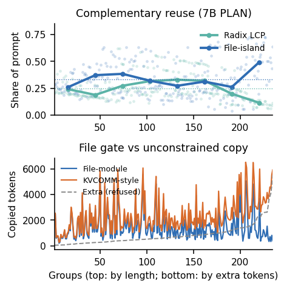

### 5.2 损失落在哪（3B probe，不是 7B/30B 注意力）

7B 速度战役**不记 attention**。另开 Qwen2.5-Coder-3B 探针：

- 26 岛：suffix TV **0.00264**，next-action **0.00492**，source-time formation **0.0462**（大约高一个数量级；约 4.4% formation 质量在 target 前缀没有对应物）。
- 20 条 Dense prompt：top-10% key 吃掉 **80.1%** 质量；观察内 top-20% 为 **80.2%**。
- 同一 8 条 prompt：file-module module TV **0.00214** vs CacheBlend **0.0454** vs KVCOMM **0.0745**（局部 TV，不是 Accuracy）。

**推理方向：** 默认修后缀（CacheBlend 式）是错的 repair；该修的是岛在 source 前缀下形成的 $K$ 相位 → M2 做 source 侧 $K$ 预旋转，而不是 suffix recompute。

**硬边界：** 编译器 **does not estimate Attention**。TV 不进主表，不绑 $1.492\times$ / $1.375\times$。

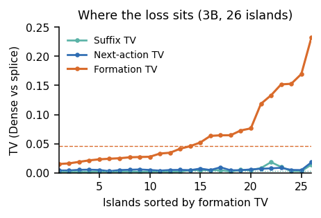

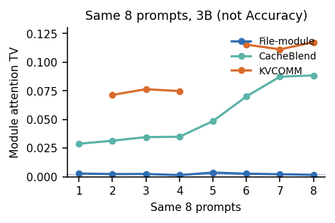

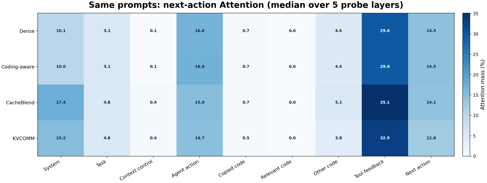

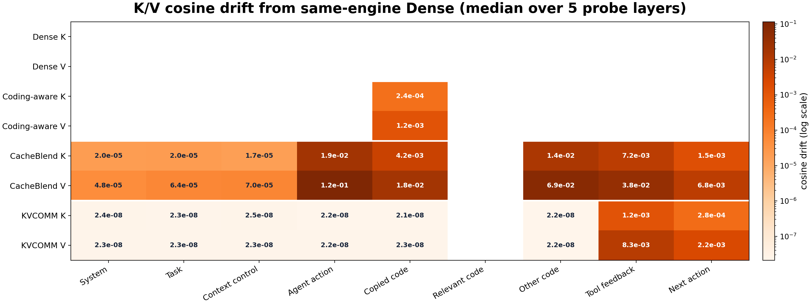

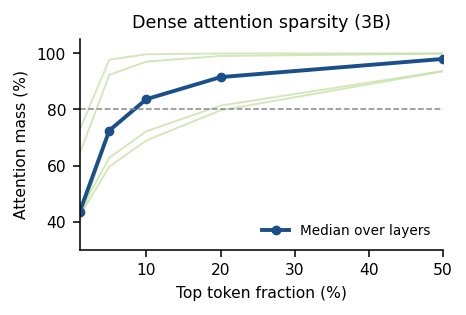

### 5.3 Opportunities（三条，直接变成 Design）

1. **Admit 移位文件，不是整段 prompt。** 拷 33.4% 合法文件岛，issue / tool / 过期文件走 Dense。
2. **修 $K$ 相位，不要重算 suffix。** Formation TV $\sim 17\times$ suffix TV。
3. **机械失败则整岛 fail-closed。** 多拷那 194,624 extra token 更快、更不一致，那不是本政策。

---

## 6. Design：四个模块，Headline 只用两个

在线路径：**Dense prefix → M2 拷贝已 admit 的岛 → Dense remainder → 1-token decode**。

| 模块 | 作用 | Headline 137185 |
|---|---|---|
| **M0** 编译器 | 冻结轨迹 → PLAN：hash、$(s,t,L)$、$\Delta\neq 0$ | **开** |
| **M1** 前缀复用 | radix LCP，不拷岛 | **关** |
| **M2** lossy 拷贝 | $K \leftarrow R_\Delta K$，$V$ 原样；机械失败则 Dense | **开** |
| **M3** prefetch | later-roles 驻留提示；miss → M2 | **关** |

关 M1/M3 的原因：主表不能被 radix hit 或 prefetch 领功。M3 miss 必须退化成仍持有的 M2 拷贝，不能把合法岛改成 Dense。

页身份：`(source-prefix hash, content hash, $\Delta$)`。相同 token、不同左上下文或不同 $\Delta$ = 不同物理页。

---

## 7. M0：文件模块 admit 编译器

不是让 LLM 给每个任务合成 DAG。离线 oracle：重建精确 target token → 定位 `repository_code` → 过四道门：

1. 单文件（一条 path）
2. 该 path 在轨迹里的版本仍有效（编辑后不拷旧文件）
3. source/target token ID 在 span 上相同
4. $\Delta \neq 0$（零位移丢掉）

产出：235 组、421 岛（丢掉 48 个零位移）。组内 1/2/3 岛 = 89 / 106 / 40。均值 copied 1537 / prompt 4433（median 4239；p90 6759；max 8721）。

---

## 8. M2：true-lossy 文件岛拷贝

每座合格文件模块是一个物理岛。目标计算路径：Dense prefix，拷每座岛，Dense remainder，再 decode。租赁岛要么整段拷，要么整段丢，没有 partial serve。

Fail-closed：hash 不匹配 / 覆盖不全 / 分配失败 → 丢岛、Dense 重算。Headline：421 次 source 预旋转，0 fallback。**零 fallback 不是贡献，也不能拿掉检查。**

---

## 9. Evaluation

顺序必须是 **Setup → Overall → Ablation → Sensitivity**。正文评测图全部 `\columnwidth`，禁止 `figure*`。

### 9.1 Setup

- 引擎 SGLang；模型 Qwen2.5-Coder-7B-Instruct；温度 0；decode 1 token；warmup 1 + 测 3（$235\times 3=705$ 对）。
- 作业 **137185**。Prefetch 和普通 prefix **关**。
- 数据集：24 任务 live-agent，**convenience sample**，不是 500-task；235 组是 rolling-6 **轮次**，不是 235 个任务；6 个仓库，20/24 任务有合格组。
- 主基线：同一引擎、同一 token 的 Dense。隔离：prefix-only / dual（139839）；admit 克隆：KVCOMM-style / CacheBlend-style 15% 边界重算（137400），**不是原生栈**。
- **不报** source-inclusive $N$-use。

两个 checkpoint 只报 agree + copy，不把两个 speedup 写进同一张小表：

| Checkpoint | Job | Agree | Copy |
|---|---|---|---|
| Qwen2.5-Coder-7B-Instruct | 137185 | 93.6% | 1684/1684 |
| Qwen3-Coder 30B-A3B (AWQ) | 96092 | 94.8% | 1684/1684 |

### 9.2 Overall（只 7B 主表）

| 指标 | Dense | ImpactKV |
|---|---|---|
| 组 / 对 | 235 / 705 | 235 / 705 |
| 拷贝 / fallback | — | 1684/1684 / 0 |
| Mean TTFT | 585.9 ms | 392.7 ms |
| Median / p90 / p99 | 555 / 952 / 1178 | 383 / 586 / 819 |
| Cache-ready | $1.000\times$ | **$1.492\times$** |
| 成对节省（均/中） | — | 30.6% / 27.9% |
| 成对胜率 | — | **99.3%** |
| One-token agree | — | **93.6%**（不是 resolved） |

30B 附录：$1.375\times$，94.8%。不要写进 Table 7/8 主表。

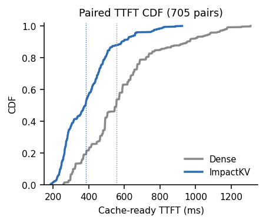

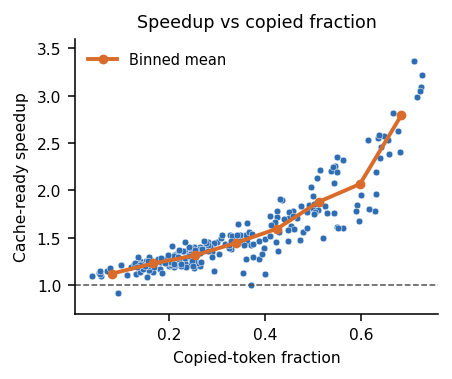

### 9.3 Ablation

**Prefix 隔离（作业 139839，同一 235 组 PLAN，prefetch 关）。** Speedup 相对**这次** Dense，不混进主表。

| Arm | vs Dense | Med. save | Agree | Prefix | Copy |
|---|---|---|---|---|---|
| prefix-only | $1.526\times$ | 32.9% | 100% | 940 | 0 |
| lossy-only | $1.408\times$ | 23.7% | 93.6% | 0 | 1684 |
| dual | $2.120\times$ | 55.4% | 94.9% | 940 | 1126 |

文件模块在已有 prefix 上的增量是 dual/prefix-only = **$1.390\times$**，同样不进主表。Dual 的 $2.120\times$ 不要和 $1.492\times$ 写在一起。

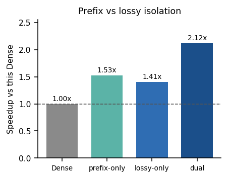

**Admit 克隆（作业 137400，同一引擎，不是原生 CacheBlend/KVCOMM）。**

| Arm | vs Dense | Med. save | Win | Agree | Copy |
|---|---|---|---|---|---|
| File-module | $1.492\times$ | 27.9% | 99.3% | 93.6% | 1684/1684 |
| KVCOMM-style | $2.100\times$ | 50.9% | 99.9% | 89.4% | 948/948 |
| CacheBlend-style | $1.883\times$ | 45.6% | 100% | 91.9% | 948/948 |

无约束更快，是因为多搬了 token；headline 留下文件门，是因为那 194,624 extra 不是合法仓库文件。51 对上 file 跟 Dense、KVCOMM 不跟（17 组 × 3 round）。**不 full-decode 这 17 组。** 不跑 same-token 30B CacheBlend/KVCOMM。30B 上 greedy longest-span（132385）**不是比较对象**（agree 94.8% → 87.1%）。

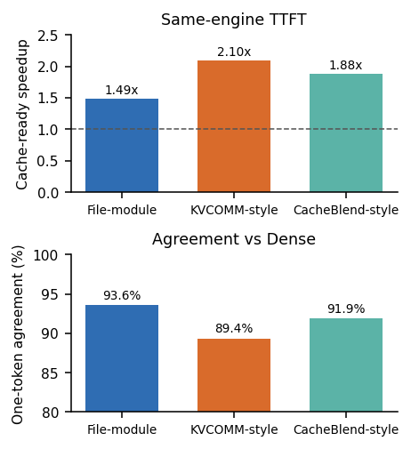

### 9.4 Sensitivity（同一 705 对，不是新 GPU）

Speedup 随 prompt 变长、岛变多、拷贝比例变高而变大；$|\Delta|$ 不是主因。

- 长度：<3K $1.28\times$ → ≥7K $1.97\times$
- 岛数：1/2/3 = $1.315\times$ / $1.492\times$ / $1.833\times$
- 拷贝比例 Q1→Q4：$1.196\times$ → $2.116\times$
- $|\Delta|\ge 3000$ 仍是 $1.609\times$

数值表在附录（`tab:prompt-shape` / `tab:ablate-islands` / `tab:ablate-delta` / `tab:ablate-frac`）。

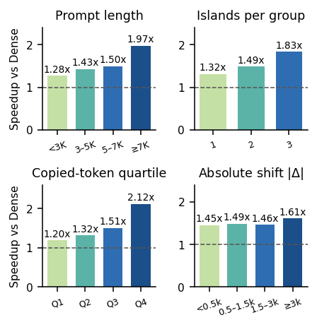

One-token 93.6% 的字段名叫 `not_accuracy`。Live-agent 24 任务 Dense 3/24 vs policy 5/24（McNemar $p=0.625$）是轨迹生产者，不是本 replay，也不是 Accuracy 赢。

---

## 10. 附录里有什么（正文不要混进来）

- 七组 dual-island 隔离（不是 30B PLAN，不是主表）。
- 30B AWQ 回放 $1.375\times$（作业 96092）。
- Template prefetch（作业 119795）：coding $1.390\times$、prefetch-only $0.996\times$、combined $1.392\times$。**不要把 prefetch 表当成 $1.492\times$ 方法。** Hints 是 next-island / later-roles，不是 remaining uses。
- 按仓库切片（30B 派生，不排名）。
- 7B sensitivity 数值表；fail-closed 机械计数图、岛数分布图。

---

## 11. 图表 ↔ 文件（改图改这里）

| 论文标签 | 文件 | 生成脚本 / 来源 |
|---|---|---|
| fig:dag-example | `figures/dag-example.tikz` | 手写 TikZ |
| fig:motivation-coverage / extra | `figures/fig_motivation_coverage.png` | `scripts/build_motivation_heatmaps.py`（7B PLAN + 137400 PLAN） |
| fig:tv-locus / module-tv / attn-proxy | `figures/fig_tv_locus.png` 等 | 同上（3B frozen26 / four-arm / frozen20） |
| fig:attn-heatmap / kv-heatmap | `figures/fig_attn_heatmap.png` | 冻结 3B four-arm PNG，不要手改数字 |
| fig:architecture | `figures/architecture.tikz` | 手写 TikZ |
| fig:template-process | `figures/template_process.tikz` | 手写 TikZ |
| fig:kv-reuse | `figures/kv-reuse.tikz` | 手写 TikZ |
| fig:ttft-cdf / copied-speedup / prefix-on / admit / slices | `figures/fig_*.png` | `scripts/build_7b_eval_figures.py`（冻结 137185/139839/137400） |
| 主表数字 | `sections/evaluation.tex` | 只许从 RESULT.json 抄，禁止手改 |

正文：`sections/*.tex`。检查：`scripts/check_asplos_claims.py`。编译：`bash compile.sh`。

**Motivation 节禁止再出现 `\begin{table}`。** 评测正文图必须 `\columnwidth`。

---

## 12. 改稿时常见杀伤

- 把 cache-ready $1.492\times$ 说成冷启动 wall-clock 或 N=1 服务加速。
- 把 93.6% one-token 说成 Accuracy / resolved。
- 打开 prefix 或 prefetch 却把增益算给 coding-aware copy。
- 把 30B $1.375\times$ 写进 7B 主表，或和 $1.492\times$ 并排当「一个方法两个规模」。
- 把 3B TV 和 7B/30B TTFT 绑在一起。
- 恢复 N=4 账单（0.905 / 0.841 / `tab:nuse`）。
- 写 SOTA。写「欠 500-task / 并发 P99 / 原生 CacheBlend 绝对值」。
- 用 `\vspace` 挤 11 页（检查器会 FAIL）。

诚实的一句话：编码感知的 true-lossy 文件模块复用，是长多文件 agent prompt 上的 **cache-ready** 赢。它是 sequential one-token prefill vs 自己的 Dense，不是并发 serving，不是冷启动 wall-clock，也不是 official SWE-bench resolved。
