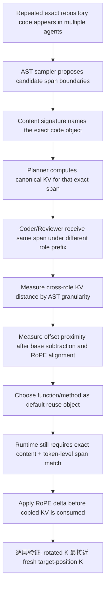
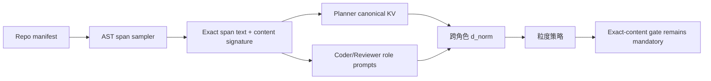
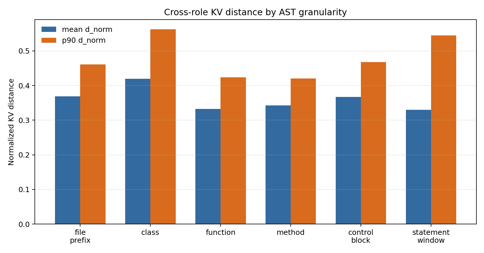
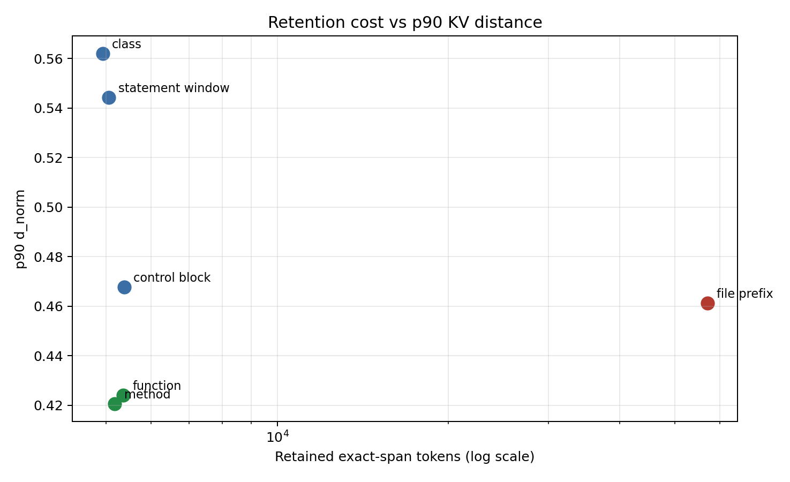
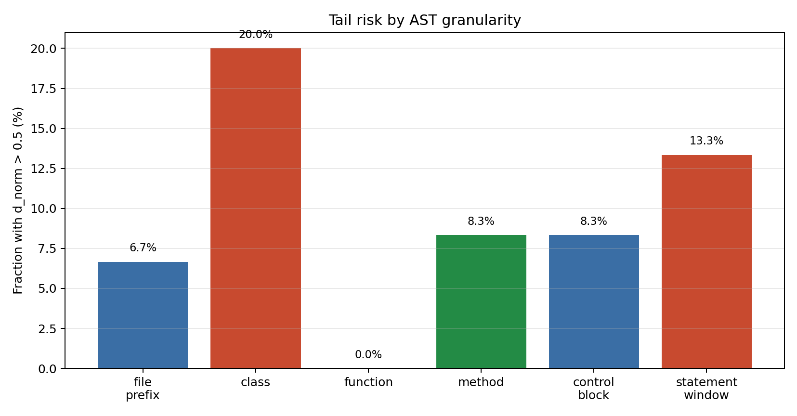
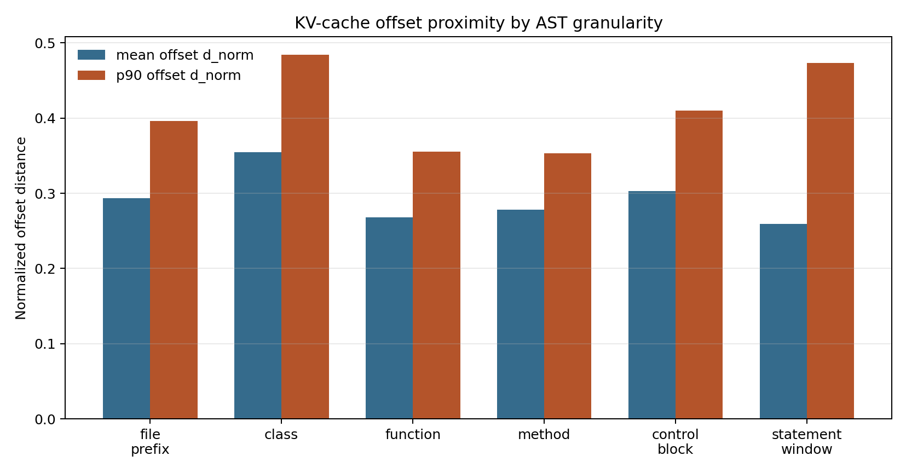
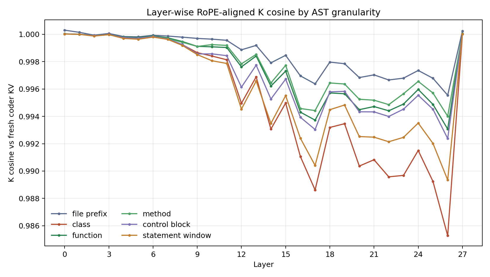
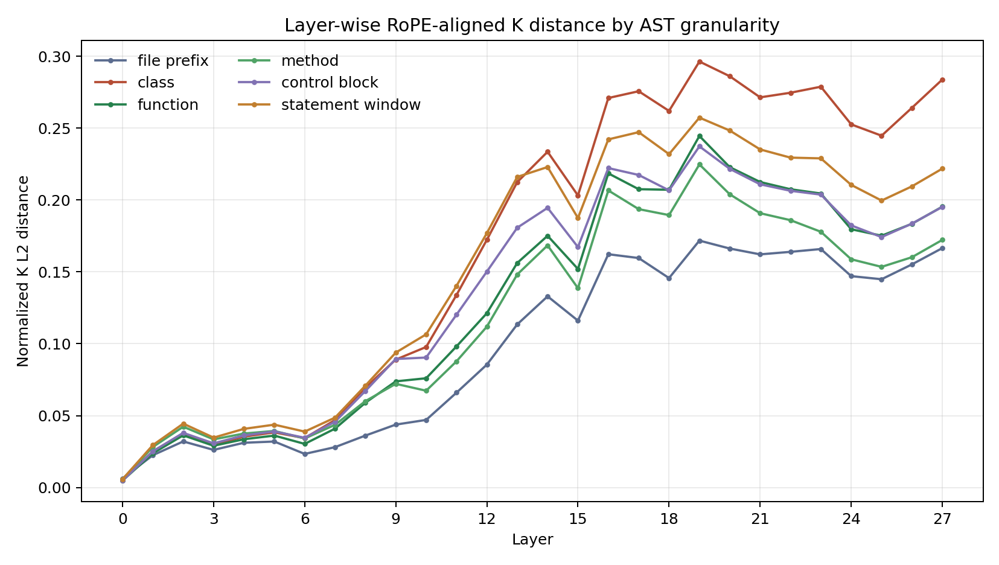
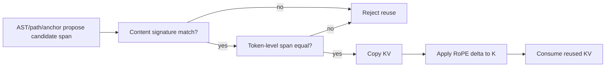

# AST 粒度 KV 距离贡献展示报告

## 0. 摘要

这份报告解释 AgentTemplateKV 中一个容易被误解的设计点：为什么要用 AST 粒度来选择可复用的代码片段，以及为什么这不等于“按 AST 相似性复用 KV”。

一句话结论：**AST 只帮助系统选择和定位 exact code span；真正允许 KV 复用的安全条件仍然是 normalized code content signature 和 token-level span check。** 在这些安全条件成立后，raw KV distance 和 KV-cache offset proximity 两组实验都显示 function/method 粒度比 class、statement window 更适合作为默认缓存对象；逐层 RoPE 实验进一步显示，跨位置复用时正确 delta 旋转能让 copied key cache 明显更接近 fresh target-position KV。

面向非项目成员，可以先记住三件事：

1. **我们不是复用“相似代码”的 KV**：代码内容必须完全一致。
2. **AST 粒度解决的是“缓存哪一段代码最合适”**：函数、方法、类、文件前缀等粒度有不同稳定性和成本。
3. **RoPE delta 解决的是“同一段代码出现在不同 prompt 位置时，KV 怎么对齐”**：正确旋转后，key cache 更接近重新计算得到的 fresh KV。

## 0.1 关键术语

| 术语 | 直观含义 | 在这里为什么重要 |
|---|---|---|
| KV cache | LLM attention 中已经算好的 Key/Value 张量 | 复用 KV 可以减少重复 prefill 计算 |
| Code span | prompt 中一段连续代码文本 | 多 agent 常常反复读取同一段 repo 代码 |
| AST granularity | 用语法结构定义代码片段的边界，例如 function/method/class | 决定“缓存哪一段代码” |
| Exact-content reuse | 只有 normalized code text 完全一致才允许复用 | 防止相似但行为不同的代码被误复用 |
| Content signature | normalized code text 的哈希式身份标记 | 跨 agent 传递“这段代码是谁” |
| Token-level span check | 运行时确认当前 prompt 中 token 序列和缓存 span 一一相同 | 保证实际 copy KV 的 token 边界正确 |
| Anchor | 用于定位候选代码 span 的元数据或缓存入口 | 只负责定位，不能单独作为安全 gate |
| RoPE delta | 两个 prompt 中同一 span 的位置差 | 同一代码换位置后，Key 需要按位置差旋转 |
| d_norm | 归一化后的 K/V 距离，越小越接近 | 衡量跨 role/prompt 后 KV 是否稳定 |

## 0.2 这项贡献证明了什么

这组实验证明的是一条分层证据链，而不是单点 claim：

不证明的内容也要说清楚：

- 不证明 AST-similar code 可以复用；不能。
- 不证明所有模型、所有 repo、所有长度下 function/method 都最优；当前是 7B 主结果加 3B sanity。
- 不证明 task accuracy 会提高；这只是 serving-side reuse object selection 和 numeric alignment 证据。

## 1. 贡献主张

本实验支撑的结论是：AST 粒度不是安全复用条件，而是 exact-content reuse object 的选择信号。安全边界始终是 `exact_code_content_signature`；AST、path、line span、anchor 只负责定位候选 span。

在当前 7B 主结果中，`function` / `method` 在 cross-role KV distance、tail risk 和 retention cost 之间最平衡，因此适合作为默认 reuse object。`statement_window` 均值低但尾部风险高，`class` 的 p90/max 更高，`file_prefix` 的 token saving 最大但 retention cost 高。

如果把系统看成一个缓存系统，这个 contribution 解决的是：**缓存对象的边界怎么选**。prefix cache 只能自然复用 prompt 开头的公共前缀；coding MAS 的重复内容经常是 repo code block，出现在不同 agent prompt 的中间位置。因此我们需要一个 code-aware 的对象边界。AST 提供了自然候选边界，但安全复用仍然由 exact content 决定。

下面这张概念图展示同一个 Python 文件可以按不同 AST 粒度切成 reusable cache objects。图中 function/method 被强调，是因为实验结果显示它们在距离、尾部风险和缓存成本之间更平衡。

## 2. 与 KVCOMM 的关系

KVCOMM 的核心启发是：同一可复用内容在不同 agent prefix / context 下会产生 KV offset variance，因此需要用 anchor / proximity 诊断判断跨上下文复用是否稳定。本实验借鉴这个思路，但把对象限定为 repository code span，并把 AST 粒度作为 reuse-object stability diagnostic。

区别也很重要：这里不使用 AST 相似性放宽复用条件。即使某个 AST 粒度的 KV distance 很低，也只能说明这个 exact span 是较好的缓存对象；真正允许复用的条件仍然是 normalized code content signature 完全一致。

可以这样理解我们和 KVCOMM 的关系：KVCOMM 给出“跨上下文 KV 复用需要看 proximity/anchor/position alignment”的系统思路；AgentTemplateKV 把这个思路落到代码场景，并额外强调代码安全边界。代码不同于普通自然语言片段：两个函数名字、AST 结构甚至 line span 很像，也可能因为一个 literal/operator 改动而语义完全不同。所以我们把 AST 降级为 locator，把 exact content signature 提升为安全 gate。

## 3. 实验工具链

这一节说明实验真正使用了哪些库和机制。脚本文件名只影响复现路径，不是方法本身。

| 组件 | 使用的工具/库 | 在本实验中的作用 |
|---|---|---|
| AST parsing | Python standard library `ast` | 解析真实 Python 文件，找到 `ClassDef`、`FunctionDef`、`If/For/Try/With` 等语法边界，用来构造不同粒度的 candidate code spans。 |
| Span slicing | Python file I/O + line-number slicing | 按 AST 节点的 `lineno/end_lineno` 从真实 repo 文件切出代码文本；`statement_window` 用固定行窗口作为 fallback 粒度。 |
| Content identity | SHA-style normalized text signature | 给 exact code text 生成稳定 identity，用于说明“这段代码是谁”；它不替代 token-level check。 |
| Prompt construction | Hand-written planner/coder/reviewer role prompts | 保持代码文本完全相同，只改变 agent role/system prompt，从而模拟 coding MAS 中同一代码被不同 agent 使用。 |
| Tokenization | HuggingFace `AutoTokenizer` | 把完整 chat prompt token 化，并用字符位置到 token 位置的映射定位 code span 在 prompt 中的 token start/end。 |
| Model forward | HuggingFace `AutoModelForCausalLM` + PyTorch | 使用 `use_cache=True` 捕获每层 attention 的 `past_key_values`，即 code span 对应的 K/V cache。 |
| Tensor computation | PyTorch tensor ops on CUDA | 对 span 的 K/V tensor 计算 L2 distance、cosine similarity、nearest-anchor margin、RoPE delta rotation。 |
| Runtime hardware | Single RTX 4090, CUDA, bf16 when available | 保持实验预算和论文假设一致，避免依赖多卡或大显存环境。 |
| Statistics | Python aggregation + bootstrap sampling | 计算 mean/p50/p90/max、tail-risk rate、bootstrap 95% CI 和 Spearman rank correlation。 |
| Visualization | Matplotlib for layer-wise plots; lightweight PDF writer for compact summary plots | 生成 cross-role distance、cost-vs-distance、tail-risk、layer-wise RoPE K/V 对齐图。 |

- 主模型：`Qwen/Qwen2.5-Coder-7B-Instruct`
- AST 距离实验选取的层：`[-1, -2, -3, -4]`
- 逐层 RoPE 验证：覆盖所有 transformer layers。
- Canonical source：planner 视角下的同一 exact code object。
- 主距离指标：对 K/V span tensor 计算 L2 distance，在选定 layers/heads/dims 上平均，并用 `sqrt(span_tokens)` 归一化为 `d_norm`。
- Offset proximity 指标：构造 neutral/base prompt，分别计算 planner/coder/reviewer 相对 base 的 K/V offset；Key 先 RoPE-align 到 base position，再比较 downstream offset 与 planner offset 的距离。

### 3.1 本次 artifact 的具体实验设置

| 项目 | 设置 | 为什么这样设定 |
|---|---|---|
| 主模型 | `Qwen/Qwen2.5-Coder-7B-Instruct` | 与论文 4090 实验主线一致，避免把 AST 诊断建立在更大模型上。 |
| 最大序列长度 | `4096` tokens | 覆盖本批 code spans 和 role prompt，同时控制 24GB 显存压力。 |
| Span/variation 数量 | `180` spans / `540` prompt variations | 每个 span 构造 planner/coder/reviewer 三个 role 视角。 |
| AST 粒度 | `file_prefix, class, function, method, control_block, statement_window` | 覆盖从大块 file prefix 到局部 statement window 的候选缓存对象。 |
| 选取层 | `[-1, -2, -3, -4]` | 使用模型后几层作为主距离统计，聚焦更接近生成决策的 KV 表征。 |
| Canonical role | `planner` | 模拟上游 planner 首先读取代码并建立可复用缓存对象。 |
| Downstream roles | `coder`, `reviewer` | 模拟同一段代码在不同 agent instruction / role prefix 下被再次读取。 |
| 内容控制 | same exact code object | 代码文本完全相同，只改变 prompt 上下文；这样距离变化来自 role/context，而不是代码差异。 |
| Pool diagnostics | `True` | 额外构造同粒度 anchor pool，检查正确 planner anchor 是否仍为最近邻。 |
| Offset proximity artifact | `ast_granularity_offset_proximity_7b.json` | KVCOMM-style 补强：扣除 neutral/base 表征并做 RoPE 对齐后，比较上下文 offset 是否稳定。 |
| Pool temperature | `0.1` | 用于把 nearest-anchor 距离转成 softmax-style entropy，观察 anchor 是否唯一清晰。 |

每条距离记录的基本单位是：一个具体 `span_id`、一种 AST 粒度、一个 agent role。planner 记录作为 canonical source；coder/reviewer 记录与同一个 `span_id` 的 planner canonical KV 比较。最终主表只统计 coder/reviewer，所以每个粒度是 30 spans × 2 downstream roles = 60 条 cross-role records。

### 3.2 Prompt 与变量控制

实验刻意只改变三件事：agent role instruction、role prefix 长度、代码片段在 prompt 中的位置。实验刻意不改变代码正文、repo path、span boundary 和 content signature。这样可以把问题限定为 serving 中真正会遇到的情形：同一段 repository code 被不同 agent 以不同上下文反复读取。

具体来说，同一 span 会被放入 planner/coder/reviewer 三种 prompt 模板。三种 prompt 的任务描述不同，但 code block 文本保持 exact match。tokenizer 会在完整 prompt 中重新定位 code block 的 token start/end，随后只截取这一段 token 对应的 K/V tensor 做距离计算。

举一个具体例子：逐层 RoPE 验证使用 `matplotlib/matplotlib` 中 `lib/matplotlib/axes/_base.py` 的一个 function span，长度为 191 tokens。它在 planner prompt 和 coder prompt 中的代码正文完全一样，但因为 coder 前面多了 issue/context/role instruction，同一段代码在 coder prompt 中整体后移了 31 tokens。AST 粒度实验关心的是：即使 role prefix 改变，这个 exact function span 的 K/V 是否仍然接近 planner canonical；RoPE 实验进一步关心的是：后移 31 tokens 后，copy 过来的 K 是否需要按这个 delta 做旋转。

### 3.3 距离指标怎么读

`d_key` 和 `d_value` 分别衡量 Key/Value tensor 的归一化 L2 距离；`d_mean` 是二者的平均；`d_norm` 是报告中使用的主指标。直觉上，`d_norm` 越小，说明同一 exact code span 在不同 role prompt 下形成的 KV 表征越接近 planner canonical，越适合作为稳定复用对象。

这里需要和 KVCOMM 的距离定义区分开。KVCOMM 里有两类诊断：第一类是 **KV-cache proximity**，即在相同 prefix 下比较不同 token 的真实 K/V 距离；第二类是 **KV-cache offset proximity**，即在两个不同 prefix 下，先做 RoPE 位置对齐，再比较“真实 KV 相对 base KV 的偏移量”是否相近。KVCOMM 的 offset proximity 不是简单比较不同位置的 raw KV，也不只是比较“旋转后的 reused KV 与真实 KV 的最终误差”；它更关心 anchor 的真实 offset 是否能预测新样本的 offset。

因此报告现在同时保留两种指标：raw AST `d_norm` 直接比较 coder/reviewer 中同一 exact span 的 fresh KV 与 planner canonical KV 的距离，用来判断某种 AST 粒度是否是稳定的 reuse object；新增的 `offset_d_norm` 则更接近 KVCOMM-style offset proximity：先构造 neutral/base prompt，再把 planner/coder/reviewer 的 Key RoPE-align 到 base position，最后比较 downstream offset 与 planner offset。后面的逐层 RoPE delta 实验单独验证另一件事：当同一 exact span 出现在不同 prompt position 时，正确旋转后的 K 是否更接近 fresh target-position K。

为什么看 p90/tail，而不只看 mean？缓存策略最怕少数不稳定 span 造成错误复用或尾延迟异常。一个粒度即使平均距离低，只要 tail risk 高，也不适合作为默认策略。`statement_window` 就是这种情况：平均值好看，但 `d_norm > 0.5` 的比例高于 function。

读表时可以按这个例子理解：`statement_window` 的 mean d_norm 为 0.330，看上去甚至略低于 `function` 的 0.333；但它的 p90 是 0.544，且 13.3% 的记录超过 0.5。也就是说，固定窗口有些样本非常稳定，但也更容易出现坏尾部。相比之下，`function` 的 p90 是 0.424，tail >0.5 为 0%，更适合作为默认粒度。

### 3.4 端到端测量流程

1. 用 Python `ast` 解析真实 Python 文件，并按 file/function/method/class/control-block/window 粒度抽取候选 span。
2. 对每个 span 构造 planner/coder/reviewer 三类 prompt；代码文本完全相同，但 role context 不同。
3. 用 HuggingFace tokenizer 在完整 prompt 中定位 code span 的 token start/end。
4. 用 `use_cache=True` 跑模型 forward，并从 `past_key_values` 中切出该 code span 对应的 K/V tensor。
5. 把 planner KV 当作 canonical；把 coder/reviewer KV 与 planner KV 比较，得到跨角色 `d_norm`。
6. 构造同粒度 canonical anchor pool，检查每个下游 span 是否仍能把自己的 planner anchor 找成最近邻。
7. 对一个 AST 选中的 function span，把同一段代码放到两个不同 prompt 位置，逐层比较 no-rotation / correct-delta / wrong-delta KV 与 fresh target-position KV。

### 3.5 为什么以 planner 作为 canonical source

Planner 是 workflow 中最早决定哪些代码对象会被下游 agent 复用的角色。因此实验把 planner 看到的同一 exact code span 当成 canonical source，测 coder/reviewer 在不同 role prompt 下的 KV 是否仍接近它。这不是说 planner 的 KV 永远最好，而是模拟“上游 agent 先看到代码，下游 agent 后续复用”的 serving 场景。

## 4. Code base 选择

- 采样 manifest：`results/repo_level_datasets/manifest_10.json`；当前 artifact 是实际用于分析的 expanded run。
- 覆盖的 repositories：`astropy/astropy, django/django, matplotlib/matplotlib, mwaskom/seaborn, pallets/flask, psf/requests, pydata/xarray, pylint-dev/pylint, pytest-dev/pytest, scikit-learn/scikit-learn`
- Code spans 数量：`180`
- Prompt variations 数量：`540`
- 每个 span 的 prompt：planner / coder / reviewer，代码文本相同，但 system prompt 和角色上下文不同。
- AST 粒度：`file_prefix`, `class`, `function`, `method`, `control_block`, `statement_window`。

举例来说，同一个 repo 文件可能同时产生多个候选对象：文件开头的 import/config block 可以形成 `file_prefix`；一个完整的 `class Foo` 可以形成 `class`；类里的 `def bar(self, ...)` 可以形成 `method`；顶层 `def helper(...)` 可以形成 `function`；某个 `if/for/try` 块可以形成 `control_block`；如果没有合适语法边界，则用相邻若干行形成 `statement_window`。实验不是预设哪个一定最好，而是把这些候选粒度都变成 exact spans 后测 KV 稳定性。

### 4.1 每种 AST 粒度是什么意思

| AST 粒度 | 边界定义 | 直觉 | 风险/成本 |
|---|---|---|---|
| `function` | top-level Python function | 自然对应 bug fix 的最小语义单元 | 通常稳定，token 成本适中 |
| `method` | class 内部 function | 和 OO 代码修改高度相关 | 通常稳定，token 成本适中 |
| `class` | Python class block | 包含相关 methods，信息更多 | 上下文更复杂，tail risk 更高 |
| `control_block` | if/for/while/try/with 等块 | 小粒度 fallback | 语义边界不如 function/method 稳 |
| `statement_window` | 固定行窗口 | 覆盖没有清晰 AST 边界的局部片段 | 均值可能低，但尾部风险高 |
| `file_prefix` | 文件开头一段代码 | token saving 最大，适合大块重复文件前缀 | retention cost 高，显存压力大 |

### 4.2 为什么代码文本必须保持完全相同

这个实验刻意保持代码文本完全相同，只改变 role prompt 和 prompt position。这样测到的差异主要来自 serving 场景中的上下文变化，而不是代码内容变化。代码内容变化的安全问题由 gate safety 实验处理；本报告只回答 exact span 在不同上下文中是否适合作为 KV reuse object。

下图是安全复用流程的概念解释：AST/path/anchor 只提出候选 span；content signature 和 token span check 都通过之后，系统才允许 copy KV。

## 5. 实验结果

读结果时可以用下面的规则：

- `mean d_norm` 越低，平均情况下跨 role 越稳定。
- `p90` 和 `max` 越低，尾部风险越小。
- `tail >0.5` 表示明显偏离 canonical KV 的比例，适合判断 fallback 风险。
- `offset_d_norm` 越低，表示扣除 neutral/base 表征并做 RoPE 对齐后，下游 role 的上下文 offset 越接近 planner offset。
- `retained toks` 越高，表示为了保住这个粒度需要占用更多 KV/显存资源。
- `own-anchor top1` 表示在同粒度 canonical pool 中，正确 exact span 是否仍然是最近 anchor。

### 5.1 仅跨角色距离

下表只包含 coder/reviewer 相对 planner canonical 的记录，排除了 planner 自身的 `d_norm=0`，因此比旧 by-granularity 表更适合写进论文。

为什么要排除 planner 自身？因为 planner 和 planner 比较必然是同一次 canonical source，`d_norm=0`，会人为拉低均值。对 serving 有意义的是：下游 coder/reviewer 在不同 prompt 中看到同一段代码时，KV 距离是否仍然低。

| AST 粒度 | span 数 | 记录数 | 平均 d_norm [95% CI] | p50 | p90 | 最大值 | tail >0.5 | 保留 token | 策略结论 |
|---|---:|---:|---:|---:|---:|---:|---:|---:|---|
| `file_prefix` | 30 | 60 | 0.369 [0.353, 0.386] | 0.349 | 0.461 | 0.573 | 6.7% | 57,039 | high-cost stable-front-block only |
| `class` | 30 | 60 | 0.419 [0.392, 0.446] | 0.406 | 0.562 | 0.770 | 20.0% | 4,930 | DAG/TTL gated fallback |
| `function` | 30 | 60 | 0.333 [0.317, 0.349] | 0.324 | 0.424 | 0.457 | 0.0% | 5,357 | default exact reuse object |
| `method` | 30 | 60 | 0.343 [0.322, 0.363] | 0.338 | 0.421 | 0.576 | 8.3% | 5,175 | default exact reuse object |
| `control_block` | 30 | 60 | 0.367 [0.344, 0.391] | 0.358 | 0.468 | 0.585 | 8.3% | 5,379 | fallback when function/method boundary is unavailable |
| `statement_window` | 30 | 60 | 0.330 [0.298, 0.363] | 0.288 | 0.544 | 0.750 | 13.3% | 5,057 | fallback exact span; high tail risk |

### 5.2 成本与距离的权衡

`file_prefix` 的 p90 不算最差，但 retention tokens 是其他粒度的一个数量级以上；`function` / `method` 的距离和成本更均衡。

这张图回答的是工程问题：不是距离越低就越应该缓存，还要看保留这段 KV 的显存/缓存成本。`file_prefix` 能带来最多潜在 token saving，但如果所有文件前缀都保护起来，会很快挤占 24GB GPU 的 KV budget。

### 5.3 尾部风险

`statement_window` 的均值接近 function/method，但 `d_norm > 0.5` 的尾部比例更高，因此不适合作为默认模板粒度。

这里的重点是：平均值会掩盖坏情况。`statement_window` 因为边界是固定窗口，不一定对应完整语义单元，所以有些窗口很稳定，有些窗口在 role prompt 改变后漂移明显。对默认策略来说，tail risk 比均值更重要。

### 5.4 KV-cache offset proximity

这一节补上更接近 KVCOMM 的 offset-proximity 诊断。raw `d_norm` 直接比较 coder/reviewer fresh KV 和 planner canonical KV；offset proximity 先构造一个 neutral/base prompt，把 planner/coder/reviewer 的 Key 都 RoPE-align 到 base position，再比较 `downstream offset = downstream KV - base KV` 和 `planner offset = planner KV - base KV` 的距离。

直观地说，raw distance 问的是“两个 KV 绝对值近不近”；offset proximity 问的是“不同上下文造成的偏移模式像不像”。后者更贴近 anchor 机制：如果 planner anchor 的 offset 能代表下游 role 的 offset，说明这个 exact span 不只是内容相同，而且跨 role 的上下文漂移也更稳定。

| AST 粒度 | span 数 | 记录数 | 平均 offset d_norm [95% CI] | p50 | p90 | 最大值 | tail >0.5 | 保留 token |
|---|---:|---:|---:|---:|---:|---:|---:|---:|
| `file_prefix` | 30 | 60 | 0.294 [0.277, 0.312] | 0.279 | 0.396 | 0.496 | 0.0% | 57,039 |
| `class` | 30 | 60 | 0.354 [0.327, 0.381] | 0.345 | 0.484 | 0.695 | 6.7% | 4,930 |
| `function` | 30 | 60 | 0.268 [0.253, 0.285] | 0.261 | 0.355 | 0.406 | 0.0% | 5,357 |
| `method` | 30 | 60 | 0.278 [0.258, 0.298] | 0.270 | 0.353 | 0.500 | 0.0% | 5,175 |
| `control_block` | 30 | 60 | 0.303 [0.280, 0.327] | 0.299 | 0.410 | 0.514 | 1.7% | 5,379 |
| `statement_window` | 30 | 60 | 0.259 [0.227, 0.293] | 0.226 | 0.473 | 0.681 | 10.0% | 5,057 |

结果解释：`function` 的 p90 offset distance 最低，且 tail >0.5 为 0%；`statement_window` 的 mean 很低，但 p90 和 tail 仍然偏高；`class` 也有明显 tail。这和 raw distance 图给出的策略一致：function/method 更适合作为默认 exact reuse object，statement_window/class 更适合作为有条件 fallback。

一个具体读法：如果某个 function span 在 base prompt 中形成 `KV_base`，在 planner prompt 中形成 `KV_planner`，在 coder prompt 中形成 `KV_coder`，那么 offset proximity 比较的是 `KV_coder - KV_base` 与 `KV_planner - KV_base`。Key 会先按 prompt 位置差旋转到 base position，避免把 RoPE 位置差误当成上下文 offset。

### 5.5 KVCOMM-style 最近 anchor 诊断

这里的 anchor 不是一个新模型，也不是用 AST 相似性生成的模糊匹配结果。它是 planner canonical 视角下的 exact code span 缓存入口：由 `span_id`、repo/path/line range、AST 粒度、normalized content signature、token start/end 和 planner KV 表征共同标识。换句话说，anchor 表示“planner 已经见过并缓存过的这一段 exact code object”。

Anchor pool 的构造方式是：对每一种 AST 粒度，收集该粒度下 30 个 planner canonical spans，形成一个同粒度候选池。然后对每条 coder/reviewer 记录，把它的 KV 表征与池中所有 planner anchors 计算距离，检查最近的 anchor 是否就是相同 `span_id` / 相同 content signature 的 planner anchor。

选择 anchor 时不跨粒度比较。例如 function 记录只在 function anchor pool 中找最近邻，class 记录只在 class pool 中找最近邻。这样做是为了回答一个明确问题：**在给定粒度策略后，正确 exact span 是否仍然是稳定、可区分的 anchor？** 它不是要证明 function 和 class 之间谁更像，而是检验每个粒度内部的定位稳定性。

表中的 `own-anchor top1=100%` 表示正确 exact span 在同粒度 pool 中始终最近；`nearest-anchor margin` 越大，说明正确 anchor 和第二近 anchor 的距离差越明显；`pool_entropy_norm` 越低，说明概率质量越集中在一个 anchor 上，定位越不含糊。注意，这仍然不是安全 gate；它只是说明 anchor/proximity 机制有定位能力。最终能否复用仍必须通过 normalized content signature 和 token-level span check。

一个实际例子：`pylint/checkers/classes.py` 的 function span，行号 398-422，content signature 为 `3eed50c215562830`，span 长度 195 tokens。coder 视角下这个 span 的 `d_norm=0.263`；在 30 个 function-level planner anchors 中，它自己的 planner anchor 排名第 1，`nearest-anchor margin=1.984`，`pool_entropy_norm≈0`。这说明在 function 粒度下，正确 exact span 不只是“能匹配上签名”，它在 KV 空间中也和自己的 planner anchor 明显更近。

| AST 粒度 | 正确 anchor Top-1 | 平均最近邻 margin | 归一化 entropy |
|---|---:|---:|---:|
| `file_prefix` | 100.0% | 1.966 | 0.000 |
| `class` | 100.0% | 1.303 | 0.042 |
| `function` | 100.0% | 1.897 | 0.000 |
| `method` | 100.0% | 1.746 | 0.000 |
| `control_block` | 100.0% | 1.895 | 0.000 |
| `statement_window` | 100.0% | 1.871 | 0.000 |

## 5.6 跨模型 sanity check

使用同一批 spans/variations 对 `Qwen2.5-Coder-3B-Instruct` 做轻量复现。这里的 cross-model check 指的是：**同一个 AST 粒度策略在不同模型大小下是否得到相似的粒度排序和策略结论**，而不是比较两个模型谁的绝对 KV 距离更小。按 p90 d_norm 的 Spearman rank correlation 为 `0.486`。

为什么不直接比较绝对值？不同模型的 hidden size、层数、head 结构、激活尺度和 RoPE 实现细节都可能改变原始距离范围。因此跨模型更适合看相对排序：function/method 是否仍然靠前，class/statement_window/file_prefix 的风险判断是否被推翻。

这个 sanity check 的作用不是把 3B 当成第二个主结果，而是检查粒度结论是否对模型大小极端敏感。当前 3B 的绝对 d_norm 更低，但粒度排序和 7B 不完全一致，所以这里应作为保守 caveat：主结论仍以 7B 为准，3B 只说明没有发现明显反例。

| AST 粒度 | 7B p90 | 3B p90 | 差值 |
|---|---:|---:|---:|
| `file_prefix` | 0.461 | 0.191 | -0.270 |
| `class` | 0.562 | 0.216 | -0.346 |
| `function` | 0.424 | 0.196 | -0.228 |
| `method` | 0.421 | 0.196 | -0.225 |
| `control_block` | 0.468 | 0.192 | -0.275 |
| `statement_window` | 0.544 | 0.225 | -0.319 |

解释：3B 与 7B 的粒度排序差异较大，应写成 model sensitivity caveat，而不是 robustness claim。换句话说，报告可以说 function/method 在 7B 主实验中最平衡，3B 没有推翻这个策略，但不要声称跨模型排序已经稳定验证。

## 5.7 逐层 RoPE 对齐后的 AST 粒度差异

你指出得对：`wrong_delta` 是一个过于人工的负对照。真实系统知道 matched span 在当前 prompt 中的 token 起止位置，因此也知道 RoPE delta 的方向和大小。更有意义的逐层实验不是“故意转错会怎样”，而是：**在使用正确 RoPE delta 后，不同 AST 粒度的 residual K distance 在各层是否仍有差异？**

这组新实验每种 AST 粒度抽取 5 个 exact spans，共 30 个 spans。对每个 span，我们 forward planner prompt 和 coder prompt，得到同一 exact code 在两个 role/context 下的 fresh KV。然后只比较两种真实有解释价值的路径：

| 路径 | 含义 | 用途 |
|---|---|---|
| `no_rotation` | 直接用 planner 位置的 K 去对比 coder fresh K | 说明不做位置对齐的误差有多大 |
| `correct_delta` | 用真实 token 位置差把 planner K 旋转到 coder 位置 | 说明正确 RoPE 对齐后，各 AST 粒度还剩多少 residual distance |

因此，这节不再把 `wrong_delta` 当作主证据。旧单 span smoke 只能说明“随便转不行”，但对实际系统设计帮助不大；下面的多粒度逐层图才是更有解释力的结果。

| AST 粒度 | spans | 平均 K cosine | 平均 K L2 | p90 K L2 | no-rotation 到 correct-delta 的平均 L2 降幅 |
|---|---:|---:|---:|---:|---:|
| `file_prefix` | 5 | 0.9986 | 0.0984 | 0.1688 | 0.6220 |
| `class` | 5 | 0.9952 | 0.1688 | 0.3143 | 0.5262 |
| `function` | 5 | 0.9974 | 0.1288 | 0.2276 | 0.5182 |
| `method` | 5 | 0.9977 | 0.1192 | 0.2011 | 0.5231 |
| `control_block` | 5 | 0.9971 | 0.1349 | 0.2199 | 0.5187 |
| `statement_window` | 5 | 0.9960 | 0.1523 | 0.3117 | 0.5417 |

这张图的读法：每条线是一种 AST 粒度，点表示该层上 5 个 spans 的平均 correct-delta K cosine。整体 cosine 很高，说明正确 RoPE delta 对齐后，copy 过来的 Key 在各层都接近 coder fresh Key。

这张图更能区分粒度：L2 越低表示 residual distance 越小。当前样本中 `method` / `function` 的逐层 residual 较低且稳定；`class` 和 `statement_window` 的 p90 更高，说明它们即使做了正确位置旋转，也更容易留下上下文相关残差；`file_prefix` 数值上较低，但 retention tokens 成本远高于其他粒度，所以不能只凭逐层 L2 把它设为默认。

这节和前面的 offset proximity 的关系是：offset proximity 统计全部 180 spans 的跨 role offset 稳定性；逐层 AST 图抽样 30 spans，展示这种差异在模型各层上的形态。二者共同支撑 function/method 作为默认 exact reuse object，但逐层图本身不替代 exact-content gate，也不单独证明 task accuracy。

## 5.8 TTFT 加速结果

这一节只看 TTFT。AST 粒度报告本身不是 serving benchmark；它解释为什么 function/method/file-prefix 这些 exact spans 可以作为复用对象。真正的加速证据来自 TTFT micro/stress artifact，尤其是 `max_tokens=1` 的 prefill-dominant 设置。

### 5.8.1 TTFT rerun: 8k single-segment

为了检查旧 P1 rollup 中 8k p50 speedup 是否稳定，我又补跑了一次独立 rerun：10 cases、8k code block、single segment、`max_tokens=1`，同时覆盖 2/3 agents。这个 rerun 显示：TTFT 加速存在，但比旧 headline 更不稳定，尤其依赖 workflow 形态和 device-hit 是否发生。

| 实验形态 | agents | prefix p50/p90 | exact+hints p50/p90 | p50/p90 speedup | exact+hints device-hit | 解释 |
|---|---:|---:|---:|---:|---:|---|
| single downstream requests | 2 | 335.3/421.5 ms | 78.5/447.3 ms | 4.27x/0.94x | 0.60 | strong p50, weak p90 |
| single downstream requests | 3 | 336.2/465.5 ms | 356.1/467.5 ms | 0.94x/1.00x | 0.33 | moderate/unstable |
| workflow-style requests | 2 | 672.0/759.8 ms | 508.7/525.7 ms | 1.32x/1.45x | 0.00 | moderate/unstable |
| workflow-style requests | 3 | 1105.8/1124.8 ms | 883.8/902.2 ms | 1.25x/1.25x | 0.00 | moderate/unstable |

解释：新的 8k rerun 不支持把 5x 当作稳定 headline。更稳妥的说法是：在部分 8k single-segment 设置中，exact reuse 可以显著降低 p50 TTFT；但 p90、3-agent exact+hints、以及 workflow-style rows 显示 fast path 仍不稳定。后续系统章节应强调 device-hit/anchor-match 闭环仍是实现 gap。

为什么有些配置反而变慢？`exact_reuse_plus_code_hints` 不是“免费开关”：它会增加 anchor metadata、codebase hints、prefetch/protection 调度和匹配检查。如果最终没有形成 device-hit / consumed fast path，请求仍然要走常规 prefill，同时还支付了这些额外控制路径开销。rerun 中 3-agent single downstream 的 exact+hints device-hit 只有 0.33，workflow-style rows 的 device-hit 为 0.00，因此 p50 可能不升反降。换句话说，TTFT 收益的必要条件不是 exact hit 本身，而是 exact hit 能稳定转成 device-resident fast-path hit。

p50 和 p90 也可能方向不同：p50 反映一半请求的典型路径，p90 会暴露 anchor miss、queueing、prefetch 未消费、prefix cache 已经满足等尾部情况。当前结果说明我们的设计有 TTFT 机会，但实现还没有把机会稳定闭环成所有请求的低尾延迟。

### 5.8.2 TTFT P1 rollup 对照

TTFT-first 实验把 `max_tokens=1`，尽量压低 decode 成本，让 prefill / cache reuse 的影响显性化。可引用的强结果集中在 8k single-segment 设置；16k/32k 是边界结果，不能写成稳定长上下文加速。

| 设置 | prefix-cache p50/p90 TTFT | exact+hints p50/p90 TTFT | p50/p90 speedup | exact hit | device hit |
|---|---:|---:|---:|---:|---:|
| 8k, 2 agents, 1 segment | 334.7/421.4 ms | 65.7/445.4 ms | 5.10x/0.95x | 1.00 | 0.70 |
| 8k, 3 agents, 1 segment | 331.9/493.8 ms | 78.3/447.6 ms | 4.24x/1.10x | 1.00 | 0.53 |
| 16k, 2 agents, 1 segment | 940.1/1289.3 ms | 888.0/1188.7 ms | 1.06x/1.08x | 1.00 | 0.20 |
| 32k, 2 agents, 1 segment | 1796.6/2013.9 ms | 1914.0/2168.8 ms | 0.94x/0.93x | 1.00 | 0.00 |

解释：旧 P1 rollup 给出了更强的 8k p50 结果，但与上面的 10-case rerun 对照后，应把它写成 positive micro evidence，而不是唯一 headline。16k/32k device-hit 降低甚至消失，说明当前 fast path 仍有 anchor-match/metadata 闭环不足的问题。

为什么 32k 会下降？32k prompt 的 prefix prefill 本身已经很重，AgentTemplateKV 还要携带 anchor spans、content signatures、code hints 和保护/匹配元数据；如果这些元数据没有转化成 device-resident hit，就只剩额外开销。P1 rollup 中 32k 的 exact hit 仍为 1.00，但 device hit 为 0.00，说明 exact-content gate 找到了可复用对象，fast path 却没有真正命中设备缓存。此时 prefix cache baseline 反而更简单，`exact+hints` 需要做更多匹配和保护逻辑，TTFT 就会从 1796.6/2013.9 ms 变成 1914.0/2168.8 ms。

更具体地说，长上下文下降可能来自四个因素：第一，长 prompt 下 anchor 起点/位置差更大，当前实现更容易出现 `no_anchor_match` 或 protected-not-consumed；第二，24GB 4090 上长上下文 KV budget 更紧，保护大 span 会增加 cache pressure；第三，metadata/hints 随代码块长度增长，控制路径开销在未命中时无法摊销；第四，baseline prefix cache 对连续前缀已经很强，AgentTemplateKV 的优势只有在中间 exact span 能稳定 device-hit 时才会显现。因此 32k 当前应写成 implementation gap / boundary case，而不是负面否定方法设计。

### 5.8.3 放在本报告里的推荐口径

建议只写 TTFT：AST/offset/RoPE 解释为什么 exact spans 可以稳定复用；TTFT micro/rerun 说明在部分 8k 单段场景中 exact reuse 能转化为 p50 TTFT 收益，但当前 fast path 对 device-hit 和 anchor-match 很敏感。不要写端到端 latency 加速，也不要把 5x 当稳定 headline。

## 5.9 E2E accuracy / pass@1 non-degradation

TTFT 加速和代码生成正确率需要分开看。AgentTemplateKV 的主要目标不是提升模型修 bug 的能力，而是在 exact-content reuse 下减少 prefill/TTFT，同时尽量不引入额外正确率损失。当前可追溯的 official accuracy 结果是 28-case paired pass@1：同一批 cases、同一 7B 模型、同一 JSON edit/schema/test 环境，对比 lossless baseline 与 exact-content reuse/lossy 路径。

| 模式 | cases | pass@1 | pass@1 rate | avg cached tokens | avg elapsed |
|---|---:|---:|---:|---:|---:|
| `lossless` | 28 | 3 | 10.7% | 1253.3 | 2052.1 ms |
| `lossy` | 28 | 2 | 7.1% | 2190.2 | 1729.4 ms |

Failure-mode breakdown:

| 模式 | generated | diff extracted | apply ok | pass@1 | json parse failed | search-not-found | other no-diff |
|---|---:|---:|---:|---:|---:|---:|---:|
| `lossless` | 28 | 14 | 14 | 3 | 4 | 10 | 0 |
| `lossy` | 28 | 12 | 12 | 2 | 4 | 9 | 3 |

Per-case summary: lossless pass@1 `3/28`, lossy pass@1 `2/28`；observed regressions `1`，improvements `0`。

解释：这组 accuracy 结果本来就不应期待提升，因为复用 KV 不会让 7B 模型突然具备更强修 bug 能力。更合理的验收问题是：lossy/exact reuse 是否引入了很大的额外损失？当前 paired 28-case 中 lossless 为 3/28，lossy 为 2/28，绝对差距是 1 个 case；per-case summary 中 observed regressions 为 1，improvements 为 0。这个样本太小，不能证明无损，但可以支持保守口径：在 underpowered pass@1 下没有观察到灾难性 accuracy 退化，主要 claim 仍应放在 exact-content safety 和 TTFT/cached-token 机会。

## 6. 策略含义

- 默认模板粒度：`function` / `method`。
- fallback 粒度：`control_block` 和 `statement_window`，仅在没有稳定 function/method 边界时使用。
- 高成本粒度：`file_prefix`，只在模板确认 downstream agents 会复用稳定文件前缀时保护。
- 高尾部风险粒度：`class` / `statement_window`，需要 DAG evidence、TTL protection 或更严格的后续验证。
- 安全 gate 不变：任何粒度都必须通过 `exact_code_content_signature`，AST 不能作为安全条件。

### 6.1 端到端复用决策流程

实际系统中的决策顺序应理解为：

因此，对外展示时可以强调：**AST 决定候选对象，signature 和 token check 决定能否复用，RoPE delta 决定复用后是否位置对齐。**

### 6.2 常见误解

| 常见误解 | 正确解释 |
|---|---|
| AST 相似就能复用 KV | 不能。AST 只定位候选 span，内容必须 exact match。 |
| signature 替代 token matching | 不替代。signature 是 code object identity，token check 是 runtime span verification。 |
| d_norm 低就表示安全 | 不表示安全，只表示 KV proximity 好；安全仍由 exact content 决定。 |
| file_prefix 最省 token，所以默认最好 | 不一定。它 retention cost 很高，4090 上会压缩 KV budget。 |
| V cosine 不随 RoPE delta 改变说明实验没用 | V 不含 RoPE 位置旋转；RoPE delta 主要作用在 K。 |
| 3B/7B 排序不完全一致说明策略失败 | 不等于失败；它说明这组实验应写成 7B 主证据 + model sensitivity caveat。 |
