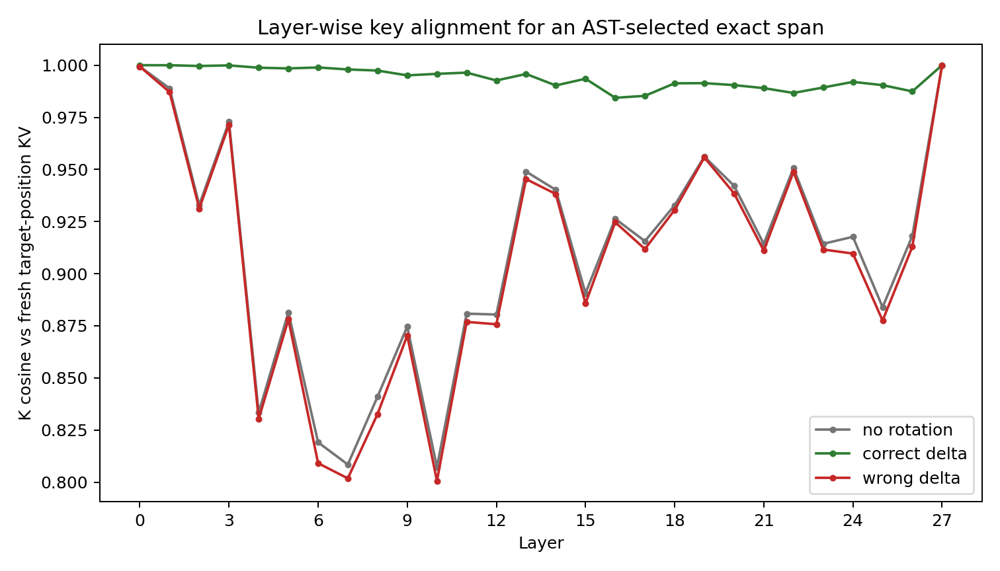
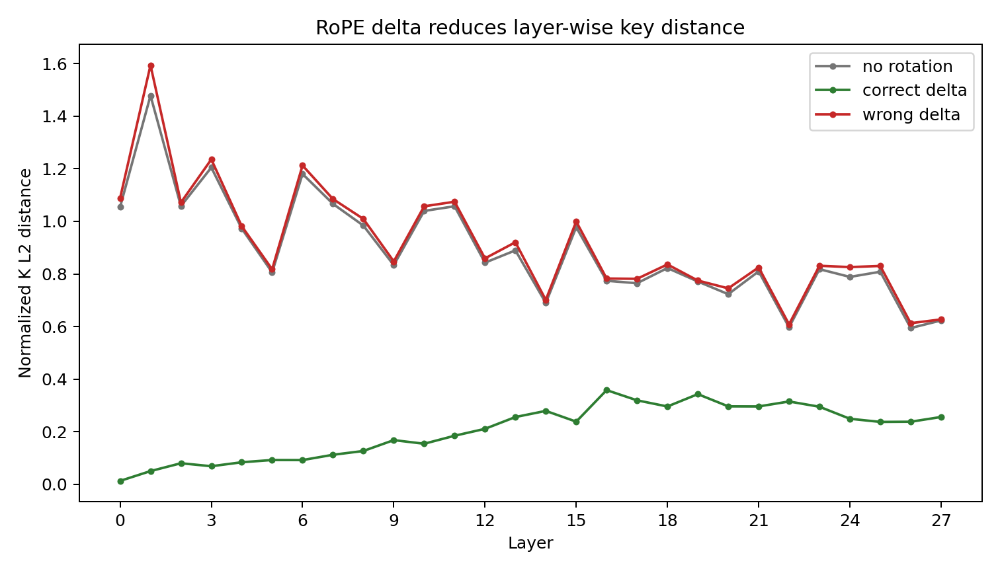
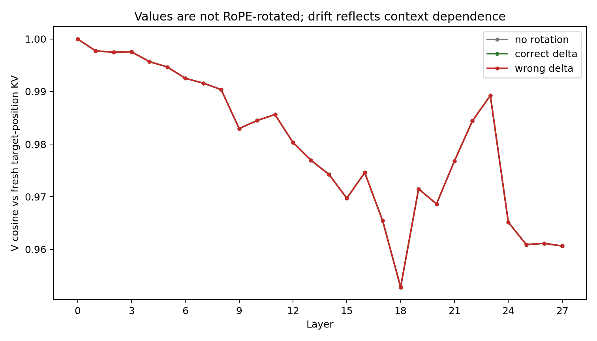

# Layer-wise RoPE Delta Validation

This experiment validates the numeric part that follows AST-based exact-span selection: once a function/method span is selected and matched by exact content, the reused key cache must be rotated to the downstream prompt position.

## Setup

- Model: `Qwen/Qwen2.5-Coder-7B-Instruct`
- Span: `matplotlib/matplotlib` / `lib/matplotlib/axes/_base.py`
- Granularity: `function` (`FunctionDef`)
- Span tokens: `191`
- True position delta: `31` tokens
- Variants: no rotation, correct RoPE delta, wrong delta.

## Summary

| Variant | mean K cosine | mean K L2 | mean V cosine | mean V L2 |
|---|---:|---:|---:|---:|
| `no_rotation` | 0.909727 | 0.893947 | 0.980106 | 0.213081 |
| `correct_delta` | 0.993871 | 0.204024 | 0.980106 | 0.213081 |
| `wrong_delta` | 0.905950 | 0.915570 | 0.980106 | 0.213081 |

## Figures

## Interpretation

Correct RoPE delta should dominate the no-rotation and wrong-delta baselines on K cosine / K distance. Values are not explicitly RoPE-rotated, so their residual drift is interpreted as context dependence rather than a rotation failure.

Paper wording: AST selects a stable exact code object, exact-content and token-level checks gate reuse, and layer-wise RoPE validation shows that the copied keys become closest to fresh target-position keys after the correct delta rotation.
