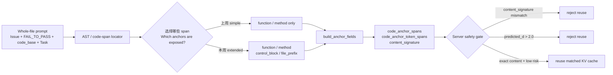
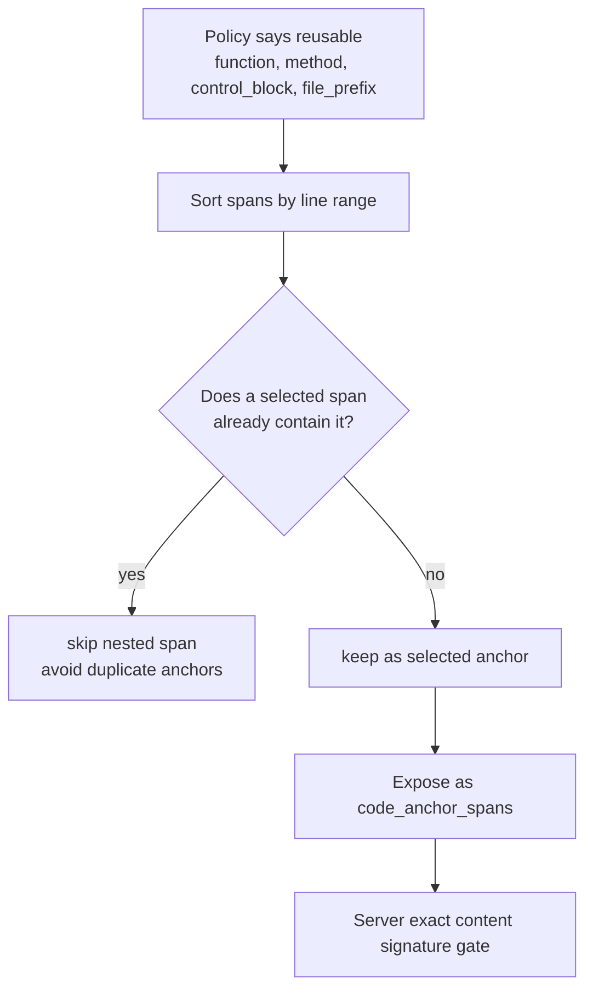
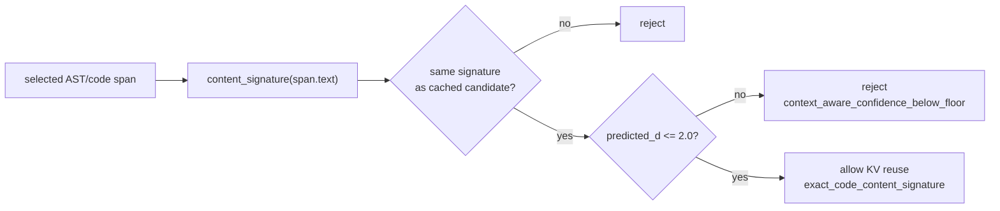
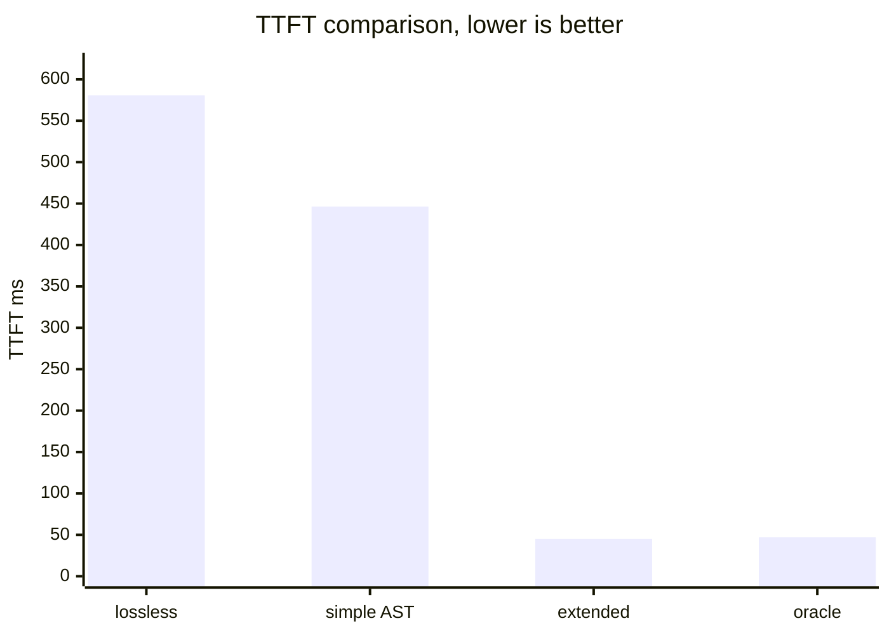
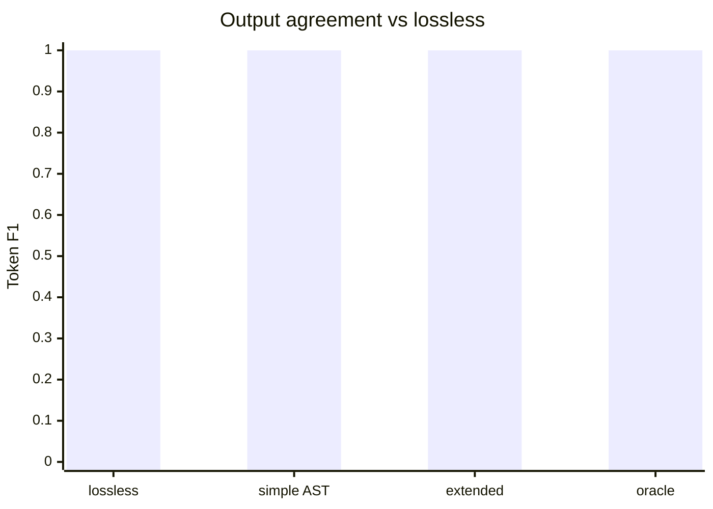
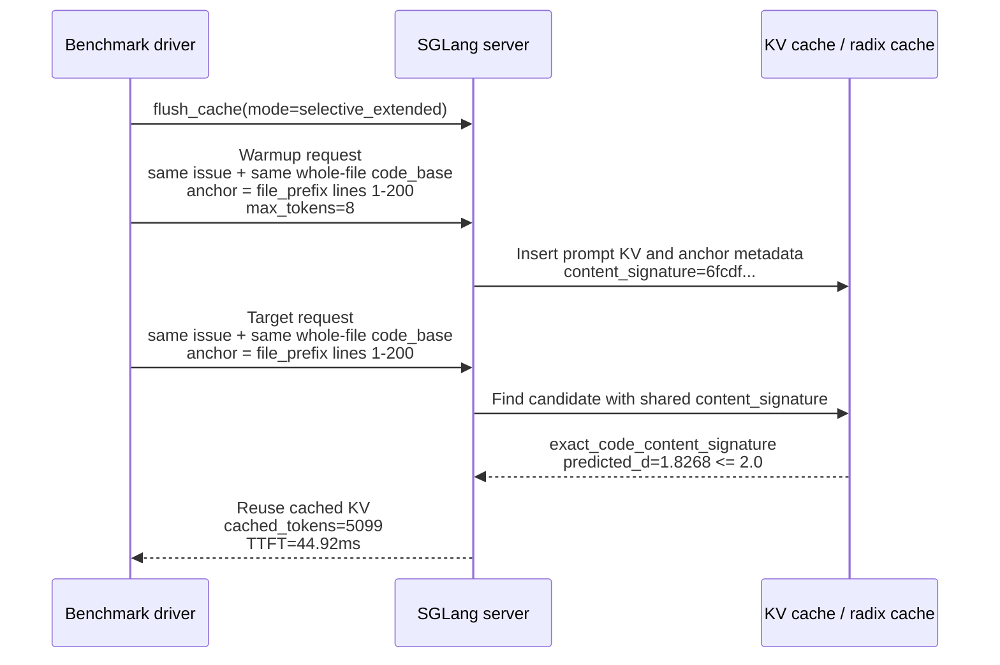
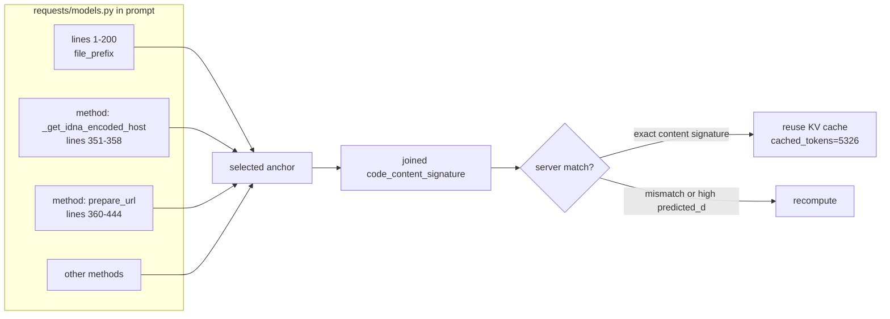
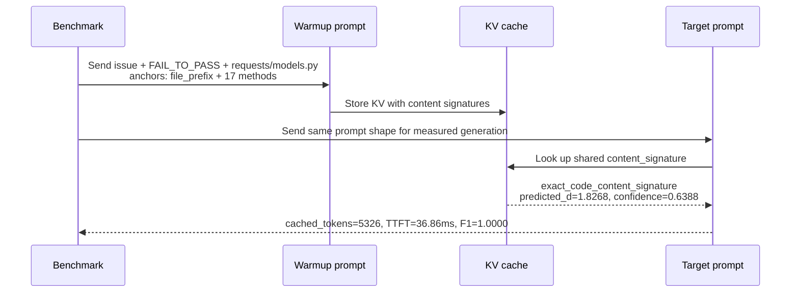
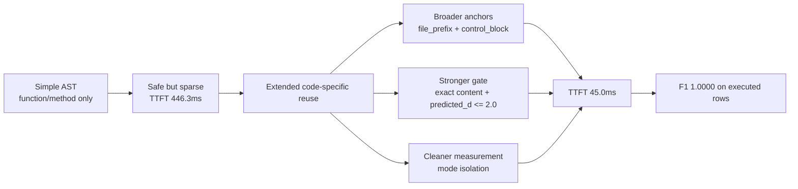

# Code-Specific Reuse 本周进展：算法区别、准确性与真实复用案例

> 面向组会展示的带图 Markdown。  
> Bilingual keywords are kept in English so the story can map back to code / logs.

数据来源：

- `results/selective_ast_reuse/swe_wholefile_68k_extended_isolated_strictd20_20260616/summary.json`
- `results/selective_ast_reuse/swe_wholefile_68k_extended_isolated_strictd20_20260616/selective_wholefile_rows.csv`
- `PHASE2_FINDINGS.md`

---

## 1. 先澄清：本周不是“AST 直接决定复用 KV”

上周的说法容易让人误解成：

> AST 找到一个函数，所以这个函数对应的 KV cache 就直接复用。

实际系统更谨慎。本周的 code-specific reuse 分成两层：

1. **客户端/benchmark 层选择 anchor**：AST 只负责从 prompt 里的代码文件中定位候选代码段。
2. **服务端层决定是否复用 KV**：只有候选代码段的 `content_signature` 精确匹配，并且 predicted KV distance 没超过安全阈值，才允许 reuse。



一句话版本：

> **AST is a locator. Exact content signature + predicted distance is the safety gate.**

---

## 2. 到底如何选择“复用哪些 KV cache”？

### 2.1 候选 span 怎么产生

对 prompt 中的 whole-file `code_base` 做 AST parse，然后生成候选 span：

| granularity | 来源 | 本周 policy 决策 |
|---|---|---|
| `function` | 顶层函数 | reuse |
| `method` | class 内方法 | reuse |
| `control_block` | `if/for/while/try/with` 等控制块 | reuse |
| `file_prefix` | 文件前 200 行 | reuse |
| `class` | class 整体 | recompute |
| `statement_window` | 语句窗口 fallback | recompute |

本周 extended policy 来自 AST granularity KV sensitivity 统计，核心阈值是：

- `p90_threshold = 0.5`
- `max_tail_rate = 0.1`
- 默认允许：`function`, `method`, `control_block`, `file_prefix`

### 2.2 selection 规则

选择逻辑可以概括成这个伪代码：

```python
spans = split_python_file(file_text)

if mode == "selective_function_method_reuse":
    selected = spans where decision == "reuse" and granularity in {"function", "method"}

if mode == "selective_extended_reuse":
    selected = spans where decision == "reuse" and granularity in {
        "function", "method", "control_block", "file_prefix"
    }

selected = non_overlapping(selected)
```

这里的 `non_overlapping` 很关键：如果一个更大的 span 已经覆盖了里面的小函数，小函数不会重复选。比如 `file_prefix: lines 1-200` 被选中后，包含在 1-200 行内的 function/method 会被跳过，避免重复 anchor。



### 2.3 服务端不是按 AST 名字复用，而是按 content signature 复用

被选中的 span 会通过 `build_anchor_fields(...)` 写进请求：

| payload field | 含义 |
|---|---|
| `code_anchor_spans` | 每个候选代码段的 anchor 类型、签名、content signature |
| `code_anchor_token_spans` | 候选代码段在完整 prompt token 序列里的位置 |
| `code_content_signature` | 多个候选 span 的 joined signature |
| `reuse_mode="lossy"` | 允许服务端尝试 code-specific reuse |

服务端 `anchor_match.py` 的关键 gate：

1. request 和 candidate 必须有共享 `content_signature`。
2. 如果 `SGLANG_CONTEXT_AWARE_MAX_PREDICTED_D=2.0`，则 `predicted_d > 2.0` 直接拒绝。
3. 通过后标记为 `exact_code_content_signature`，reuse allowed。

因此，本周算法不是“AST 类型相同就复用”，而是：



---

## 3. Bench accuracy：这批实验准不准？

这批 benchmark 的 accuracy 口径是：

- **token F1 vs lossless**：复用模式输出和 lossless 输出的 token F1。
- **exact output match vs lossless**：复用模式输出是否和 lossless 完全一致。
- 不是 SWE-bench pass@1，也不是单元测试通过率。

Corrected strictd20 结果如下：

| Mode | n_ok/n | TTFT | cached tokens | exact output match | token F1 |
|---|---:|---:|---:|---:|---:|
| `lossless_full_prefill` | 28/28 | 580.6ms | 0.0 | 28/28 | 1.0000 |
| `whole_file_reuse_all` | 28/28 | 41.5ms | 5775.6 | 28/28 | 1.0000 |
| `selective_function_method_reuse` | 28/28 | 446.3ms | 1427.6 | 28/28 | 1.0000 |
| `selective_extended_reuse` | 25/28 | 45.0ms | 5824.7 | 25/25 | 1.0000 |
| `selective_oracle_low_dnorm` | 25/28 | 47.0ms | 5824.7 | 25/25 | 1.0000 |

Graph-aware 现在也已经接入同一个 selective AST driver。这个 run 使用同样的
token-F1-vs-lossless 口径；启用 `--enable-graph-aware-lossy` 后，driver 会优先加载
graph bundle 的 target file，并把 `call_neighborhood_1hop` bundle 映射回 whole-file
prompt 中已经存在的非重叠 AST spans。目标 prompt 不额外塞 graph evidence，graph
只负责选择复用哪些已有代码 span。

Artifact:

- `results/selective_ast_reuse/swe_wholefile_68k_extended_graphaware_isolated_strictd20_20260617/`

| Mode | n_ok/n | TTFT | cached tokens | exact output match | token F1 |
|---|---:|---:|---:|---:|---:|
| `lossless_full_prefill` | 28/28 | 699.7ms | 0.0 | 28/28 | 1.0000 |
| `whole_file_reuse_all` | 28/28 | 42.2ms | 6802.2 | 28/28 | 1.0000 |
| `selective_function_method_reuse` | 28/28 | 42.2ms | 6802.2 | 28/28 | 1.0000 |
| `selective_extended_reuse` | 8/28 | 35.8ms | 4115.4 | 8/8 | 1.0000 |
| `graph_aware_lossy` | 24/28 | 38.9ms | 5366.7 | 24/24 | 1.0000 |

注意：这张 graph-aware 同-driver 表和上面的 corrected strictd20 表不能逐数值直接比较，因为启用 graph-aware 时 driver 会优先加载 graph target file，所以 28-case 的目标文件集合发生了变化。它回答的是另一个问题：**graph-aware 已经能作为 selective driver 的一个 mode，按同一 TTFT/F1 口径进入主实验表。**

每个 mode 的 accuracy 应该这样解释：

| Mode | 在验证什么 | Accuracy 怎么读 | 能不能作为最终算法结论 |
|---|---|---|---|
| `lossless_full_prefill` | 不复用 KV，完整 prefill；作为 reference output | F1 固定是 `1.0000`，因为其他模式都和它比 | 不是加速算法，是 correctness baseline |
| `whole_file_reuse_all` | 如果整份 code file 完全相同，整份文件都复用会怎样 | `28/28` exact match，说明在这个 controlled setting 下 whole-file reuse 没有引入输出漂移 | 只能作为 diagnostic upper bound；真实多轮修改时整文件通常不会完全相同 |
| `selective_function_method_reuse` | 上周 simple AST 策略：只复用 function / method spans | `28/28` exact match，说明保守策略很安全；但 TTFT 仍高，因为命中少、cached tokens 少 | 可以作为上周 baseline |
| `selective_extended_reuse` | 本周主方法：复用 function / method / control_block / file_prefix，并经过 exact content signature + predicted-d guard | `25/25` executed rows exact match，token F1 `1.0000`；3 个不是生成错误，而是 payload construction skip | 是本周主要算法结论 |
| `selective_oracle_low_dnorm` | Oracle sanity check：用低 predicted distance 的候选模拟“知道哪些更安全” | `25/25` exact match，并且 TTFT 接近 extended | 不是线上算法；用来证明 extended 已经接近 oracle selection |

这里的 `n_ok/n` 要特别解释：

- `28/28` 表示 28 个 case 都成功构造 payload、调用模型并完成 accuracy 对比。
- `25/28` 表示 28 个 case 中有 25 个真正执行了该 mode；剩下 3 个在构造 selected span payload 时跳过。
- 所以 `selective_extended_reuse` 的 accuracy 不能写成 “25/28 accuracy”，应该写成：

```text
executed rows: 25/28
exact output match on executed rows: 25/25
token F1 on executed rows: 1.0000
skipped rows: 3/28 payload construction / text-normalization skips
```

讲给老师时，最稳妥的表述是：

> 在本 benchmark 里，accuracy 衡量的是复用后输出是否和 lossless full-prefill 一致。`selective_extended_reuse` 在所有实际执行的 rows 上都与 lossless 完全一致；3 个未执行 rows 是工程性 payload 构造跳过，不是模型输出漂移。因此当前结论是：本周 extended reuse 的 TTFT 加速没有牺牲 observed generation accuracy，但还需要修复 skip rows 后再报告完整 28/28 coverage。

3 个 `selective_extended_reuse` / `selective_oracle_low_dnorm` skipped rows 是 payload construction / text-normalization skip：

- `psf__requests-1142`
- `pytest-dev__pytest-7324`
- `pytest-dev__pytest-7432`

它们不是 generation drift，也不是模型回答错了。





结论：

> 本周的 speedup 不是靠牺牲输出一致性换来的。在 executed rows 上，extended reuse 的输出与 lossless 完全一致。

---

## 3.1 Graph-aware 方法：同-driver 主表 + patch-harness 证据

按同一批 strict28 case，现在有两层 graph-aware 证据：

1. `selective_ast_reuse` 同-driver 结果：验证 graph-aware 作为一个 reuse mode 的 TTFT、cached tokens 和 token F1。
2. patch-harness 结果：验证 graph-aware bundle 接入 live patch harness 后的 exact signature hit、JSON edit synthesis 和 `git apply --check`。

Graph-aware bundle 使用 `call_neighborhood_1hop`：

```text
target symbol
+ statically resolved direct callees
+ local import/call neighborhood
+ exact normalized content signature gate
```

### 3.1.1 Coverage

Graph analyzer successfully built `call_neighborhood_1hop` bundles for `24/28` cases. Four cases were skipped because the current static Python AST analyzer could not map the patch hunk to a function/class symbol:

- `pytest-dev__pytest-7521`
- `pytest-dev__pytest-7571`
- `pytest-dev__pytest-7982`
- `pytest-dev__pytest-8399`

所以 graph-aware 结果应该写成：

```text
coverage: 24/28
runtime exact-signature hit on covered rows: 24/24
```

### 3.1.2 Same selective-driver graph-aware table

| Mode | n_ok/n | avg TTFT | avg cached | token F1 vs lossless | Selection meaning |
|---|---:|---:|---:|---:|---|
| `graph_aware_lossy` | 24/28 | 38.9ms | 5366.7 | 1.0000 | graph-selected call-neighborhood bundle mapped back to exact AST spans in the same whole-file prompt |

This is the fairest table for comparing graph-aware with AST modes, because output accuracy is measured against the same case-local `lossless_full_prefill` baseline.

### 3.1.3 Strict28 graph-aware patch-harness table

Generation/apply metrics from non-streaming run:

| mode | n/28 | elapsed ms | cached | exact sig | synth ok | apply ok | search miss | json parse fail |
|---|---:|---:|---:|---:|---:|---:|---:|---:|
| `lossless` | 24/28 | 1151.7 | 5638.1 | 0/24 | 12/24 | 12/24 | 9/24 | 3/24 |
| `lossy` | 24/28 | 1268.4 | 6145.0 | 24/24 | 13/24 | 13/24 | 7/24 | 4/24 |
| `lossy_prefetch` | 24/28 | 1423.9 | 6146.0 | 24/24 | 13/24 | 13/24 | 9/24 | 2/24 |
| `graph_aware_lossy` | 24/28 | 1031.0 | 3410.0 | 24/24 | 15/24 | 15/24 | 5/24 | 4/24 |

TTFT metrics from streaming run:

| mode | n/28 | TTFT ms | elapsed ms | cached | exact sig |
|---|---:|---:|---:|---:|---:|
| `lossless` | 24/28 | 82.1 | 1138.4 | 5832.2 | 0/24 |
| `lossy` | 24/28 | 125.8 | 1342.9 | 5415.4 | 24/24 |
| `lossy_prefetch` | 24/28 | 96.2 | 1488.5 | 5692.3 | 24/24 |
| `graph_aware_lossy` | 24/28 | 94.1 | 1026.7 | 3430.3 | 24/24 |

Result files:

- `results/code_graph_kv_reuse/strict28_graph_data_20260617/`
- `results/code_graph_kv_reuse/strict28_graph_aware_skiptest_20260617/`
- `results/code_graph_kv_reuse/strict28_graph_aware_skiptest_nostream_20260617/`
- `results/code_graph_kv_reuse/strict28_graph_aware_skiptest_20260617/GRAPH_AWARE_STRICT28_REPORT.md`

### 3.1.4 和主表怎么放在一起？

| 方法 | Locator / selection signal | Safety gate | 当前证据 | 主表使用方式 |
|---|---|---|---|---|
| simple AST | function / method span | exact content signature | 28-case TTFT+F1 | 已在主表 |
| extended AST | function / method / control_block / file_prefix | exact content signature + predicted-d guard | corrected 28-case TTFT+F1 | 已在主表，是本周主结果 |
| graph-aware | call neighborhood / import dependency / test-target bundle | exact normalized content signature；同-driver 版本再映射回 whole-file prompt AST spans | selective-driver: coverage `24/28`, TTFT `38.9ms`, F1 `1.0000`; patch-harness: exact sig `24/24`, apply_ok `15/24` | 现在可进主表；patch-harness 仍作为 apply/check 证据 |

更准确的展示方式是：主表放 selective-driver TTFT/F1；旁边增加一个 **Graph-aware patch-harness evidence** 小表，说明它在同一批 case 上也改善了 apply/check 侧的诊断指标。

### 3.1.5 真实案例：`psf__requests-5414`

这个 case 的问题是：`http://.example.com` 会触发底层 UnicodeError，期望行为是抛出 `InvalidURL`。

| mode | segment source | segment shape | cached | elapsed | apply |
|---|---|---|---:|---:|---:|
| `lossless` | file context | `requests/models.py`, 973 lines | 8458 | 946.7ms | ok |
| `lossy` | file context | same whole file context | 8459 | 954.8ms | ok |
| `lossy_prefetch` | file context | same whole file context + hints | 8460 | 956.1ms | ok |
| `graph_aware_lossy` | code graph bundle | 2 bundles, 176 + 613 lines | 6945 | 929.0ms | ok |

Graph-aware 复用的不是整份 `requests/models.py`，也不是单个 AST method。它围绕 `PreparedRequest.prepare_url`，把直接调用和导入相关的证据放进同一个 bundle：

- `PreparedRequest.prepare_url`
- `PreparedRequest._get_idna_encoded_host`
- `RequestEncodingMixin._encode_params`
- `requote_uri`
- `to_native_string`
- `unicode_is_ascii`
- `InvalidURL`
- `MissingSchema`

对比三种复用：

| reuse style | 复用假设 | 区别 |
|---|---|---|
| whole-file | 整个文件都稳定可复用 | 最强假设，容易快，但对局部编辑不鲁棒 |
| extended AST | 语法 span 稳定可复用 | 安全、可诊断，但不知道调用关系 |
| graph-aware | 目标 symbol 的调用/导入邻域稳定可复用 | 更懂程序依赖，少于 whole-file，多于单个 method |

一句话：

> Extended AST 解决“哪些语法块稳定”；graph-aware 进一步问“哪些稳定代码块在程序依赖上应该一起复用”。

---

## 4. 真实案例 A：`pallets__flask-5014`

### 4.1 Prompt 结构

这个 case 的 issue 是：

```text
Require a non-empty name for Blueprints
Things do not work correctly if a Blueprint is given an empty name.
It would be helpful if a ValueError was raised when trying to do that.
```

Benchmark 发送给模型的 prompt 结构是：

```text
system:
  You are a coding agent...
  The serving runtime may reuse exact low-risk AST spans...

user:
  ## Issue
  Require a non-empty name for Blueprints...

  ## FAIL_TO_PASS
  ["tests/test_blueprints.py::test_empty_name_not_allowed"]

  ## Whole-file code_base
  ## code_base: src/flask/scaffold.py
  ```python
  import importlib.util
  import os
  ...
  class Scaffold:
      ...
  ```

  ## Task
  Summarize the minimal implementation change needed for the issue.
```

### 4.2 哪些 prompt 被选择为可复用 anchor？

对 `src/flask/scaffold.py`，AST 候选里有：

- `file_prefix`: lines 1-200
- `function`: 7 个
- `method`: 33 个
- `control_block`: 34 个
- `class`: 1 个

上周 simple AST 只看 function/method；在 corrected run 里这个 case 的 simple mode 实际没有 selected span 命中：

| Mode | selected anchors | matched content | cached tokens | TTFT |
|---|---:|---|---:|---:|
| lossless | 0 | none | 0 | 496.39ms |
| simple AST / function-method | 0 | none | 0 | 486.70ms |
| extended | 1 × `file_prefix` | `exact_code_content_signature` | 5099 | 44.92ms |

被 extended 选中的真实代码段：

```text
src/flask/scaffold.py:file_prefix:scaffold.py:1-200
signature: 6fcdf93c11589d00
risk p90: 0.4612
words estimate: 972
```

代码片段开头：

```python
001: import importlib.util
002: import os
003: import pathlib
004: import pkgutil
005: import sys
006: import typing as t
...
044: def setupmethod(f: F) -> F:
045:     f_name = f.__name__
...
054: class Scaffold:
055:     """Common behavior shared between :class:`~flask.Flask` and
056:     :class:`~flask.blueprints.Blueprint`.
...
076:     def __init__(
077:         self,
078:         import_name: str,
...
```

### 4.3 多轮对话/请求中如何复用

注意：这里的“多轮”不是用户和模型的自然多轮聊天，而是 benchmark 对同一个 case/mode 的 **warmup request → target request**。



为什么 `cached_tokens=5099` 比 selected span 的 972 words 大？

- selected span 是 anchor，它告诉服务端“这个代码片段可以作为安全匹配依据”。
- 服务端最终报告的是实际 prompt KV 命中的 token 数，可能覆盖更大的 radix/prefix cache 节点。
- 所以 selected span 是“钥匙”，cached tokens 是“用这把钥匙打开后实际复用的 KV 范围”。

---

## 5. 真实案例 B：`psf__requests-5414`

这个 case 更容易说明“本周 extended 和 simple 的区别不是只有速度数字”。

Issue：

```text
Getting http://.example.com raises UnicodeError
Expected: InvalidUrl: URL has an invalid label.
Actual: UnicodeError: encoding with 'idna' codec failed
```

Prompt 的 whole-file code_base 是：

```text
requests/models.py
```

其中和 issue 语义相关的代码片段包括：

```python
351:     def _get_idna_encoded_host(host):
352:         import idna
353:
354:         try:
355:             host = idna.encode(host, uts46=True).decode('utf-8')
356:         except idna.IDNAError:
357:             raise UnicodeError
358:         return host

360:     def prepare_url(self, url, params):
361:         """Prepares the given HTTP URL."""
...
401:         if not unicode_is_ascii(host):
402:             try:
403:                 host = self._get_idna_encoded_host(host)
404:             except UnicodeError:
405:                 raise InvalidURL('URL has an invalid label.')
```

### 5.1 这个 case 的复用选择

Corrected run 里的行级结果：

| Mode | selected anchors | selected by granularity | matched content | cached tokens | TTFT | F1 |
|---|---:|---|---|---:|---:|---:|
| lossless | 0 | `{}` | none | 0 | 536.22ms | 1.0000 |
| whole-file diagnostic | 1 | `{whole_file: 1}` | exact content | 5326 | 36.85ms | 1.0000 |
| simple AST | 22 | `{method: 22}` | exact content | 5326 | 37.56ms | 1.0000 |
| extended | 18 | `{file_prefix: 1, method: 17}` | exact content | 5326 | 36.86ms | 1.0000 |

这里 simple AST 已经能命中，因为关键代码在 method 内；但 extended 的选择更结构化：

- 用 `file_prefix` 覆盖文件头部 imports / class setup。
- 用 methods 覆盖后续关键函数，如 `_get_idna_encoded_host` / `prepare_url`。
- 通过 non-overlap 去掉被 file_prefix 包住的重复 method。



### 5.2 多轮请求图



---

## 6. 跟上周 simple AST 的核心区别

| 维度 | 上周 simple AST | 本周 code-specific extended |
|---|---|---|
| AST 角色 | 主要用 function/method 找候选 | AST 仍是 locator，但候选扩到 file_prefix/control_block |
| 选择范围 | `function`, `method` | `function`, `method`, `control_block`, `file_prefix` |
| 安全条件 | exact content signature | exact content signature + predicted-d guard |
| benchmark 隔离 | 旧结果有 shared-cache 顺序污染风险 | per-mode flush + own warmup |
| diagnostics | metadata 不够完整，streaming F1 曾有坑 | 输出 `lossy_candidate_count`, `reuse_allowed`, first/final match, TTFT |
| 结果 | TTFT 446.3ms，F1 1.0000 | TTFT 45.0ms，F1 1.0000 |

核心升级：



---

## 7. 可以对老师这样讲

> 上周我们把 AST 当成“可复用边界”，只敢复用 function/method，所以安全但命中有限。本周我们把 AST 降级成 locator：它只负责提出候选代码段，真正决定能不能复用的是 exact content signature 和 predicted-d safety gate。这样我们可以安全地把候选扩到 file_prefix/control_block，命中大幅增加，同时通过 per-mode flush + own warmup 避免旧 benchmark 的 cache 顺序污染。

一句话结果：

> Corrected 28-case run 里，`selective_extended_reuse` 在 25/28 executed rows 上 TTFT 从 `580.6ms` 降到 `45.0ms`，输出 exact match / token F1 都是 `1.0000`。
