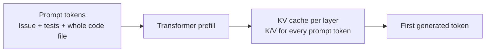
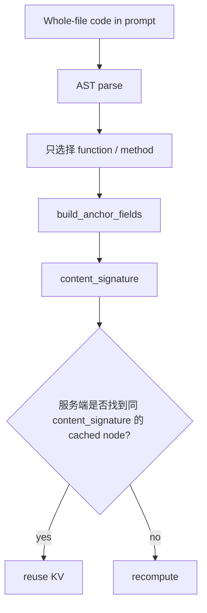
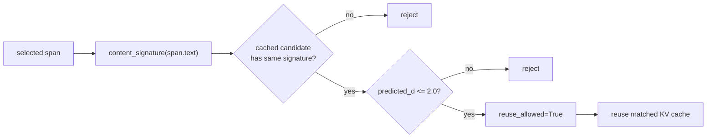
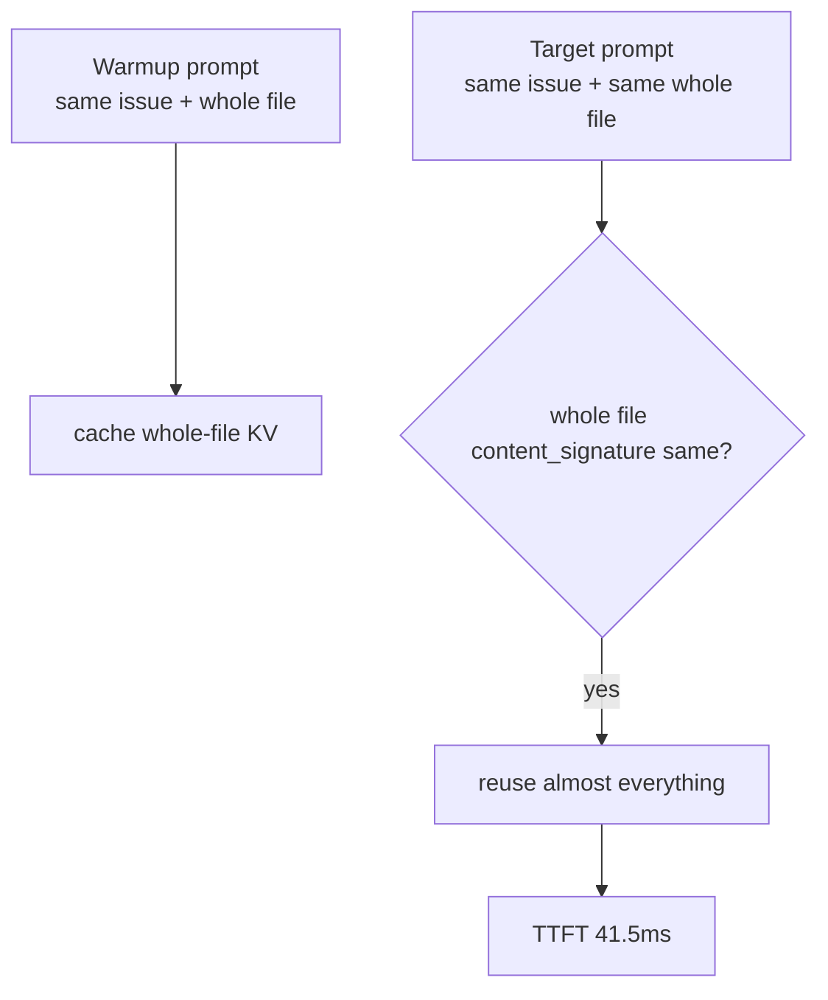
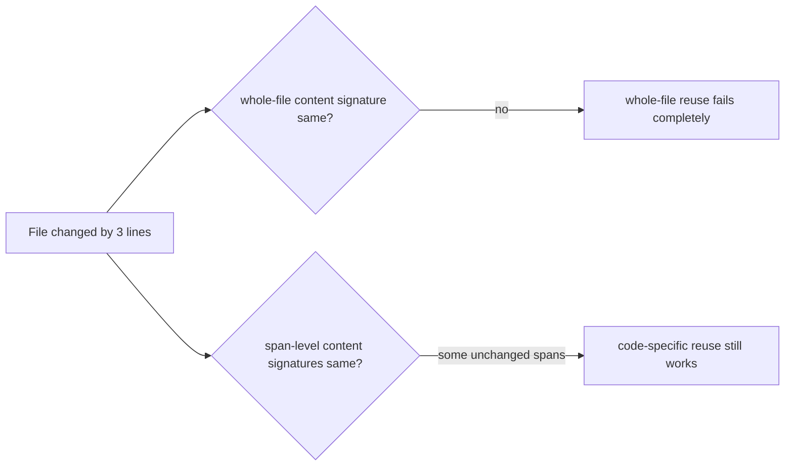
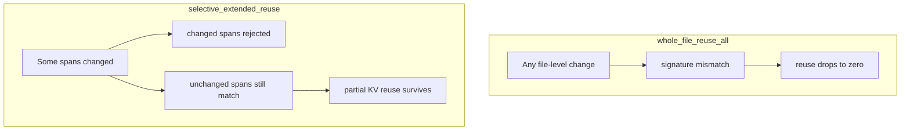
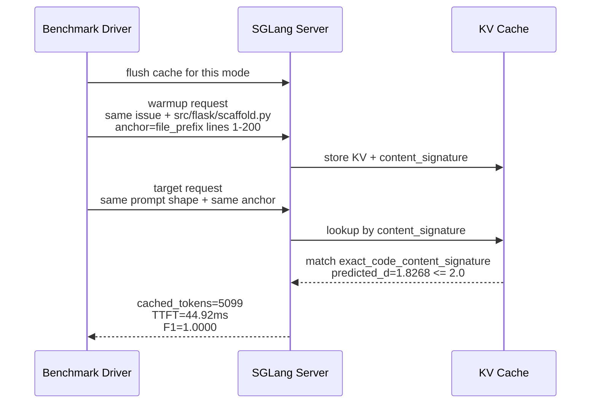
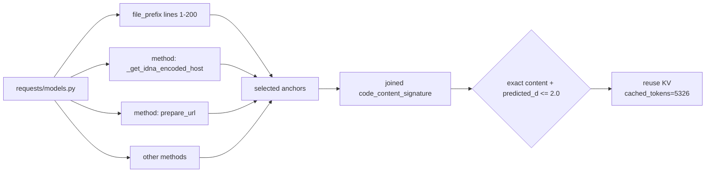

# Code-Specific Reuse 深入解释：到底复用了什么？为什么 whole-file 看起来更快？

这份说明专门回答两个疑问：

1. **AST 定位之后，系统到底怎么决定复用哪些 KV cache？**
2. **为什么 `whole_file_reuse_all` 的 TTFT 看起来比 `selective_extended_reuse` 还好？那我们为什么不直接用 whole-file reuse？**

---

## 0. 先用一句话定性

`whole_file_reuse_all` 是一个 **diagnostic upper bound / 诊断上界**：

> 如果我提前知道整份 code file 在 warmup 和 target 之间完全一样，那当然可以把整份文件对应的 prompt KV 都复用掉。

`selective_extended_reuse` 才是本周真正的 **code-specific reuse algorithm**：

> 它不假设整份文件都能复用，而是用 AST 找候选代码片段，再用 exact content signature 和 predicted-d guard 决定哪些片段真的安全。

所以当前表里：

| Mode | TTFT | F1 | 含义 |
|---|---:|---:|---|
| `whole_file_reuse_all` | 41.5ms | 1.0000 | 诊断上界：整份文件都当成可复用 |
| `selective_extended_reuse` | 45.0ms | 1.0000 | 实际算法：选择安全代码片段复用 |

whole-file 略快是正常的，因为它给了系统一个更强的假设：**整份文件都可复用**。但这个假设在真实 agent workflow 里经常不成立。

如果老师追问 bench accuracy，每个 mode 的含义是：

| Mode | Accuracy 解释 |
|---|---|
| `lossless_full_prefill` | 完整 prefill，不复用；作为 reference output，所以 F1 是 `1.0000` |
| `whole_file_reuse_all` | 诊断上界；这组 controlled prompt 里 `28/28` 和 lossless 完全一致，但真实局部修改时整文件假设太强 |
| `selective_function_method_reuse` | 上周 simple AST baseline；`28/28` 一致，说明保守但命中有限 |
| `selective_extended_reuse` | 本周主方法；`25/25` executed rows 与 lossless 完全一致，3 个 skipped rows 是 payload construction / text-normalization skip |
| `selective_oracle_low_dnorm` | oracle sanity check；不是线上算法，用来确认 extended selection 接近低风险上界 |

因此不要把 `selective_extended_reuse` 说成 “accuracy 25/28”。更准确的是：

```text
coverage / executed rows: 25/28
generation accuracy on executed rows: 25/25 exact match, token F1 = 1.0000
skipped rows: 3/28 engineering payload construction skips, not generation drift
```

还有一个容易被问到的问题：graph-aware 方法有没有补测？

答案是：**已经补了两种口径**。第一种是同一个 `selective_ast_reuse`
driver，验证 graph-aware 作为 reuse mode 的 TTFT/F1；第二种是 patch-harness，
验证 graph-aware bundle 对 JSON edit synthesis 和 `git apply --check` 的影响。
它已有的证据在：

- `results/selective_ast_reuse/swe_wholefile_68k_extended_graphaware_isolated_strictd20_20260617/`
- `results/code_graph_kv_reuse/`

- `call_neighborhood_1hop` / `import_dependency_bundle` 在 3B 和 7B 上 KV distance 更稳。
- 7B robustness sanity 中 overall mean/p90/max d_norm 是 `0.278 / 0.356 / 0.394`，tail `d_norm>0.5 = 0.00`。
- strict28 graph-aware coverage 是 `24/28`；4 个 pytest case 没有被当前静态 call-graph analyzer 映射到函数/类 symbol。
- selective-driver 中 `graph_aware_lossy` 是 `24/28`，TTFT `38.9ms`，token F1 `1.0000`。这里 graph bundle 会映射回 whole-file prompt 中已有的非重叠 AST spans，所以目标 prompt 不额外塞 graph evidence。
- covered rows 上 `graph_aware_lossy` exact signature match `24/24`。
- patch-harness 中 `graph_aware_lossy` apply_ok `15/24`，高于同轮 lossless `12/24` 和 generic lossy `13/24`。
- patch-harness streaming TTFT run 中 `graph_aware_lossy` TTFT 是 `94.1ms`；它是另一个 harness 的诊断指标，不应和 selective-driver 主表的 `38.9ms` 混成一个数。

展示时可以把它放成“两层 graph-aware evidence”：

```text
extended AST = 本周 corrected 28-case TTFT+F1 主结果
graph-aware selective-driver = 24/28 covered，TTFT 38.9ms，F1 1.0000
graph-aware patch-harness = exact sig 24/24，apply_ok 15/24
```

最容易解释的 case 是 `psf__requests-5414`：whole-file 复用整份 `requests/models.py`；extended AST 复用 file_prefix/method/control_block；graph-aware 则围绕 `PreparedRequest.prepare_url`，把 `_get_idna_encoded_host`、`requote_uri`、`InvalidURL`、`MissingSchema` 等调用/导入邻域一起作为 bundle 复用。

---

## 1. KV cache 到底是什么？

LLM 处理 prompt 时，不是直接“读一段文本然后忘掉”。每个 prompt token 经过 transformer layers 后，会产生每层 attention 用的 Key / Value 张量，也就是 KV cache。

如果 prompt 很长，例如包含整份 `requests/models.py`，prefill 会很贵：



复用 KV cache 的目标是：

> 如果一段 prompt token 和以前某次请求完全一样，就不要重新跑 transformer prefill，直接拿以前算好的 K/V。

所以我们复用的不是“答案”，也不是“AST 节点”，而是：

> **某些 prompt token 对应的 transformer KV tensors。**

---

## 2. 上周 simple AST 是怎么复用的？

上周方法可以理解成：

1. 解析 prompt 里的 Python 文件。
2. 只找 `function` / `method` 级别的 span。
3. 把这些 span 暴露给服务端作为 anchor。
4. 服务端如果看到相同 content signature，就允许复用对应 cache。



它的问题不是“不安全”，而是 **保守导致命中不够**。

比如 `pallets__flask-5014`：

| Mode | selected anchors | cached tokens | TTFT |
|---|---:|---:|---:|
| lossless | 0 | 0 | 496.39ms |
| simple AST | 0 | 0 | 486.70ms |
| extended | 1 × `file_prefix` | 5099 | 44.92ms |

这个 case 里 simple AST 没拿到有效复用；extended 通过 `file_prefix` 找到了更稳定的大块代码前缀。

---

## 3. 本周 extended 到底多了什么？

本周不是简单地“多加几个 AST 类型”，而是把选择逻辑拆成了三个层次。

### Layer 1: AST/code-span locator

从代码文件中生成候选 span：

| Span type | 上周 simple | 本周 extended |
|---|---:|---:|
| `function` | yes | yes |
| `method` | yes | yes |
| `control_block` | no | yes |
| `file_prefix` | no | yes |
| `class` | no | no |
| `statement_window` | no | no |

这些候选不是直接复用 KV，只是告诉服务端：

> 这些代码片段可以作为“内容相同”的证据。

### Layer 2: policy filter

本周 policy 来自 AST granularity KV sensitivity 统计：

| Granularity | p90 distance | tail > 0.5 | Decision |
|---|---:|---:|---|
| `function` | 0.424 | 0.000 | reuse |
| `method` | 0.421 | 0.083 | reuse |
| `control_block` | 0.468 | 0.083 | reuse |
| `file_prefix` | 0.461 | 0.067 | reuse |
| `class` | 0.562 | 0.200 | recompute |
| `statement_window` | 0.544 | 0.133 | recompute |

也就是说，extended 不是随便扩大范围，而是只加入统计上更稳的 granularity。

### Layer 3: server-side safety gate

即使 span 被选中，也必须过服务端 gate：



因此，真正的复用条件是：

```text
AST/code span selected
AND exact content signature matched
AND predicted_d <= 2.0
```

不是：

```text
AST node type looks similar => reuse
```

---

## 4. 那 whole-file reuse 为什么更快？

因为它做了一件更激进的事：

> 不选 function/method/file_prefix，而是直接把整份 file 作为一个可复用 anchor。

在当前 benchmark 里，warmup request 和 target request 使用同一个 whole-file prompt shape，而且文件内容完全相同。所以 whole-file 当然容易命中。



这解释了为什么它看起来最好：

| Mode | 给系统的假设 | TTFT |
|---|---|---:|
| `whole_file_reuse_all` | 整份文件完全可复用 | 41.5ms |
| `selective_extended_reuse` | 只有 selected safe spans 可复用 | 45.0ms |

差距只有 `3.5ms`，约 `8%`。在这组实验里，两者 accuracy 都是 `1.0000`。

---

## 5. 为什么不直接用 whole-file reuse？

因为它回答的是一个更容易的问题。

### 5.1 Whole-file reuse 的隐含假设太强

它假设：

```text
target prompt 里的整份 code_base
和 warmup prompt 里的整份 code_base
完全一样
```

真实多轮 coding agent 里，经常不是这样：

- agent 修改了文件的一部分；
- prompt 中加入了新的上下文；
- 只想复用某些未变函数；
- 文件头、imports、某些 helper 不变，但目标函数变了；
- 多文件任务里只有部分文件或部分 span 重复。

whole-file reuse 遇到这些情况会很脆：



### 5.2 Extended reuse 的价值是“局部稳定”

它可以复用：

- 文件前缀不变的 imports / declarations；
- 未变化的方法；
- 未变化的 control blocks；
- 与当前 issue 无关但 prompt 里反复出现的 helper code。

所以 extended 的目标不是在“完全相同 prompt”里打败 whole-file diagnostic，而是在更真实的 partial-change workflow 中保持可用。



---

## 6. 真实案例 A：whole-file 更快，但不是算法目标

Case: `pallets__flask-5014`

Issue:

```text
Require a non-empty name for Blueprints.
Raise ValueError when Blueprint name is empty.
```

Prompt 中的 code_base:

```text
src/flask/scaffold.py
```

### 6.1 不同模式选择了什么

| Mode | selected span | matched signature | cached tokens | TTFT | F1 |
|---|---|---|---:|---:|---:|
| lossless | none | none | 0 | 496.39ms | 1.0000 |
| simple AST | none | none | 0 | 486.70ms | 1.0000 |
| whole-file diagnostic | whole file | exact content | 5099 | 38.30ms | 1.0000 |
| extended | `file_prefix: lines 1-200` | exact content | 5099 | 44.92ms | 1.0000 |

### 6.2 为什么 extended 能复用

Extended 选中了：

```text
src/flask/scaffold.py:file_prefix:scaffold.py:1-200
signature: 6fcdf93c11589d00
risk p90: 0.4612
estimated words: 972
```

片段开头：

```python
001: import importlib.util
002: import os
003: import pathlib
004: import pkgutil
005: import sys
006: import typing as t
...
044: def setupmethod(f: F) -> F:
045:     f_name = f.__name__
...
054: class Scaffold:
...
076:     def __init__(
```

多轮请求过程：



这里 whole-file 比 extended 快：

```text
38.30ms vs 44.92ms
```

但这个 case 正好是“整份文件完全相同”的理想条件，所以 whole-file diagnostic 本来就应该强。

---

## 7. 真实案例 B：extended 展示了“组合式 anchor”

Case: `psf__requests-5414`

Issue:

```text
Getting http://.example.com raises UnicodeError.
Expected: InvalidUrl: URL has an invalid label.
```

Prompt 中的 code_base:

```text
requests/models.py
```

和 issue 相关的代码：

```python
351:     def _get_idna_encoded_host(host):
352:         import idna
353:
354:         try:
355:             host = idna.encode(host, uts46=True).decode('utf-8')
356:         except idna.IDNAError:
357:             raise UnicodeError
358:         return host

360:     def prepare_url(self, url, params):
...
401:         if not unicode_is_ascii(host):
402:             try:
403:                 host = self._get_idna_encoded_host(host)
404:             except UnicodeError:
405:                 raise InvalidURL('URL has an invalid label.')
```

### 7.1 这个 case 中不同模式的表现

| Mode | selected anchors | selected granularity | cached tokens | TTFT | F1 |
|---|---:|---|---:|---:|---:|
| lossless | 0 | `{}` | 0 | 536.22ms | 1.0000 |
| whole-file diagnostic | 1 | `{whole_file: 1}` | 5326 | 36.85ms | 1.0000 |
| simple AST | 22 | `{method: 22}` | 5326 | 37.56ms | 1.0000 |
| extended | 18 | `{file_prefix: 1, method: 17}` | 5326 | 36.86ms | 1.0000 |

这个 case 里 simple AST 已经能命中，因为关键逻辑在 methods 里。

extended 仍有区别：

- 它选择了 `file_prefix`，覆盖 imports / class setup / early declarations。
- 它继续选择未被 file_prefix 包住的 methods。
- 它通过 non-overlap 删除重复嵌套 span。



这说明：extended 不是每个 case 都一定比 simple 快很多；它的价值是 **覆盖 simple AST 命中不到的稳定区域**，同时不牺牲 simple 能命中的情况。

---

## 8. 为什么 extended 的 cached tokens 有时看起来和 whole-file 一样？

因为 selected span 是 anchor，不一定等于最终复用范围。

系统可能出现这种情况：

```text
selected span content_signature matched
→ 服务端找到对应 radix/cache node
→ 实际 cached_tokens 由服务端 prefix/cache report 统计
```

所以：

- selected span 是“安全证明”或“钥匙”；
- cached tokens 是“最后实际跳过 prefill 的 token 数”。

这就是为什么 `pallets__flask-5014` 中：

```text
selected span estimated words = 972
cached_tokens = 5099
```

二者不是一个量纲，也不应该直接相等。

---

## 9. 当前结果应该怎么讲给老师

可以这么讲：

> Whole-file reuse 在这组实验里确实略快，因为它是假设整份文件完全可复用的 diagnostic upper bound。我们的贡献不是证明 extended 在完全相同 whole-file prompt 下比 whole-file 更快，而是证明：在不使用 whole-file 全量假设的情况下，code-specific extended reuse 可以通过 file_prefix / method / control_block anchors，配合 exact content signature 和 predicted-d guard，达到接近 whole-file 的 TTFT，同时保持输出和 lossless 完全一致。

更短版本：

> Whole-file 是“如果整份文件都一样，我能跑多快”；extended 是“真实 agent 里只有部分代码稳定时，我还能安全复用多少”。

---

## 10. 下一步建议

为了让老师更信服，可以补一个更贴近真实多轮 agent 的实验：

1. warmup 使用旧文件；
2. target prompt 中人为修改文件的少量行；
3. 对比：
   - whole-file reuse 是否因 whole-file signature mismatch 失效；
   - extended 是否仍能复用未变化的 file_prefix / methods / control_blocks；
   - 输出 F1 是否仍为 1.0。

这个实验会更直接地展示：

```text
whole-file reuse = strong but brittle
extended code-specific reuse = slightly more complex but robust to partial changes
```

---

## 11. `predicted_d <= 2.0` 这个 threshold 有来源吗？

结论先说清楚：**`2.0` 不是某篇相关工作给出的通用理论常数，而是我们在当前模型、prompt 模板和 SWE-bench setting 上校准出的 operating point**。

更准确地讲，它有三层来源：

1. **相关工作支持“KV reuse 必须有安全边界”这个方向。**
   - vLLM Automatic Prefix Caching 和 SGLang RadixAttention 都复用完全相同 prefix 的 KV cache。这个场景基本是 safe path，因为 token prefix 一致，输出不应改变。
   - Prompt Cache 支持把 prompt 拆成可复用 modules，但强调 reusable text segment / schema / positional accuracy，也是在用结构约束保证 attention state 的复用位置正确。
   - CacheGen 这类 KV cache compression / streaming 工作不是做我们的 code-specific reuse，但它把 KV cache 加速和 generation quality 一起评估，说明这类系统不能只报 TTFT，必须同时报告 F1 / accuracy / perplexity 等质量指标。

2. **`predicted_d` 来自我们自己的 same-code / different-context KV-distance calibration。**
   - 本项目已经跑过 `results/same_code_context_variation/`：
     - 24 个 code segments
     - 96 种 prompt variants / segment
     - 共 2304 次 forward
     - 模型：`Qwen/Qwen2.5-Coder-7B-Instruct`
   - 这个实验测的是：**同一段代码内容放到不同 prompt context 中时，KV cache 会偏移多少**。
   - 生成的查表文件是：
     `results/same_code_context_variation/data/predicted_distance_table.json`
   - 报告里的关键数：
     - baseline d_norm: `1.7703`
     - max observed d_norm: about `2.74` / table 中 `2.7886`
     - offset 越大、system prompt class 越偏离 planner，d_norm 越大。

3. **`2.0` 是在 corrected Phase 2 里选择的安全/性能折中。**
   - `1.8` 比 baseline `1.7703` 只高一点，在 smoke probe 中过于保守，几乎把可用 reuse 都拒掉。
   - `2.0` 可以允许低风险的 exact-content matches，例如本轮 SWE-bench 常见的 `predicted_d = 1.8268`。
   - 在 corrected isolated `strictd20` 结果中：
     - `selective_extended_reuse`: TTFT `45.0ms`
     - executed rows F1: `1.0000`
     - n_ok: `25/28`
   - 所以当前表述应该是：**`2.0` 是 validated operating threshold，不是 universal threshold**。

### 可以给老师的回答

如果老师问“这个 threshold 有论文支持吗”，建议这样答：

> 相关工作支持的是 exact prefix / modular prompt / KV cache reuse 需要结构约束和质量评估，而不是支持 `2.0` 这个具体数字。我们的 `2.0` 来自本项目的 same-code different-context KV-distance calibration：baseline d_norm 约 `1.77`，更差 context 会升到 `2.7+`。我们先试过 `1.8`，发现太保守；`2.0` 在 corrected 28-case SWE-bench run 中保留了有效 reuse，并且 executed rows 的 token F1 仍为 `1.0000`。因此它是当前 setting 下的 empirical safety threshold，后续换模型、换 prompt 模板、换 benchmark 都应该重新校准。

### 相关工作能支持到哪里？

| Claim | 相关工作支持程度 | 对我们 threshold 的含义 |
|---|---|---|
| Exact same prefix 的 KV reuse 是标准优化 | 强。vLLM APC / SGLang RadixAttention 都是这个方向 | 支持我们的 exact content signature guard |
| Prompt 中可复用结构可以模块化 | 强。Prompt Cache 明确做 modular attention reuse | 支持 AST/code span 作为 reusable module locator |
| KV cache 加速必须同时看质量 | 强。CacheGen 报告 TTFT 同时看 F1 / accuracy / perplexity | 支持我们报告 token F1，而不是只报 TTFT |
| `predicted_d <= 2.0` 是通用安全阈值 | 弱 / 没有 | 只能说是本项目 empirical operating point |

### References

- vLLM Automatic Prefix Caching: https://docs.vllm.ai/en/stable/design/prefix_caching/
- SGLang / RadixAttention paper: https://arxiv.org/pdf/2312.07104
- Prompt Cache: Modular Attention Reuse for Low-Latency Inference: https://arxiv.org/abs/2311.04934
- CacheGen: Fast Context Loading via KV Cache Streaming: https://arxiv.org/html/2310.07240v3
